# 📘 Dispensa completa — Dalla rete neurale al LLM locale con Spring AI

> Documento unico del progetto. Unisce: **(1)** le schede dei 10 video di *Neural Networks: Zero to Hero* (A. Karpathy), **(2)** i capitoli teorici con grafici e diagrammi, **(3)** **codice vero**, incluso automaticamente dai file del repository insieme al suo **output reale**, **(4)** la parte Java / Spring AI / REST.
> Generato da `scripts/build_dispensa.py`: i listati sono sempre uguali ai file eseguiti.

## Come leggere questo documento
- Ogni video ha: **scheda con capitoli ufficiali** → **approfondimento** → **codice eseguito**.
- 💻 = codice completo e funzionante · 📖 = teoria · ⚠️ = limite o avvertenza.
- I diagrammi `mermaid` si vedono su GitHub; le figure sono in `book/figures/`.

## ⚠️ Cosa è verificato e cosa no
| Elemento | Stato |
|---|---|
| Script Python (`code/python/`) | ✅ **eseguiti**; gli output mostrati sono quelli reali (PyTorch 2.x, CPU) |
| Progetto Spring Boot 4.1.1 / Spring AI 2.0.1 / Java 21 | ✅ compila, 2 test passano (`code/python/outputs/spring_tests.txt`) |
| Dialogo con un modello **Ollama reale** (chat, RAG, tool calling) | ⚠️ **non eseguito** (nessun modello nel sandbox); il codice compila |
| Trascrizione parlata dei video | ❌ non disponibile: le schede usano i **capitoli ufficiali** dei video + spiegazioni mie |
| Video 6 e 8 | ⚠️ senza capitoli su YouTube: struttura ricostruita |

## Indice

1. Parte I — Panoramica e le tre strade per un LLM locale
2. Parte II — Dai neuroni a GPT (i 10 video, con codice)
3. Parte III — LLM locale: Ollama, quantizzazione, LoRA
4. Parte IV — Spring AI: installazione, fondamenti, chat, RAG, tool calling REST (codice Java completo)
5. Parte V — Python: digressioni
6. Appendice — Glossario


---


# Parte I — Panoramica e le tre strade per un LLM locale


> Guida pratica in italiano: come nasce un LLM (percorso *Neural Networks: Zero to Hero* di Andrej Karpathy) e come usarlo da Java con **Spring AI** e servizi **REST**.

### 0.1 Ho capito la richiesta? Sì — ecco la mia lettura

| Tu hai chiesto | Come l'ho tradotto |
|---|---|
| Recap della playlist YouTube | La playlist è **"Neural Networks: Zero to Hero"** (Andrej Karpathy, 10 video). I capitoli 1–7 la seguono in ordine, con codice Python eseguibile e grafici. |
| "Parti dal principio e spiega come è costruito un LLM" | Neurone → backpropagation → language model → MLP/embedding → attivazioni → Transformer → tokenizer → pretraining → SFT/RLHF. |
| "Creazione di un LLM locale" | Capitolo 8: le **3 strade realistiche** (inferenza locale con Ollama, fine-tuning LoRA/QLoRA, RAG) e perché non si addestra da zero. |
| Java + Spring AI + REST | Capitoli 9–13 + progetto Maven funzionante in `code/spring-ai-demo` (chat, streaming, structured output, RAG, tool calling verso API REST). |
| Installare Spring AI e fondamenti per gestire un LLM | Capitolo 9 (installazione passo-passo) e 10 (fondamenti operativi: token, contesto, temperatura, memoria, streaming, risorse). |
| Immagini, grafici, mockup, flow model | 18 figure in `book/figures/` (generate da `scripts/make_figures.py`, i grafici dati usano dati reali dagli script) + diagrammi **Mermaid** per i flussi. |
| "Usa tutte le skill Java/Spring per le best practice" | In questa sessione non ho skill specifiche per Java/Spring: ho applicato le best practice che conosco (cap. 13) e **verificato** che il codice compili e i test passino. |

#### Una precisazione importante
Il testo che hai incollato dice «il corso di Spring che hai visto con Ollama». Io non ho visibilità su quel corso: ho quindi basato il libro sulla playlist indicata e sulla documentazione Spring AI. Se vuoi che il libro segua anche quel corso, indicami titolo/link.

#### Cosa ho (e non ho) verificato
- ✅ Gli script Python (`code/python/`) **sono stati eseguiti**; i grafici dei capitoli 1, 2, 5, 6 usano i loro output reali.
- ✅ Il progetto Spring (Spring Boot 4.1.1, Spring AI 2.0.1, Java 21) **compila** e i **2 test** passano.
- ⚠️ Non ho potuto far girare un modello Ollama reale nel sandbox: gli endpoint di chat/RAG sono compilati ma non provati end-to-end. Il capitolo 9 ha una checklist per provarli sulla tua macchina.
- ⚠️ I grafici "illustrativi" (embedding 2D, scaling law) sono dichiarati tali nella didascalia.

### 0.2 Mappa del libro

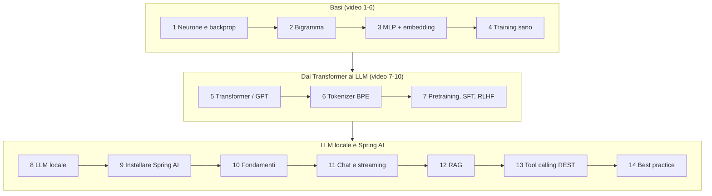
```mermaid
flowchart TB
    subgraph B["Basi (video 1-6)"]
        direction LR
        A[1 Neurone e backprop] --> B2[2 Bigramma] --> C[3 MLP + embedding] --> D[4 Training sano]
    end
    subgraph G["Dai Transformer ai LLM (video 7-10)"]
        direction LR
        E[5 Transformer / GPT] --> F[6 Tokenizer BPE] --> G2[7 Pretraining, SFT, RLHF]
    end
    subgraph S["LLM locale e Spring AI"]
        direction LR
        H[8 LLM locale] --> I[9 Installare Spring AI] --> J[10 Fondamenti] --> K[11 Chat e streaming]
        K --> L[12 RAG] --> M[13 Tool calling REST] --> N[14 Best practice]
    end
    B --> G --> S
```

### 0.3 Le tre strade per "avere un LLM locale"

Nel 99% dei casi un backend developer **non addestra un modello da zero** (milioni di dollari, cluster di GPU). Le strade reali:

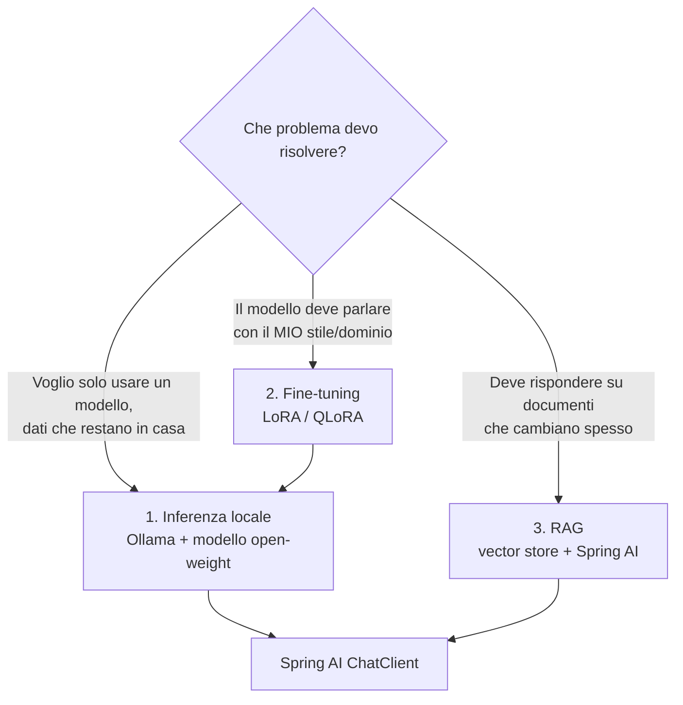
```mermaid
flowchart TD
    Q{Che problema devo risolvere?}
    Q -->|Voglio solo usare un modello,<br/>dati che restano in casa| I[1. Inferenza locale<br/>Ollama + modello open-weight]
    Q -->|Il modello deve parlare<br/>con il MIO stile/dominio| F[2. Fine-tuning<br/>LoRA / QLoRA]
    Q -->|Deve rispondere su documenti<br/>che cambiano spesso| R[3. RAG<br/>vector store + Spring AI]
    I --> S[Spring AI ChatClient]
    F --> I
    R --> S
```

| Strada | Costo | Quando | Dati aggiornabili? |
|---|---|---|---|
| Inferenza (Ollama) | Basso (una GPU/CPU decente) | Sempre, è il punto di partenza | No (conoscenza congelata) |
| Fine-tuning LoRA | Medio (1 GPU + dataset curato) | Stile, formato, compiti ripetitivi | Richiede nuovo training |
| **RAG** | Basso-medio | **Il caso enterprise più comune** | **Sì, istantaneamente** |

**Regola pratica:** parti da RAG + prompt buono. Fai fine-tuning solo se misuri che RAG non basta.

### 0.4 Come leggere il libro
- Se non conosci il machine learning: leggi 1→8 in ordine.
- Se sei solo uno sviluppatore Java con fretta: leggi 0.3, 8, poi 9→14 e usa il progetto in `code/spring-ai-demo`.
- Il codice Python gira con `python3` senza dipendenze (solo `attention.py` richiede NumPy).

### Come è stata costruita la parte sui video


Playlist: <https://www.youtube.com/playlist?list=PLAqhIrjkxbuWI23v9cThsA9GvCAUhRvKZ> · Autore: Andrej Karpathy · 10 video

##### ⚠️ Come è stata costruita (leggere!)
Non ho potuto fare una **trascrizione parlata** dei video: dal sandbox YouTube non è raggiungibile (rete bloccata) e il testo dei sottotitoli non è tra i dati recuperabili; inoltre non ho accesso all'audio per un riconoscimento vocale. Cosa ho fatto invece:

| Fonte | Uso |
|---|---|
| **Capitoli ufficiali con timestamp** (nella descrizione di ogni video, recuperati realmente) | scheletro di ogni lezione: i timestamp ti permettono di saltare al punto giusto |
| La mia conoscenza del contenuto di queste lezioni e del codice | spiegazione **in italiano, con parole mie**, formule, trappole, esercizi, quiz |
| Esempi Python eseguiti nel repo (`code/python/`) | dove un concetto è dimostrabile in poche righe |

Quindi: **non è una trascrizione** e non riporta il parlato di Karpathy; è una dispensa di studio guidata dai capitoli del video. Dove ho un dubbio sul dettaglio esatto lo indico con ⚠️. Per i video **6 (WaveNet)** e **8 (State of GPT)** YouTube non espone capitoli: la struttura è ricostruita da me e va verificata guardando il video.

Se vuoi una vera trascrizione: su YouTube apri il video → «…altro» → **Mostra trascrizione**, oppure su una tua macchina `pip install youtube-transcript-api` / `yt-dlp --write-auto-subs --skip-download`. Poi posso integrarla nella dispensa (tradotta e rielaborata).

##### Indice
| # | Video | Durata | File |
|---|---|---|---|
| 1 | micrograd: backpropagation | 2:25:52 | [01](01_micrograd.md) |
| 2 | makemore: language modeling (bigramma) | 1:57:45 | [02](02_makemore_bigramma.md) |
| 3 | makemore Part 2: MLP | 1:15:40 | [03](03_makemore_mlp.md) |
| 4 | makemore Part 3: attivazioni, gradienti, BatchNorm | 1:55:58 | [04](04_makemore_batchnorm.md) |
| 5 | makemore Part 4: Backprop Ninja | 1:55:24 | [05](05_makemore_backprop_ninja.md) |
| 6 | makemore Part 5: WaveNet | 56:22 | [06](06_makemore_wavenet.md) |
| 7 | Let's build GPT | 1:56:20 | [07](07_build_gpt.md) |
| 8 | State of GPT (Microsoft Build 2023) | 42:40 | [08](08_state_of_gpt.md) |
| 9 | Let's build the GPT Tokenizer | 2:13:35 | [09](09_tokenizer.md) |
| 10 | Let's reproduce GPT-2 (124M) | 4:01:26 | [10](10_gpt2_124m.md) |

##### Percorso consigliato
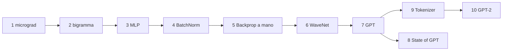
```mermaid
flowchart LR
    V1[1 micrograd] --> V2[2 bigramma] --> V3[3 MLP] --> V4[4 BatchNorm] --> V5[5 Backprop a mano] --> V6[6 WaveNet]
    V6 --> V7[7 GPT] --> V9[9 Tokenizer] --> V10[10 GPT-2]
    V7 --> V8[8 State of GPT]
```
Prerequisiti: Python di base e un ricordo di derivate delle superiori. Per ogni video: guarda **con il codice aperto** e fermati ad ogni capitolo per riscriverlo tu.

##### Formato di ogni scheda
Obiettivo · Mappa dei capitoli (timestamp ufficiali + cosa si impara) · Concetti chiave · Formule · Trappole · Esercizi · Quiz con risposte.


---

# Parte II — Dai neuroni a GPT (i 10 video, con codice)


## Video 1 — micrograd: reti neurali e backpropagation (2:25:52)

🔗 <https://www.youtube.com/watch?v=VMj-3S1tku0> · Codice: [`micrograd_mini.py`](code/python/micrograd_mini.py) · Libro: [cap. 1](book/01_reti_neurali_backprop.md)

**Obiettivo:** capire la backpropagation costruendo da zero un motore di autograd scalare (~100 righe) e allenare una piccola rete.

#### Mappa dei capitoli (timestamp ufficiali)
| Tempo | Capitolo (titolo originale) | Cosa si impara |
|---|---|---|
| 0:00 | intro | scopo: capire cosa c'è *dentro* `loss.backward()` |
| 0:25 | micrograd overview | una rete è un'espressione matematica; micrograd costruisce il grafo e calcola i gradienti |
| 8:08 | derivative of a simple function with one input | derivata come rapporto incrementale numerico: «se sposto x di h, quanto cambia f?» |
| 14:12 | derivative of a function with multiple inputs | derivate parziali: ogni ingresso ha la sua sensibilità |
| 19:09 | starting the core Value object and its visualization | classe `Value` che ricorda *chi l'ha prodotto* (figli e operazione) → grafo di calcolo |
| 32:10 | manual backpropagation example #1 | chain rule a mano su un'espressione semplice; `+` distribuisce il gradiente, `*` lo scambia con l'altro operando |
| 51:10 | preview of a single optimization step | spingere i dati nella direzione del gradiente fa salire/scendere l'output |
| 52:52 | manual backpropagation example #2: a neuron | backprop attraverso `tanh(Σ wx + b)` |
| 1:09:02 | implementing the backward function for each operation | ogni operazione definisce la sua `_backward` locale |
| 1:17:32 | … for a whole expression graph | ordinamento topologico, poi `_backward` in ordine inverso |
| 1:22:28 | fixing a backprop bug when one node is used multiple times | i gradienti vanno **accumulati** (`+=`), non assegnati |
| 1:27:05 | breaking up a tanh, exercising with more operations | tanh scomponibile in exp/divisioni; si aggiungono `**`, `exp`, `/`, `-` |
| 1:39:31 | doing the same thing but in PyTorch | stessi gradienti con tensori e `requires_grad` |
| 1:43:55 | building out a neural net library (MLP) | classi `Neuron`, `Layer`, `MLP` |
| 1:51:04 | creating a tiny dataset, writing the loss function | 4 esempi, loss = somma errori² |
| 1:57:56 | collecting all of the parameters | `parameters()` per poterli aggiornare |
| 2:01:12 | gradient descent manually, training the network | ciclo forward → azzera grad → backward → update; learning rate troppo alto = instabile |
| 2:14:03 | summary of what we learned | reti moderne = stessa idea, tensori e scala |
| 2:16:46 | walkthrough of the full code on GitHub | micrograd reale |
| 2:21:10 | diving into PyTorch, backward pass for tanh | in PyTorch la derivata di tanh è definita allo stesso modo |
| 2:24:39 / 2:25:20 | conclusion / outtakes | — |

#### Concetti chiave
- **Derivata = sensibilità** dell'output a una variazione dell'input.
- **Chain rule:** `dL/dx = dL/dy · dy/dx`; la backprop la applica a ritroso nel grafo.
- Regole locali: somma → gradiente copiato; prodotto → gradiente × altro operando; `tanh` → `1 − t²`.
- **Accumulo** dei gradienti quando un nodo ha più usi.
- Training = ripetere forward/backward/update.

#### Formule
```
f'(x) ≈ (f(x+h) − f(x)) / h
d(a·b)/da = b        d(tanh x)/dx = 1 − tanh²(x)
w ← w − η · ∂L/∂w
```

#### Trappole
1. Dimenticare di **azzerare** i gradienti tra un passo e l'altro.
2. `=` invece di `+=` nell'accumulo (bug mostrato nel video).
3. `η` troppo grande → la loss oscilla/esplode.

#### Esercizi
1. Aggiungi `exp` e `__truediv__` a `Value` e verifica con differenze finite.
2. Allena la rete su XOR; con quanti neuroni nascosti converge?
3. Confronta i gradienti con quelli di PyTorch su 3 espressioni diverse.

#### Quiz
1. *Perché `+` copia il gradiente?* — `d(a+b)/da = 1`, quindi il gradiente in uscita passa invariato.
2. *Perché serve l'ordinamento topologico?* — il gradiente di un nodo si può propagare solo dopo che tutti i nodi che lo usano sono stati processati.
3. *Cosa succede se non azzeri i gradienti?* — si sommano a quelli dei passi precedenti: update sbagliati.

### 📖 Approfondimento: Reti neurali e backpropagation


*Video 1: «The spelled-out intro to neural networks and backpropagation: building micrograd» (2h25)*

##### 1.1 Il neurone
Un neurone artificiale fa tre cose: **moltiplica** ogni ingresso per un peso, **somma** (più un bias), applica una **non-linearità**.

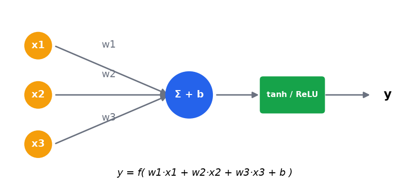

Senza la non-linearità, impilare strati equivarrebbe a un solo strato lineare: la rete non potrebbe imparare nulla di interessante.

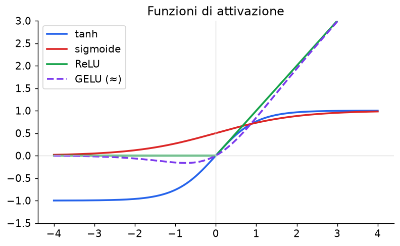

| Funzione | Pro | Contro |
|---|---|---|
| tanh | centrata su 0 | satura (gradiente ≈ 0 agli estremi) |
| sigmoide | output in (0,1) | satura, non centrata |
| ReLU | semplice, veloce | "neuroni morti" se sempre < 0 |
| GELU | liscia, usata nei Transformer | più costosa |

##### 1.2 La loss: misurare l'errore
Confrontiamo la predizione con il target e otteniamo **un solo numero** (la *loss*), es. errore quadratico: `L = Σ (y_pred − y_true)²`. Allenare = ridurre L.

##### 1.3 Il gradiente e la chain rule
Il **gradiente** `∂L/∂w` dice: *"se aumento w di un soffio, di quanto cambia L?"*. Per una composizione di operazioni vale la **chain rule**: si moltiplicano le derivate locali lungo il cammino.

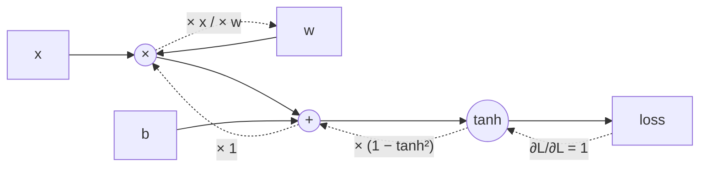
```mermaid
flowchart LR
    x[x] --> mul((×))
    w[w] --> mul
    mul --> add((+))
    b[b] --> add
    add --> t((tanh))
    t --> L[loss]
    L -. "∂L/∂L = 1" .-> t
    t -. "× (1 − tanh²)" .-> add
    add -. "× 1" .-> mul
    mul -. "× x  /  × w" .-> w
```

La **backpropagation** non è magia: è la chain rule applicata a un grafo di calcolo, partendo dalla loss (gradiente 1) verso i parametri.

##### 1.4 La discesa del gradiente
Dato il gradiente, si muovono i pesi nella direzione opposta: `w ← w − η · ∂L/∂w`, dove `η` è il *learning rate*.

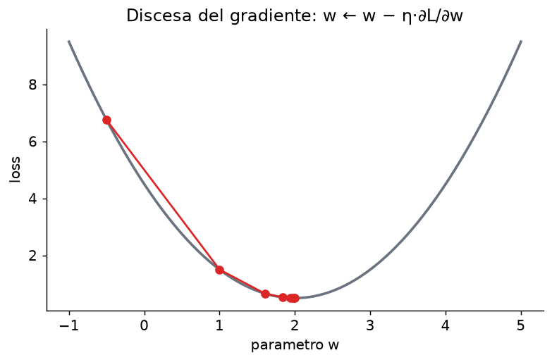

##### 1.5 Codice: un autograd in 60 righe
Il file [`code/python/micrograd_mini.py`](code/python/micrograd_mini.py) implementa `Value` (con `+`, `*`, `**`, `tanh` e `backward()`), un `Neuron` e un `MLP`. Estratto del cuore:

```python
def __mul__(self, o):
    out = Value(self.data * o.data, (self, o), "*")
    def _b():
        self.grad += o.data * out.grad      # d(a*b)/da = b
        o.grad    += self.data * out.grad   # d(a*b)/db = a
    out._backward = _b
    return out
```

Esecuzione reale (60 step, `lr = 0.05`):

```
step  0  loss 3.1407
step 10  loss 0.0695
step 59  loss 0.0103
predizioni: [0.952, -0.95, -0.956, 0.942] target: [1.0, -1.0, -1.0, 1.0]
```

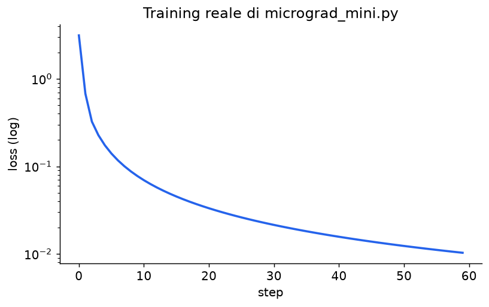

###### Il ciclo di training (lo ritroverai identico in un LLM da 100 miliardi di parametri)
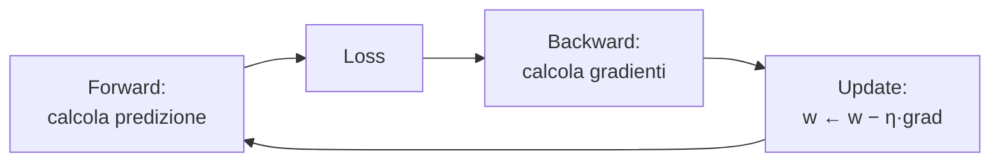
```mermaid
flowchart LR
    A[Forward:<br/>calcola predizione] --> B[Loss]
    B --> C[Backward:<br/>calcola gradienti]
    C --> D[Update:<br/>w ← w − η·grad]
    D --> A
```
> ⚠️ Trappola classica (la mostra anche Karpathy): **azzerare i gradienti** prima di ogni `backward()`, altrimenti si accumulano.

##### 1.6 Cosa portarsi a casa
- Una rete è una funzione differenziabile con milioni/miliardi di parametri.
- "Imparare" = minimizzare una loss con la discesa del gradiente.
- PyTorch fa esattamente ciò che fa `micrograd`, ma su **tensori** e su GPU.


#### 💻 Codice: `code/python/micrograd_mini.py` — autograd + MLP, il cuore del video 1

```python
"""Mini-micrograd: autograd scalare + neurone, ispirato al video 1 di Karpathy."""
import math, random


class Value:
    def __init__(self, data, children=(), op=""):
        self.data, self.grad = data, 0.0
        self._prev, self._op, self._backward = set(children), op, lambda: None

    def __add__(self, o):
        o = o if isinstance(o, Value) else Value(o)
        out = Value(self.data + o.data, (self, o), "+")
        def _b():
            self.grad += out.grad
            o.grad += out.grad
        out._backward = _b
        return out

    def __mul__(self, o):
        o = o if isinstance(o, Value) else Value(o)
        out = Value(self.data * o.data, (self, o), "*")
        def _b():
            self.grad += o.data * out.grad
            o.grad += self.data * out.grad
        out._backward = _b
        return out

    def __neg__(self): return self * -1
    def __sub__(self, o): return self + (-o if isinstance(o, Value) else Value(-o))
    __radd__ = __add__
    __rmul__ = __mul__

    def __pow__(self, k):
        out = Value(self.data ** k, (self,), f"**{k}")
        def _b(): self.grad += k * self.data ** (k - 1) * out.grad
        out._backward = _b
        return out

    def tanh(self):
        t = math.tanh(self.data)
        out = Value(t, (self,), "tanh")
        def _b(): self.grad += (1 - t * t) * out.grad
        out._backward = _b
        return out

    def backward(self):
        topo, seen = [], set()
        def build(v):
            if v not in seen:
                seen.add(v)
                for c in v._prev: build(c)
                topo.append(v)
        build(self)
        self.grad = 1.0
        for v in reversed(topo): v._backward()


class Neuron:
    def __init__(self, n_in):
        self.w = [Value(random.uniform(-1, 1)) for _ in range(n_in)]
        self.b = Value(0.0)
    def __call__(self, x):
        return (sum((wi * xi for wi, xi in zip(self.w, x)), self.b)).tanh()
    def parameters(self): return self.w + [self.b]


class MLP:
    def __init__(self, n_in, sizes):
        dims = [n_in] + sizes
        self.layers = [[Neuron(dims[i]) for _ in range(dims[i + 1])] for i in range(len(sizes))]
    def __call__(self, x):
        for layer in self.layers:
            x = [n(x) for n in layer]
        return x[0] if len(x) == 1 else x
    def parameters(self): return [p for l in self.layers for n in l for p in n.parameters()]


if __name__ == "__main__":
    random.seed(1337)
    xs = [[2.0, 3.0, -1.0], [3.0, -1.0, 0.5], [0.5, 1.0, 1.0], [1.0, 1.0, -1.0]]
    ys = [1.0, -1.0, -1.0, 1.0]
    net = MLP(3, [4, 4, 1])
    for step in range(60):
        loss = sum(((net(x) - y) ** 2 for x, y in zip(xs, ys)), Value(0.0))
        for p in net.parameters(): p.grad = 0.0
        loss.backward()
        for p in net.parameters(): p.data -= 0.05 * p.grad   # gradient descent
        if step % 10 == 0 or step == 59:
            print(f"step {step:2d}  loss {loss.data:.4f}")
    print("predizioni:", [round(net(x).data, 3) for x in xs], "target:", ys)
```

**Output reale** (eseguito durante la scrittura, `code/python/outputs/micrograd_mini.txt`):

```text
step  0  loss 3.1407
step 10  loss 0.0695
step 20  loss 0.0332
step 30  loss 0.0214
step 40  loss 0.0157
step 50  loss 0.0123
step 59  loss 0.0103
predizioni: [0.952, -0.95, -0.956, 0.942] target: [1.0, -1.0, -1.0, 1.0]
```


#### 💻 Codice: `code/python/v01_gradcheck.py` — verifica dei gradienti: micrograd vs PyTorch vs derivata numerica

```python
"""Video 1/5: verifica dei gradienti. Confronta micrograd_mini, differenze finite e PyTorch autograd."""
import math, torch
from micrograd_mini import Value

def f_micro(a, b, c):
    return ((a * b + c).tanh() * 2.0 + a ** 2)

def f_torch(a, b, c):
    return torch.tanh(a * b + c) * 2.0 + a ** 2

vals = dict(a=0.7, b=-1.3, c=0.4)

# 1) micrograd
a, b, c = (Value(v) for v in vals.values())
out = f_micro(a, b, c); out.backward()
g_micro = [a.grad, b.grad, c.grad]

# 2) PyTorch
ta, tb, tc = (torch.tensor(v, dtype=torch.float64, requires_grad=True) for v in vals.values())
f_torch(ta, tb, tc).backward()
g_torch = [ta.grad.item(), tb.grad.item(), tc.grad.item()]

# 3) differenze finite (derivata numerica)
def numeric(i, h=1e-6):
    p = list(vals.values()); q = list(vals.values()); p[i] += h; q[i] -= h
    fp = f_micro(*(Value(x) for x in p)).data
    fm = f_micro(*(Value(x) for x in q)).data
    return (fp - fm) / (2 * h)
g_num = [numeric(i) for i in range(3)]

print(f"{'':8}{'micrograd':>12}{'torch':>12}{'numerico':>12}")
for n, x, y, z in zip("abc", g_micro, g_torch, g_num):
    print(f"d/d{n:<5}{x:12.6f}{y:12.6f}{z:12.6f}")
assert all(abs(x - y) < 1e-9 and abs(x - z) < 1e-6 for x, y, z in zip(g_micro, g_torch, g_num))
print("OK: i tre metodi coincidono")

# Video 5: derivata di softmax + cross-entropy = p - onehot
logits = torch.randn(1, 5, dtype=torch.float64, requires_grad=True)
target = torch.tensor([2])
torch.nn.functional.cross_entropy(logits, target).backward()
p = torch.softmax(logits.detach(), dim=1); p[0, 2] -= 1
print("dlogits autograd == p - onehot ?", torch.allclose(logits.grad, p))
```

**Output reale** (eseguito durante la scrittura, `code/python/outputs/v01_gradcheck.txt`):

```text
           micrograd       torch    numerico
d/da       -0.625794   -0.625794   -0.625794
d/db        1.090812    1.090812    1.090812
d/dc        1.558303    1.558303    1.558303
OK: i tre metodi coincidono
dlogits autograd == p - onehot ? True
```


---


## Video 2 — makemore: il modello bigramma (1:57:45)

🔗 <https://www.youtube.com/watch?v=PaCmpygFfXo> · Codice: [`bigram.py`](code/python/bigram.py) · Libro: [cap. 2](book/02_language_modeling_bigram.md)

**Obiettivo:** primo language model a livello di carattere (generare nomi), prima con i **conteggi**, poi con una **rete neurale** — arrivando allo stesso risultato.

#### Mappa dei capitoli (timestamp ufficiali)
| Tempo | Capitolo | Cosa si impara |
|---|---|---|
| 0:00 | intro | makemore: «fa più cose come i nomi» |
| 3:03 | reading and exploring the dataset | ~32k nomi, lunghezze, caratteri |
| 6:24 | exploring the bigrams | coppie di caratteri consecutivi con marcatori di inizio/fine |
| 9:24 | counting bigrams in a python dictionary | tabella dei conteggi |
| 12:45 | counting bigrams in a 2D torch tensor | la tabella diventa matrice 27×27 («training» = contare) |
| 18:19 | visualizing the bigram tensor | heatmap (vedi [fig. 5](book/figures/05_bigram_heatmap.png)) |
| 20:54 | deleting spurious (S) and (E) tokens → single `.` | un solo simbolo per inizio e fine |
| 24:02 | sampling from the model | `torch.multinomial` dalle righe normalizzate |
| 36:17 | efficiency! vectorized normalization, broadcasting | regole di broadcasting e `keepdim=True` (bug classico) |
| 50:14 | loss function (negative log likelihood) | likelihood come prodotto, log → somma, media negativa |
| 1:00:50 | model smoothing with fake counts | +1 ai conteggi per evitare probabilità zero (loss infinita) |
| 1:02:57 | PART 2: the neural network approach | stesso obiettivo con pesi allenabili |
| 1:05:26 | creating the bigram dataset for the neural net | coppie (x, y) come interi |
| 1:10:01 | one-hot encodings | gli interi non si danno in pasto a una rete: si codificano |
| 1:13:53 | one linear layer of neurons via matrix multiplication | `logits = x_onehot @ W` |
| 1:18:46 | the softmax | logits → exp → normalizza = probabilità |
| 1:26:17 | summary, preview, reference to micrograd | |
| 1:35:49 | vectorized loss | selezionare la probabilità del carattere corretto |
| 1:38:36 | backward and update, in PyTorch | `loss.backward()`, update dei pesi |
| 1:42:55 | putting everything together | training completo |
| 1:47:49 | note 1: one-hot just selects a row of W | l'embedding è una **lookup** |
| 1:50:18 | note 2: smoothing as regularization | `W²` come penalità ≈ fake counts |
| 1:54:31 | sampling from the neural net | stessi risultati del metodo a conteggi |
| 1:56:16 | conclusion | |

#### Concetti chiave
- **Language model** = distribuzione del prossimo simbolo dato il contesto.
- **NLL** come misura di qualità; la loss di un modello uniforme su 27 simboli è `ln 27 ≈ 3.30`.
- **Softmax** = trasformazione differenziabile logits→probabilità.
- Conteggi e rete **sono lo stesso modello**; la rete però scala a contesti più lunghi.
- **Regolarizzazione** ≈ smoothing.

#### Trappole
1. Broadcasting sbagliato: dimenticare `keepdim=True` normalizza lungo l'asse errato *senza errori*.
2. Probabilità 0 → `log(0) = −∞` (serve smoothing).
3. Valutare sulla stessa loss di training.

#### Esercizi
1. Calcola la NLL con e senza smoothing e osserva l'effetto.
2. Implementa il **trigramma** a conteggi: quanto cresce la tabella? Quanto migliora la loss?
3. Dimostra numericamente che one-hot × W seleziona una riga di W.

#### Quiz
1. *Perché il log nella loss?* — trasforma il prodotto di probabilità in somma, stabile e differenziabile.
2. *Perché una rete anziché una tabella?* — la tabella cresce esponenzialmente col contesto; la rete generalizza con pochi parametri.
3. *Che loss ha un modello casuale su 27 caratteri?* — circa 3.30.

### 📖 Approfondimento: Language modeling e bigramma


*Video 2: «The spelled-out intro to language modeling: building makemore» (1h57)*

##### 2.1 Cos'è un language model
Un language model assegna una **probabilità al prossimo elemento** (carattere o token) dato ciò che precede. **Un LLM fa esattamente questo**, solo con contesti lunghi e miliardi di parametri.

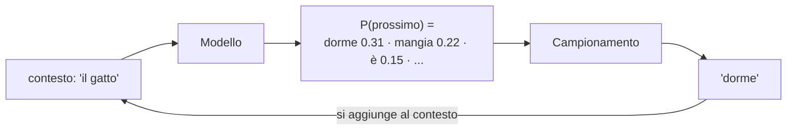
```mermaid
flowchart LR
    C["contesto: 'il gatto'"] --> M[Modello]
    M --> P["P(prossimo) =<br/>dorme 0.31 · mangia 0.22 · è 0.15 · ..."]
    P --> S[Campionamento]
    S --> N["'dorme'"]
    N -->|si aggiunge al contesto| C
```

##### 2.2 Il bigramma a conteggi
Contiamo quante volte ogni carattere segue un altro (con `.` come inizio/fine parola) e normalizziamo in probabilità.

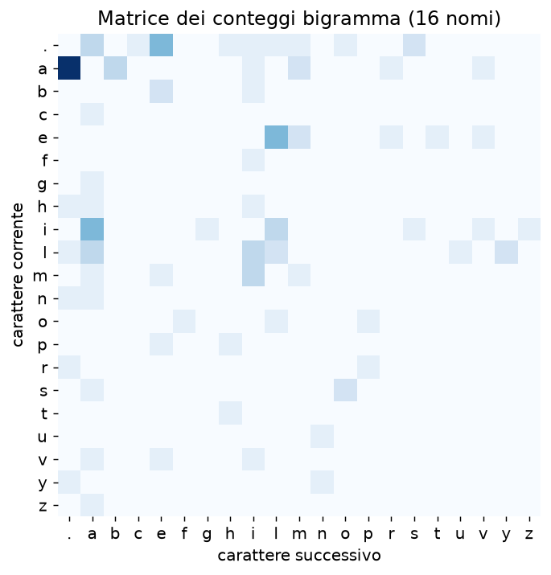

Codice: [`code/python/bigram.py`](code/python/bigram.py). Output reale su 16 nomi:

```
NLL media (loss): 1.305
generati: ['sa', 'er', 'ca', 'ela', 'ela', 'ililyn']
```

I nomi generati sono "quasi plausibili": il modello vede **un solo carattere** di contesto. Pochissimo.

##### 2.3 La loss giusta: Negative Log-Likelihood
Si usa `NLL = −media(log P(carattere vero))`. Se il modello assegna alta probabilità al carattere corretto, la NLL è bassa. Una NLL di 1.3 significa che mediamente il modello assegna ~27% (`e^-1.3`) al carattere giusto.

| Concetto | Significato |
|---|---|
| Logits | punteggi grezzi della rete |
| Softmax | logits → probabilità che sommano a 1 |
| NLL / cross-entropy | `−log p(target)` |
| Perplexity | `exp(NLL)`: "tra quante scelte equiprobabili sono indeciso" |

##### 2.4 Dal conteggio alla rete neurale
Lo stesso modello si può esprimere come **una rete a un solo strato lineare**: codifica one-hot → moltiplica per una matrice `W` → softmax. Allenandola con la discesa del gradiente si ottiene (circa) la tabella dei conteggi. Perché farlo? Perché **una rete scala**: possiamo aggiungere strati e contesto, la tabella no (con 3 caratteri di contesto servirebbero 27³ righe, con 100 token di contesto è impossibile).

##### 2.5 Softmax e temperatura (utile anche per Spring AI)
Alla generazione si può "scaldare" o "raffreddare" la distribuzione dividendo i logits per `T`:

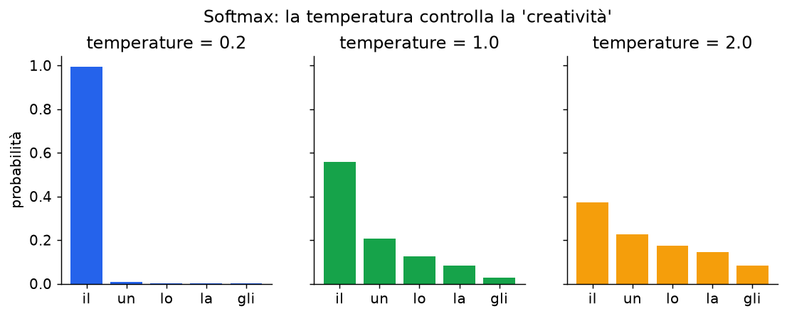

- `T → 0`: sceglie sempre il più probabile (deterministico, ripetitivo)
- `T = 1`: distribuzione del modello
- `T > 1`: più sorprese, più errori

Troverai questo parametro come `temperature` nelle opzioni di Spring AI/Ollama (capitolo 10).


#### 💻 Codice: `code/python/bigram.py` — bigramma a conteggi e NLL

```python
"""Language model bigramma a conteggi (video 2, makemore)."""
import random
from collections import defaultdict

words = ["emma", "olivia", "ava", "isabella", "sophia", "mia", "amelia", "harper",
         "evelyn", "abigail", "emily", "ella", "elizabeth", "camila", "luna", "sofia"]

counts = defaultdict(lambda: defaultdict(int))
for w in words:
    chars = ["."] + list(w) + ["."]          # "." = inizio/fine parola
    for a, b in zip(chars, chars[1:]):
        counts[a][b] += 1

def sample(rng):
    out, cur = [], "."
    while True:
        nxt = counts[cur]
        cur = rng.choices(list(nxt), weights=list(nxt.values()))[0]
        if cur == ".": return "".join(out)
        out.append(cur)

import math
nll, n = 0.0, 0
for w in words:
    chars = ["."] + list(w) + ["."]
    for a, b in zip(chars, chars[1:]):
        p = counts[a][b] / sum(counts[a].values())
        nll -= math.log(p); n += 1
print(f"NLL media (loss): {nll / n:.3f}")
rng = random.Random(42)
print("generati:", [sample(rng) for _ in range(6)])
```

**Output reale** (eseguito durante la scrittura, `code/python/outputs/bigram.txt`):

```text
NLL media (loss): 1.305
generati: ['sa', 'er', 'ca', 'ela', 'ela', 'ililyn']
```


#### 💻 Codice: `code/python/sampling.py` — temperatura, top-k, top-p da zero

```python
"""Temperature, top-k e top-p (nucleus) da zero con NumPy: ciò che fa il 'sampler' di un LLM."""
import numpy as np

def softmax(z):
    z = z - z.max(); e = np.exp(z); return e / e.sum()

def sample(logits, temperature=1.0, top_k=None, top_p=None, rng=None):
    rng = rng or np.random.default_rng()
    if temperature == 0:                       # greedy
        return int(np.argmax(logits))
    p = softmax(np.asarray(logits, float) / temperature)
    order = np.argsort(-p)                     # indici dal più probabile
    keep = np.ones_like(p, dtype=bool)
    if top_k:
        keep[order[top_k:]] = False
    if top_p:
        cum = np.cumsum(p[order])
        cutoff = np.searchsorted(cum, top_p) + 1
        keep[order[cutoff:]] = False
    p = np.where(keep, p, 0.0)
    return int(rng.choice(len(p), p=p / p.sum()))

if __name__ == "__main__":
    vocab = ["il", "un", "lo", "la", "gli"]
    logits = [2.0, 1.0, 0.5, 0.1, -1.0]
    rng = np.random.default_rng(0)
    for cfg in [dict(temperature=0), dict(temperature=1.0), dict(temperature=1.0, top_k=2),
                dict(temperature=1.0, top_p=0.8), dict(temperature=2.0)]:
        draws = [vocab[sample(logits, rng=rng, **cfg)] for _ in range(2000)]
        freq = {w: round(draws.count(w) / 2000, 2) for w in vocab}
        print(cfg, freq)
```

**Output reale** (eseguito durante la scrittura, `code/python/outputs/sampling.txt`):

```text
{'temperature': 0} {'il': 1.0, 'un': 0.0, 'lo': 0.0, 'la': 0.0, 'gli': 0.0}
{'temperature': 1.0} {'il': 0.55, 'un': 0.21, 'lo': 0.13, 'la': 0.08, 'gli': 0.03}
{'temperature': 1.0, 'top_k': 2} {'il': 0.74, 'un': 0.26, 'lo': 0.0, 'la': 0.0, 'gli': 0.0}
{'temperature': 1.0, 'top_p': 0.8} {'il': 0.62, 'un': 0.24, 'lo': 0.14, 'la': 0.0, 'gli': 0.0}
{'temperature': 2.0} {'il': 0.38, 'un': 0.22, 'lo': 0.18, 'la': 0.14, 'gli': 0.09}
```


---


## Video 3 — makemore Part 2: MLP (1:15:40)

🔗 <https://www.youtube.com/watch?v=TCH_1BHY58I> · Libro: [cap. 3](book/03_mlp_embedding.md)

**Obiettivo:** passare da 1 carattere di contesto a più caratteri con un **MLP + embedding** (idea di Bengio et al., 2003) e imparare i fondamentali dell'allenamento.

#### Mappa dei capitoli (timestamp ufficiali)
| Tempo | Capitolo | Cosa si impara |
|---|---|---|
| 0:00 | intro | |
| 1:48 | Bengio et al. 2003 paper walkthrough | embedding condivisi + MLP + softmax sul vocabolario |
| 9:03 | (re-)building our training dataset | finestre di `block_size` caratteri → carattere successivo |
| 12:19 | implementing the embedding lookup table | matrice `C`; indicizzare `C[X]` dà tensori (N, block, dim) |
| 18:35 | hidden layer + internals of torch.Tensor: storage, views | `view()` non copia: stesso storage, diverso shape; concatenare gli embedding con `view` |
| 29:15 | implementing the output layer | strato lineare → logits |
| 29:53 | implementing the negative log likelihood loss | |
| 32:17 | summary of the full network | |
| 32:49 | introducing `F.cross_entropy` and why | più efficiente e **numericamente stabile** (sottrae il massimo) |
| 37:56 | training loop, overfitting one batch | sanity check: la rete deve poter memorizzare un solo batch |
| 41:25 | training on the full dataset, minibatches | gradiente su sottoinsiemi: più rumoroso ma molto più rapido |
| 45:40 | finding a good initial learning rate | scansione esponenziale di lr e curva loss-vs-lr |
| 53:20 | train/val/test splits and why | train per i pesi, dev per gli iperparametri, test una sola volta |
| 1:00:49 | experiment: larger hidden layer | più capacità → rischio overfit |
| 1:05:27 | visualizing the character embeddings | vocali vicine tra loro, `.` isolato (vedi [fig. 6](book/figures/06_embedding.png), illustrativa) |
| 1:07:16 | experiment: larger embedding size | |
| 1:11:46 | summary of our final code | |
| 1:13:24 | sampling from the model | |
| 1:14:55 | google colab notebook | |

#### Concetti chiave
- **Embedding**: tabella appresa; indicizzare = selezionare una riga (equivale a one-hot × W).
- **Mini-batch**, **split train/dev/test**, **learning-rate finding**, **overfitting**.
- `cross_entropy` fonde softmax + NLL.

#### Formule
```
emb = C[X]                      # (N, block, d)
h   = tanh(emb.view(N,-1) @ W1 + b1)
logits = h @ W2 + b2
loss = cross_entropy(logits, Y)
```

#### Trappole
1. Valutare la loss sul train e credere che il modello sia bravo.
2. Cambiare iperparametri guardando il **test**: lo si "consuma".
3. `view` su tensori non contigui.

#### Esercizi
1. Cerca il miglior `lr` con la scansione esponenziale e traccia il grafico.
2. Porta `block_size` da 3 a 5 e `emb_dim` da 2 a 10: cosa migliora?
3. Visualizza gli embedding a 2 dimensioni e commenta i cluster.

#### Quiz
1. *Perché `cross_entropy` invece di softmax + log a mano?* — evita overflow (usa log-sum-exp) ed è più veloce.
2. *Perché provare a "overfittare" un batch?* — verifica che modello e loop di training funzionino.
3. *A cosa serve il dev set?* — scegliere gli iperparametri senza toccare il test.

### 📖 Approfondimento: MLP ed embedding


*Video 3: «Building makemore Part 2: MLP» (1h15)*

##### 3.1 Il limite del bigramma e l'idea di Bengio (2003)
Per usare più contesto senza esplodere in tabelle, ogni simbolo viene mappato in un **vettore denso** (*embedding*); i vettori del contesto vengono concatenati e passati a un **MLP** (strati lineari + tanh) che predice il prossimo simbolo.

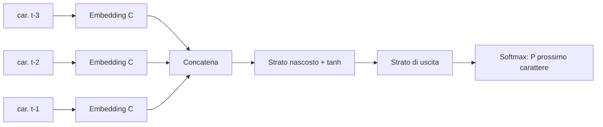
```mermaid
flowchart LR
    c1[car. t-3] --> E1[Embedding C]
    c2[car. t-2] --> E2[Embedding C]
    c3[car. t-1] --> E3[Embedding C]
    E1 --> CAT[Concatena]
    E2 --> CAT
    E3 --> CAT
    CAT --> H[Strato nascosto + tanh]
    H --> O[Strato di uscita]
    O --> SM[Softmax: P prossimo carattere]
```

La tabella `C` (embedding) è **condivisa** tra le posizioni ed è **appresa**: simboli che compaiono in contesti simili finiscono vicini nello spazio.

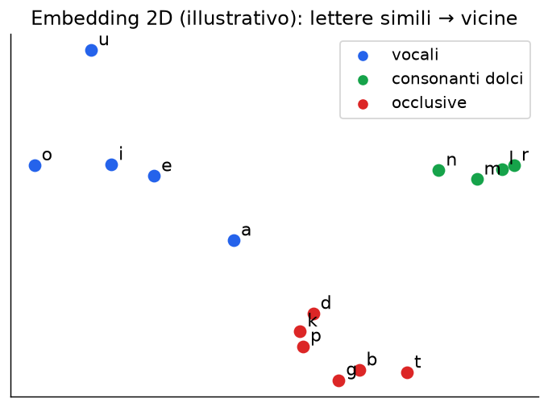

> Questo è lo stesso principio degli *embedding di testo* che in Spring AI usi per il RAG (cap. 12), ma con più dimensioni (es. 768) e un modello dedicato.

##### 3.2 Buone pratiche di training introdotte nel video
| Pratica | Perché |
|---|---|
| **Train / dev / test split** (80/10/10) | La loss di training mente: misura la generalizzazione sul dev |
| **Mini-batch** | Gradiente approssimato ma 100× più veloce |
| **Trovare il learning rate** | Si scorre `lr` da 10⁻³ a 1 e si guarda dove la loss scende meglio |
| **Learning-rate decay** | Passi più piccoli a fine training |
| **Overfitting** | Train ≪ dev: la rete ha memorizzato |

##### 3.3 Iperparametri tipici
`block_size` (contesto), `emb_dim`, `hidden`, `lr`, `batch_size`. Il video mostra come il modello migliora aumentando dimensione e contesto — in miniatura, la stessa storia degli LLM: **più parametri + più contesto + più dati = loss più bassa**.


#### 💻 Codice: `code/python/v03_mlp_nomi.py` — MLP + embedding su nomi italiani, con split train/dev/test, early stopping e overfitting REALE

```python
"""Video 2-3: language model a caratteri con MLP + embedding (stile makemore) su nomi italiani. PyTorch."""
import random, torch, torch.nn.functional as F

NAMES = """giulia sofia aurora alice ginevra emma giorgia beatrice greta chiara martina anna vittoria noemi sara alessia
matilde bianca camilla elisa francesca ludovica gaia arianna rebecca federica angelica lucia eleonora nicole irene
marco luca francesco alessandro andrea matteo lorenzo gabriele riccardo davide leonardo tommaso mattia federico simone
giuseppe antonio giovanni salvatore filippo edoardo samuele nicolo diego pietro enrico stefano claudio fabio paolo
roberto massimo daniele michele valerio emanuele cristian manuel gianluca raffaele vincenzo ciro carmine gennaro
rosa maria concetta teresa antonella paola laura silvia monica elena valentina serena veronica roberta daniela
cinzia lorella patrizia donatella giovanna annamaria carla lidia flavia ilaria claudia manuela marta olga rita""".split()

random.seed(42); torch.manual_seed(42)
random.shuffle(NAMES)
chars = ["."] + sorted(set("".join(NAMES)))
stoi = {c: i for i, c in enumerate(chars)}; itos = {i: c for c, i in stoi.items()}
V, BLOCK, EMB, HID = len(chars), 3, 4, 30

def build(words):
    X, Y = [], []
    for w in words:
        ctx = [0] * BLOCK
        for ch in w + ".":
            X.append(ctx); Y.append(stoi[ch]); ctx = ctx[1:] + [stoi[ch]]
    return torch.tensor(X), torch.tensor(Y)

n1, n2 = int(.8 * len(NAMES)), int(.9 * len(NAMES))
Xtr, Ytr = build(NAMES[:n1]); Xdv, Ydv = build(NAMES[n1:n2]); Xte, Yte = build(NAMES[n2:])
print(f"nomi: {len(NAMES)}  vocabolario: {V}  esempi train/dev/test: {len(Xtr)}/{len(Xdv)}/{len(Xte)}")
print(f"loss attesa di un modello casuale: ln({V}) = {torch.log(torch.tensor(float(V))).item():.3f}")

C  = torch.randn(V, EMB)
W1 = torch.randn(BLOCK * EMB, HID) * (5 / 3) / (BLOCK * EMB) ** 0.5
b1 = torch.zeros(HID)
W2 = torch.randn(HID, V) * 0.01
b2 = torch.zeros(V)
params = [C, W1, b1, W2, b2]
for p in params: p.requires_grad = True
print("parametri:", sum(p.numel() for p in params))

def loss_on(X, Y):
    h = torch.tanh(C[X].view(len(X), -1) @ W1 + b1)
    return F.cross_entropy(h @ W2 + b2, Y)

STEPS, best_dev, best = 6000, 9e9, None
for step in range(STEPS):
    ix = torch.randint(0, len(Xtr), (32,))
    loss = loss_on(Xtr[ix], Ytr[ix])
    for p in params: p.grad = None
    loss.backward()
    lr = 0.1 if step < STEPS * 0.6 else 0.01      # learning-rate decay
    for p in params: p.data -= lr * p.grad
    if step % 250 == 0 or step == STEPS - 1:
        with torch.no_grad():
            tr, dv = loss_on(Xtr, Ytr).item(), loss_on(Xdv, Ydv).item()
        if dv < best_dev:                                   # early stopping: ricorda i pesi migliori sul DEV
            best_dev, best = dv, [p.detach().clone() for p in params]
        if step % 1000 == 0 or step == STEPS - 1:
            print(f"step {step:5d}  train {tr:.3f}  dev {dv:.3f}" + ("   <- overfitting: dev risale" if dv > best_dev + 0.05 else ""))
for p, b in zip(params, best): p.data = b                    # ripristina il modello migliore
with torch.no_grad():
    print(f"miglior dev: {best_dev:.3f}  |  loss test finale: {loss_on(Xte, Yte).item():.3f}  (casuale: 3.045)")

g = torch.Generator().manual_seed(7)
out = []
for _ in range(10):
    ctx, s = [0] * BLOCK, ""
    while True:
        with torch.no_grad():
            h = torch.tanh(C[torch.tensor([ctx])].view(1, -1) @ W1 + b1)
            probs = F.softmax(h @ W2 + b2, dim=1)
        i = torch.multinomial(probs, 1, generator=g).item()
        if i == 0 or len(s) > 15: break
        s += itos[i]; ctx = ctx[1:] + [i]
    out.append(s)
print("nomi generati:", out)
```

**Output reale** (eseguito durante la scrittura, `code/python/outputs/v03_mlp_nomi.txt`):

```text
nomi: 105  vocabolario: 21  esempi train/dev/test: 649/69/76
loss attesa di un modello casuale: ln(21) = 3.045
parametri: 1125
step     0  train 3.032  dev 3.021
step  1000  train 1.836  dev 2.241
step  2000  train 1.525  dev 2.341   <- overfitting: dev risale
step  3000  train 1.304  dev 2.423   <- overfitting: dev risale
step  4000  train 1.183  dev 2.483   <- overfitting: dev risale
step  5000  train 1.163  dev 2.505   <- overfitting: dev risale
step  5999  train 1.149  dev 2.507   <- overfitting: dev risale
miglior dev: 2.224  |  loss test finale: 2.090  (casuale: 3.045)
nomi generati: ['slla', 'ufiamine', 're', 'gpiga', 'gianueolavleslan', 'rora', 'tdetlnaa', 'hiode', 'cca', 'vido']
```


---


## Video 4 — makemore Part 3: attivazioni, gradienti, BatchNorm (1:55:58)

🔗 <https://www.youtube.com/watch?v=P6sfmUTpUmc> · Libro: [cap. 4](book/04_training_sano.md)

**Obiettivo:** «ispezionare» una rete profonda: statistiche delle attivazioni e dei gradienti, inizializzazione corretta, BatchNorm.

#### Mappa dei capitoli (timestamp ufficiali)
| Tempo | Capitolo | Cosa si impara |
|---|---|---|
| 0:00 | intro | |
| 1:22 | starter code | MLP del video precedente |
| 4:19 | fixing the initial loss | loss iniziale attesa ≈ `−ln(1/27) ≈ 3.29`; se è 27 i logits iniziali sono troppo grandi → scala W2 (×0.01) e b2=0 |
| 12:59 | fixing the saturated tanh | pre-attivazioni troppo ampie → tanh a ±1 → gradiente ≈ 0 («neuroni morti») |
| 27:53 | calculating the init scale: Kaiming init | `std = gain/√fan_in` (gain 5/3 per tanh) mantiene la varianza stabile |
| 40:40 | batch normalization | normalizza per batch (media 0, std 1) + `γ`, `β` appresi; running mean/std per l'inferenza |
| 1:03:07 | batch normalization: summary | |
| 1:04:50 | real example: resnet50 walkthrough | dove stanno conv + BN + residui in una rete vera |
| 1:14:10 | summary of the lecture | |
| 1:18:35 | part 2: PyTorch-ifying the code | `Linear`, `BatchNorm1d`, `Tanh` come moduli |
| 1:26:51 | viz #1: forward pass activations statistics | istogrammi e % di saturazione per strato |
| 1:30:54 | viz #2: backward pass gradient statistics | i gradienti devono avere scala simile tra strati |
| 1:32:07 | the fully linear case of no non-linearities | perché serve un *gain* |
| 1:36:15 | viz #3: parameter activation and gradient statistics | |
| 1:39:55 | viz #4: update:data ratio over time | rapporto ≈ 10⁻³ è un buon segno |
| 1:46:04 | bringing back batchnorm, looking at the visualizations | BN rende la rete robusta a init e lr |
| 1:51:34 | summary of the lecture for real this time | |

#### Concetti chiave
- Un'inizializzazione sbagliata spreca le prime migliaia di step.
- Stabilità = **varianza costante** tra strati (forward) e tra gradienti (backward).
- BatchNorm stabilizza ma introduce **accoppiamento tra esempi del batch** (fonte di bug sottili) → alternative: LayerNorm, GroupNorm.

#### Formule
```
BN(x) = γ · (x − μ_B)/√(σ²_B + ε) + β
Kaiming: W ~ N(0, (gain/√fan_in)²)
```

#### Trappole
1. Bias prima di una BN è inutile (la BN lo cancella).
2. In inferenza usare le **running statistics**, non quelle del batch.
3. Training/eval mode dimenticati.

#### Esercizi
1. Riproduci gli istogrammi delle attivazioni con e senza gain corretto.
2. Misura il rapporto update/data e trova un `lr` fuori scala.
3. Sostituisci BN con LayerNorm: cosa cambia in training e inferenza?

#### Quiz
1. *Perché la loss iniziale deve essere ~3.3?* — a pesi casuali il modello deve essere "agnostico"; una loss molto più alta significa fiducia ingiustificata.
2. *Cosa rende satura una tanh?* — ingressi di grande modulo: derivata `1−tanh²` ≈ 0.
3. *Perché LayerNorm nei Transformer e non BN?* — non dipende dal batch (sequenze di lunghezze diverse, batch piccoli, generazione token per token).

### 📖 Approfondimento: Far funzionare il training: init, BatchNorm, backprop manuale, WaveNet


*Video 4: «Activations & Gradients, BatchNorm» (1h55) · Video 5: «Becoming a Backprop Ninja» (1h55) · Video 6: «Building a WaveNet» (56 min)*

##### 4.1 Inizializzazione: partire dalla loss giusta
Con 27 caratteri possibili, un modello **completamente ignorante** dovrebbe avere loss iniziale `−ln(1/27) ≈ 3.30`. Se all'inizio vedi 27, i pesi di uscita sono troppo grandi: il modello è *sicuro e sbagliato*. Soluzione: scalare i pesi dell'ultimo strato (×0.01) e il bias a 0.

##### 4.2 Attivazioni sature e gradienti che spariscono
Con `tanh`, se i valori entrano nelle code (|x| grande) il gradiente `1 − tanh²` ≈ 0: il neurone smette di imparare. Rimedi:

| Tecnica | Idea |
|---|---|
| **Kaiming/He init** | scala i pesi con `gain / √fan_in` per mantenere la varianza stabile da strato a strato |
| **BatchNorm** | normalizza le attivazioni (media 0, std 1) per mini-batch, poi riscala con parametri appresi |
| **LayerNorm** | come BatchNorm ma per esempio, non per batch → **è quella dei Transformer** |
| **Residual connection** | `y = x + f(x)`: il gradiente ha una "autostrada" fino all'ingresso |

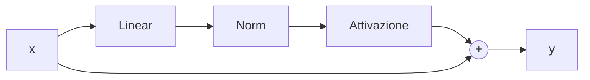
```mermaid
flowchart LR
    x --> L[Linear] --> N[Norm] --> A[Attivazione] --> p((+))
    x --> p
    p --> y
```

##### 4.3 Strumenti diagnostici (da usare davvero)
- Istogrammi delle attivazioni per strato (% di saturazione).
- Istogrammi dei gradienti (devono avere scala simile tra strati).
- Rapporto **update/data** ≈ 10⁻³ per ogni parametro (se è molto diverso, `lr` sbagliato).

##### 4.4 Backprop "a mano" (video 5)
Karpathy calcola i gradienti di un'intera rete **senza `loss.backward()`**, tensore per tensore, e li confronta con PyTorch. Perché? Perché chi capisce la backprop riconosce subito i bug (gradienti che esplodono, `softmax` instabile, errori di broadcasting). Il trucco chiave: la derivata di `softmax + cross-entropy` rispetto ai logits è semplicemente `p − y`.

##### 4.5 WaveNet: contesto gerarchico (video 6)
Invece di concatenare tutti i caratteri in un colpo solo, li si fonde **a coppie, strato dopo strato** (struttura ad albero). È un'anticipazione dell'idea che nei Transformer diventa *attention*: ogni posizione può raccogliere informazioni da molte altre.

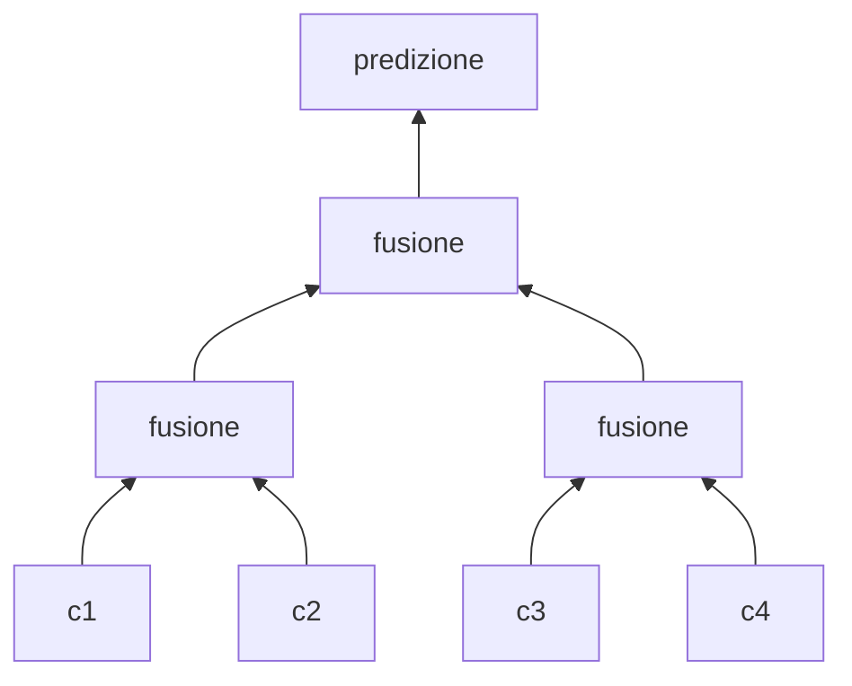
```mermaid
flowchart BT
    a1[c1] --> b1[fusione]
    a2[c2] --> b1
    a3[c3] --> b2[fusione]
    a4[c4] --> b2
    b1 --> c[fusione]
    b2 --> c
    c --> out[predizione]
```


#### 💻 Codice: `code/python/v04_init_batchnorm.py` — perché l'inizializzazione conta: saturazione di tanh e BatchNorm

```python
"""Video 4: perché l'inizializzazione conta. Statistiche delle attivazioni in una rete tanh a 6 strati."""
import torch
torch.manual_seed(0)
N, D, L = 1000, 100, 6
x0 = torch.randn(N, D)

def run(scale_fn, batchnorm=False):
    x, rows = x0, []
    for i in range(L):
        W = torch.randn(D, D) * scale_fn(D)
        h = x @ W
        if batchnorm:
            h = (h - h.mean(0)) / (h.std(0) + 1e-5)
        x = torch.tanh(h)
        rows.append((i + 1, x.std().item(), (x.abs() > 0.97).float().mean().item() * 100))
    return rows

cases = {
    "troppo piccola (0.01)":      (lambda d: 0.01, False),
    "troppo grande (1.0)":        (lambda d: 1.0, False),
    "Kaiming (5/3)/sqrt(fan_in)": (lambda d: (5 / 3) / d ** 0.5, False),
    "pesi grandi + BatchNorm":    (lambda d: 1.0, True),
}
for name, (fn, bn) in cases.items():
    print(f"\n{name}")
    print("  strato   std attivazioni   % saturi (|tanh|>0.97)")
    for i, s, sat in run(fn, bn):
        print(f"  {i:^6}   {s:^15.3f}   {sat:^10.1f}")
```

**Output reale** (eseguito durante la scrittura, `code/python/outputs/v04_init_batchnorm.txt`):

```text

troppo piccola (0.01)
  strato   std attivazioni   % saturi (|tanh|>0.97)
    1           0.099           0.0    
    2           0.010           0.0    
    3           0.001           0.0    
    4           0.000           0.0    
    5           0.000           0.0    
    6           0.000           0.0    

troppo grande (1.0)
  strato   std attivazioni   % saturi (|tanh|>0.97)
    1           0.959           83.5   
    2           0.958           82.7   
    3           0.957           82.5   
    4           0.957           82.7   
    5           0.958           82.9   
    6           0.958           82.9   

Kaiming (5/3)/sqrt(fan_in)
  strato   std attivazioni   % saturi (|tanh|>0.97)
    1           0.758           20.8   
    2           0.690           9.4    
    3           0.666           6.8    
    4           0.656           5.9    
    5           0.649           5.3    
    6           0.647           5.2    

pesi grandi + BatchNorm
  strato   std attivazioni   % saturi (|tanh|>0.97)
    1           0.628           3.6    
    2           0.629           3.6    
    3           0.631           3.5    
    4           0.632           3.4    
    5           0.632           3.4    
    6           0.632           3.4
```


---


## Video 5 — makemore Part 4: Becoming a Backprop Ninja (1:55:24)

🔗 <https://www.youtube.com/watch?v=q8SA3rM6ckI> · Libro: [cap. 4, §4.4](book/04_training_sano.md)

**Obiettivo:** calcolare **a mano** i gradienti di tutta la rete (MLP + BatchNorm), a livello di tensori, e confrontarli con PyTorch.

#### Mappa dei capitoli (timestamp ufficiali)
| Tempo | Capitolo | Cosa si impara |
|---|---|---|
| 0:00 | intro: why you should care & fun history | la backprop "a mano" insegna a riconoscere i bug; breve storia |
| 7:26 | starter code | |
| 13:01 | exercise 1: backproping the atomic compute graph | si scompone il forward in passi minimi e si propaga un gradiente alla volta; verifica con `cmp` |
| 1:05:17 | digression: Bessel's correction in batchnorm | varianza con `n−1` (stimatore non distorto) vs `n`: incoerenza storica fra training e inferenza |
| 1:26:31 | exercise 2: cross entropy loss backward pass | formula chiusa: `dlogits = softmax − onehot`, diviso per N |
| 1:36:37 | exercise 3: batch norm layer backward pass | derivata analitica compatta della BN |
| 1:50:02 | exercise 4: putting it all together | training senza `loss.backward()` |
| 1:54:24 | outro | |

#### Concetti chiave
- **La forma del gradiente = forma del tensore**: ottimo controllo di sanità.
- Broadcasting in avanti ⇒ **somma** all'indietro (e viceversa).
- Il prodotto matriciale `C = A@B` ha gradienti `dA = dC @ Bᵀ`, `dB = Aᵀ @ dC`.
- Le derivate chiuse (softmax+CE, BN) sono molto più semplici dell'espansione nodo per nodo.

#### Formule
```
C = A @ B       →  dA = dC @ Bᵀ ;  dB = Aᵀ @ dC
softmax+CE      →  dlogits = (p − y_onehot) / N
broadcast fwd   →  somma sulle dimensioni broadcastate nel bwd
```

#### Trappole
1. Dimenticare di sommare lungo le dimensioni broadcastate.
2. Confrontare con tolleranze sbagliate (`allclose` vs uguaglianza esatta).
3. `n` vs `n−1` nella varianza.

#### Esercizi
1. Deriva a mano `d/dW` di un layer lineare + tanh e verifica con PyTorch.
2. Implementa la backward della LayerNorm (formula chiusa).

#### Quiz
1. *Perché `dlogits = p − y`?* — la derivata di CE∘softmax si semplifica elegantemente.
2. *Perché fare backprop manuale se esiste autograd?* — per capire, diagnosticare gradienti esplosi/nulli e scrivere kernel custom.

---


## Video 6 — makemore Part 5: Building a WaveNet (56:22)

🔗 <https://www.youtube.com/watch?v=t3YJ5hKiMQ0> · Libro: [cap. 4, §4.5](book/04_training_sano.md)

> ⚠️ YouTube **non espone capitoli** per questo video: la mappa sotto è **ricostruita da me** dal contenuto descritto («MLP reso più profondo con struttura ad albero, simile a un'architettura convoluzionale tipo WaveNet») e va verificata guardando il video.

**Obiettivo:** rendere il modello più profondo fondendo il contesto **in modo gerarchico** (a coppie), anticipando le reti convoluzionali.

#### Mappa ricostruita
| Parte | Cosa si impara |
|---|---|
| Ripartenza dal codice dei video precedenti | contesto portato a 8 caratteri; ricomposizione in moduli |
| Moduli stile PyTorch (`Embedding`, `FlattenConsecutive`, `Sequential`) | si costruisce una mini-libreria di layer |
| Fusione gerarchica | invece di concatenare 8 caratteri in un colpo, si fondono 2 per volta in 3 livelli |
| Bug con BatchNorm su tensori a 3 dimensioni | le statistiche vanno calcolate su più dimensioni (batch e posizione) |
| Confronto loss | il modello gerarchico migliora a parità di parametri, ma l'allenamento richiede più cura |
| Cenni a convoluzioni causali dilatate | lo stesso schema, calcolato in modo efficiente |

#### Concetti chiave
- **Gerarchia**: info locali fuse progressivamente (come i filtri dilatati di WaveNet).
- Costruire **blocchi riusabili** (`Sequential`) riduce i bug.
- Forma dei tensori e dimensioni di BN sono la fonte principale di errori.
- Il training resta lento senza un buon **set-up sperimentale** (dev loss, curve) — Karpathy lo evidenzia come tema aperto.

#### Trappole
1. BN che calcola le statistiche solo sull'ultima dimensione dopo il reshape.
2. Perdere il collegamento tra la forma `(B, T, C)` e ciò che significa ogni asse.

#### Esercizi
1. Cambia il contesto a 16 e aggiungi un livello di fusione.
2. Confronta una concatenazione "piatta" con quella gerarchica a parità di parametri.

#### Quiz
1. *Qual è il vantaggio della fusione a coppie?* — il campo recettivo cresce esponenzialmente con la profondità, con pochi parametri.
2. *Cosa viene poi sostituito dall'attention?* — la fusione fissa e locale diventa una selezione appresa e dinamica di *quali* posizioni combinare.

---


## Video 7 — Let's build GPT: da zero, in codice (1:56:20)

🔗 <https://www.youtube.com/watch?v=kCc8FmEb1nY> · Codice: [`attention.py`](code/python/attention.py) · Libro: [cap. 5](book/05_transformer_gpt.md)

**Obiettivo:** costruire un Transformer *decoder-only* (stile GPT) su testo (Shakespeare, a livello di carattere), seguendo «Attention Is All You Need».

#### Mappa dei capitoli (timestamp ufficiali)
| Tempo | Capitolo | Cosa si impara |
|---|---|---|
| 0:00 | intro: ChatGPT, Transformers, nanoGPT, Shakespeare | |
| 7:52 | reading and exploring the data | dataset testuale, vocabolario di caratteri |
| 9:28 | tokenization, train/val split | encode/decode a caratteri, split 90/10 |
| 14:27 | data loader: batches of chunks | campioni casuali di finestre `block_size`; target = input spostato di 1 |
| 22:11 | simplest baseline: bigram language model | riferimento minimo; loss iniziale attesa ≈ 4.17 (`ln 65`) |
| 34:53 | training the bigram model | |
| 38:00 | port our code to a script | |
| 42:13 | version 1: averaging past context with for loops | media dei token precedenti: forma più debole di aggregazione |
| 47:11 | the trick: matrix multiply as weighted aggregation | matrice triangolare × X = medie cumulative |
| 51:54 | version 2: using matrix multiply | |
| 54:42 | version 3: adding softmax | `masked_fill(-inf)` + softmax → pesi che sommano a 1 |
| 58:26 | minor code cleanup | |
| 1:00:18 | positional encoding | embedding di posizione appreso |
| 1:02:00 | **THE CRUX: version 4: self-attention** | Q, K, V; pesi dipendenti dai dati; testa singola |
| 1:11:38 | note 1: attention as communication | nodi di un grafo orientato che si scambiano messaggi |
| 1:12:46 | note 2: no notion of space, operates over sets | per questo servono le posizioni |
| 1:13:40 | note 3: no communication across batch dimension | gli esempi del batch sono indipendenti |
| 1:14:14 | note 4: encoder vs decoder blocks | la maschera triangolare distingue il decoder |
| 1:15:39 | note 5: attention vs self- vs cross-attention | dove nascono Q, K, V |
| 1:16:56 | note 6: "scaled" attention, why divide by √head_size | tiene la varianza ≈ 1, softmax non satura |
| 1:19:11 | inserting a single self-attention block | |
| 1:21:59 | multi-headed self-attention | più teste in parallelo, concatenate |
| 1:24:25 | feedforward layers of the transformer block | calcolo per-token dopo la comunicazione |
| 1:26:48 | residual connections | `x + f(x)` + proiezione |
| 1:32:51 | layernorm (and its relation to batchnorm) | normalizza per token; pre-norm |
| 1:37:49 | scaling up the model, adding dropout | iperparametri, regolarizzazione |
| 1:42:39 | encoder vs decoder vs both Transformers | |
| 1:46:22 | quick walkthrough of nanoGPT | teste "batched" in un unico tensore |
| 1:48:53 | back to ChatGPT, GPT-3, pretraining vs finetuning, RLHF | quello costruito è solo il **pretraining** |
| 1:54:32 | conclusions | |

#### Concetti chiave
- `softmax(QKᵀ/√d)·V` con **maschera causale**.
- **Comunicazione** (attention) alternata a **calcolo** (MLP).
- Residui + LayerNorm = reti profonde allenabili.
- Il modello costruito è un *base model*: completa testo, non risponde a istruzioni.

#### Formule
```
Attention(Q,K,V) = softmax( QKᵀ/√d_k + M ) V     M = 0 sotto/sulla diagonale, −∞ sopra
Block:  x = x + MHA(LN(x));  x = x + MLP(LN(x))
```

#### Trappole
1. Dimenticare la maschera → il modello "bara" vedendo il futuro (loss irrealisticamente bassa).
2. Non dividere per `√d` → softmax satura.
3. Contesto più lungo del `block_size` a generazione: tagliare l'input.

#### Esercizi
1. Disegna a mano la matrice dei pesi per 4 token e confrontala con [`attention.py`](code/python/attention.py).
2. Rimuovi i residui e osserva quanto peggiora il training.
3. Aggiungi la generazione con temperatura e top-k ([`sampling.py`](code/python/sampling.py)).

#### Quiz
1. *Query, Key, Value in una frase?* — Q: cosa cerco; K: cosa offro; V: cosa trasmetto.
2. *Perché serve la codifica posizionale?* — l'attention è invariante all'ordine.
3. *Perché 4× nell'MLP?* — più capacità di calcolo per token; scelta storica del paper.

### 📖 Approfondimento: Il Transformer


*Video 7: «Let's build GPT: from scratch, in code, spelled out» (1h56) — paper «Attention Is All You Need» (2017)*

##### 5.1 L'idea: ogni token "guarda" i token precedenti
Per prevedere il prossimo token servono le informazioni dei token passati — ma **non tutte con lo stesso peso**. La *self-attention* calcola questi pesi dinamicamente.

Ogni token produce tre vettori:
- **Query (Q)**: *"cosa sto cercando?"*
- **Key (K)**: *"cosa contengo?"*
- **Value (V)**: *"cosa comunico se mi scegli?"*

`Attention(Q,K,V) = softmax( Q·Kᵀ / √d ) · V`

La divisione per `√d` evita che i prodotti scalari diventino enormi (softmax satura → gradienti nulli).

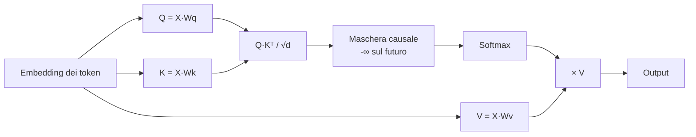
```mermaid
flowchart LR
    X[Embedding dei token] --> Q[Q = X·Wq]
    X --> K[K = X·Wk]
    X --> V[V = X·Wv]
    Q --> S["Q·Kᵀ / √d"]
    K --> S
    S --> M[Maschera causale<br/>-∞ sul futuro]
    M --> SM[Softmax]
    SM --> O["× V"]
    V --> O
    O --> Y[Output]
```

##### 5.2 La maschera causale
Un modello *decoder-only* (GPT, Llama, Mistral...) **non può vedere il futuro**: la matrice dei punteggi è resa triangolare inferiore.

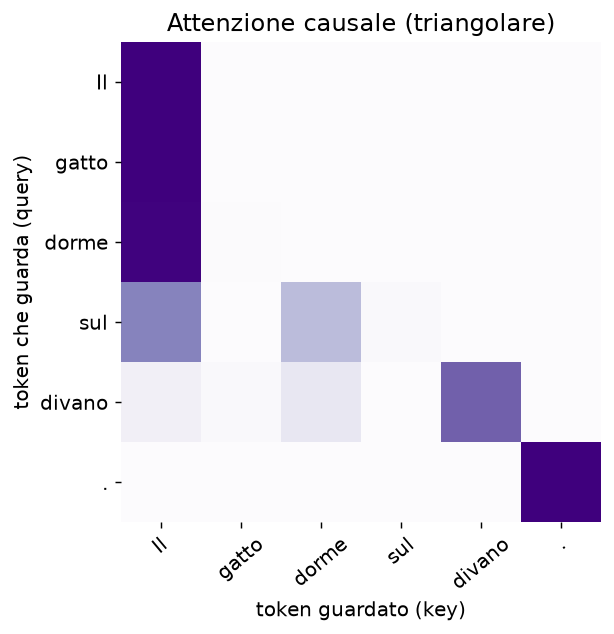

Codice reale ([`attention.py`](code/python/attention.py)): le righe sommano a 1 e sopra la diagonale c'è zero.

```python
scores = q @ k.T / np.sqrt(k.shape[-1])
scores = np.where(np.tril(np.ones((T, T), bool)), scores, -np.inf)
att = softmax(scores)          # (T, T), triangolare
out = att @ v
```

##### 5.3 Multi-head attention
Si eseguono *h* teste di attenzione in parallelo (ognuna con dimensione `d/h`) e si concatenano: teste diverse imparano relazioni diverse (sintassi, coreferenze, posizione...).

##### 5.4 Il blocco Transformer

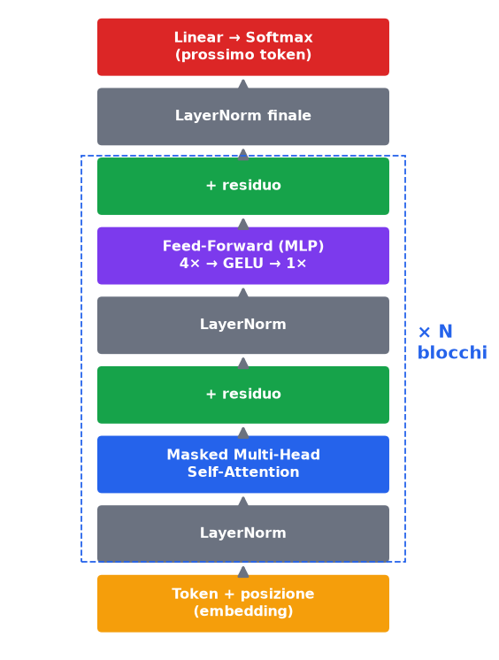

| Componente | Ruolo |
|---|---|
| Embedding + posizione | il modello non ha nozione d'ordine: la si aggiunge |
| Self-attention | **comunicazione** tra token |
| MLP (feed-forward) | **calcolo** su ogni token (4× più largo, poi GELU) |
| Residual + LayerNorm | rende trainabili reti profonde |
| Linear + softmax finale | distribuzione sul vocabolario |

Il blocco si ripete N volte (GPT-2 small: 12; modelli grandi: 32–120+).

##### 5.5 Generare testo
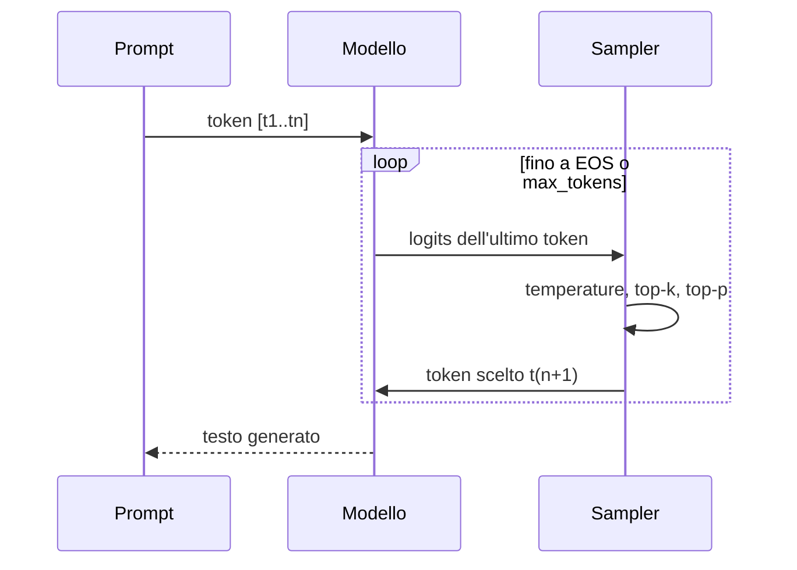
```mermaid
sequenceDiagram
    participant U as Prompt
    participant M as Modello
    participant S as Sampler
    U->>M: token [t1..tn]
    loop fino a EOS o max_tokens
        M->>S: logits dell'ultimo token
        S->>S: temperature, top-k, top-p
        S->>M: token scelto t(n+1)
    end
    M-->>U: testo generato
```

Ogni nuovo token richiede un passaggio nel modello; per non ricalcolare tutto si usa la **KV-cache** (cap. 10).

##### 5.6 Encoder, decoder, encoder-decoder
| Tipo | Esempi | Uso |
|---|---|---|
| Decoder-only | GPT, Llama, Mistral, Qwen | generazione (chat) |
| Encoder-only | BERT | embedding, classificazione |
| Encoder-decoder | T5 | traduzione |

I **modelli di embedding** (`nomic-embed-text`, ecc.) usati nel RAG sono di tipo encoder.


#### 💻 Codice: `code/python/attention.py` — self-attention causale in NumPy

```python
"""Self-attention causale a una testa in NumPy (video 7, 'Let's build GPT')."""
import numpy as np

def softmax(x, axis=-1):
    x = x - x.max(axis=axis, keepdims=True)
    e = np.exp(x)
    return e / e.sum(axis=axis, keepdims=True)

def causal_self_attention(x, Wq, Wk, Wv):
    T, _ = x.shape
    q, k, v = x @ Wq, x @ Wk, x @ Wv
    scores = q @ k.T / np.sqrt(k.shape[-1])              # (T, T) similarità
    mask = np.tril(np.ones((T, T), dtype=bool))           # vietato guardare il futuro
    scores = np.where(mask, scores, -np.inf)
    att = softmax(scores)                                 # righe che sommano a 1
    return att @ v, att

if __name__ == "__main__":
    rng = np.random.default_rng(0)
    T, C, H = 5, 8, 4
    x = rng.normal(size=(T, C))
    out, att = causal_self_attention(x, *(rng.normal(size=(C, H)) for _ in range(3)))
    np.set_printoptions(precision=2, suppress=True)
    print("pesi di attenzione (triangolare inferiore):\n", att)
    print("somma righe:", att.sum(axis=1), " output shape:", out.shape)
```

**Output reale** (eseguito durante la scrittura, `code/python/outputs/attention.txt`):

```text
pesi di attenzione (triangolare inferiore):
 [[1.   0.   0.   0.   0.  ]
 [1.   0.   0.   0.   0.  ]
 [0.81 0.19 0.   0.   0.  ]
 [0.   0.01 0.98 0.01 0.  ]
 [0.   0.45 0.04 0.51 0.  ]]
somma righe: [1. 1. 1. 1. 1.]  output shape: (5, 4)
```


#### 💻 Codice: `code/python/v07_mini_gpt.py` — mini-GPT completo in PyTorch, allenato su CPU

```python
"""Video 7: un mini-GPT a caratteri (decoder-only) in PyTorch, allenabile su CPU in ~1-2 minuti.
ATTENZIONE: il corpus è minuscolo e ripetuto 6 volte, quindi la loss di validazione NON misura la generalizzazione
(il val set contiene testo già visto): il modello memorizza. Serve a mostrare la meccanica, non la qualità.
Contiene: embedding token+posizione, self-attention causale multi-testa, MLP, residui, LayerNorm, generazione."""
import time, torch, torch.nn as nn, torch.nn.functional as F

TEXT = """un modello di linguaggio prevede il prossimo token dato il contesto. la rete neurale impara dai dati riducendo l errore.
il gradiente indica la direzione in cui cambiare i pesi per ridurre la loss. la backpropagation calcola i gradienti con la regola della catena.
il transformer usa l attenzione per far comunicare i token tra loro. ogni token guarda solo i token precedenti grazie alla maschera causale.
il tokenizer trasforma il testo in numeri. l embedding trasforma i numeri in vettori. il vettore contiene il significato del token.
spring ai permette di usare un modello di linguaggio da java. ollama esegue il modello in locale sul computer.
il rag cerca i documenti rilevanti e li aggiunge al prompt prima di chiedere la risposta al modello.
""" * 6

torch.manual_seed(1337)
chars = sorted(set(TEXT)); V = len(chars)
stoi = {c: i for i, c in enumerate(chars)}; itos = {i: c for c, i in stoi.items()}
data = torch.tensor([stoi[c] for c in TEXT])
n = int(0.9 * len(data)); train, val = data[:n], data[n:]
B, T, C, H, L = 32, 64, 64, 4, 3          # batch, contesto, embedding, teste, strati
print("NB: corpus ripetuto -> val non indipendente (il modello memorizza)")
print(f"caratteri: {len(TEXT)}  vocabolario: {V}  loss casuale attesa ln(V) = {torch.log(torch.tensor(float(V))).item():.3f}")

def batch(split):
    d = train if split == "train" else val
    ix = torch.randint(len(d) - T - 1, (B,))
    return torch.stack([d[i:i + T] for i in ix]), torch.stack([d[i + 1:i + T + 1] for i in ix])

class Head(nn.Module):
    def __init__(self, hs):
        super().__init__()
        self.k, self.q, self.v = (nn.Linear(C, hs, bias=False) for _ in range(3))
        self.register_buffer("mask", torch.tril(torch.ones(T, T)))
    def forward(self, x):
        t = x.shape[1]
        k, q, v = self.k(x), self.q(x), self.v(x)
        w = q @ k.transpose(-2, -1) * k.shape[-1] ** -0.5          # (B,t,t)
        w = w.masked_fill(self.mask[:t, :t] == 0, float("-inf"))   # maschera causale
        return F.softmax(w, dim=-1) @ v

class Block(nn.Module):
    def __init__(self):
        super().__init__()
        self.heads = nn.ModuleList(Head(C // H) for _ in range(H))
        self.proj = nn.Linear(C, C)
        self.ff = nn.Sequential(nn.Linear(C, 4 * C), nn.GELU(), nn.Linear(4 * C, C))
        self.ln1, self.ln2 = nn.LayerNorm(C), nn.LayerNorm(C)
    def forward(self, x):
        x = x + self.proj(torch.cat([h(self.ln1(x)) for h in self.heads], dim=-1))
        return x + self.ff(self.ln2(x))

class MiniGPT(nn.Module):
    def __init__(self):
        super().__init__()
        self.tok, self.pos = nn.Embedding(V, C), nn.Embedding(T, C)
        self.blocks = nn.Sequential(*[Block() for _ in range(L)])
        self.ln, self.head = nn.LayerNorm(C), nn.Linear(C, V)
    def forward(self, idx, targets=None):
        x = self.tok(idx) + self.pos(torch.arange(idx.shape[1]))
        logits = self.head(self.ln(self.blocks(x)))
        loss = None if targets is None else F.cross_entropy(logits.view(-1, V), targets.view(-1))
        return logits, loss
    @torch.no_grad()
    def generate(self, idx, n_new, temperature=0.8, top_k=10):
        for _ in range(n_new):
            logits, _ = self(idx[:, -T:])
            logits = logits[:, -1] / temperature
            v, _ = torch.topk(logits, top_k); logits[logits < v[:, [-1]]] = -float("inf")
            idx = torch.cat([idx, torch.multinomial(F.softmax(logits, dim=-1), 1)], dim=1)
        return idx

model = MiniGPT()
print("parametri:", sum(p.numel() for p in model.parameters()))
opt = torch.optim.AdamW(model.parameters(), lr=3e-3)

@torch.no_grad()
def eval_loss(split):
    model.eval(); l = sum(model(*batch(split))[1].item() for _ in range(10)) / 10; model.train(); return l

t0 = time.time()
for step in range(1500):
    xb, yb = batch("train")
    _, loss = model(xb, yb)
    opt.zero_grad(set_to_none=True); loss.backward()
    torch.nn.utils.clip_grad_norm_(model.parameters(), 1.0)
    opt.step()
    if step % 300 == 0 or step == 1499:
        print(f"step {step:4d}  train {eval_loss('train'):.3f}  val {eval_loss('val'):.3f}  ({time.time()-t0:.0f}s)")

prompt = torch.tensor([[stoi[c] for c in "il transformer "]])
print("\n--- testo generato ---")
print("".join(itos[i] for i in model.generate(prompt, 200)[0].tolist()))
```

**Output reale** (eseguito durante la scrittura, `code/python/outputs/v07_mini_gpt.txt`):

```text
NB: corpus ripetuto -> val non indipendente (il modello memorizza)
caratteri: 4500  vocabolario: 25  loss casuale attesa ln(V) = 3.219
parametri: 156825
step    0  train 3.076  val 3.088  (0s)
step  300  train 0.132  val 0.133  (8s)
step  600  train 0.084  val 0.087  (16s)
step  900  train 0.076  val 0.073  (23s)
step 1200  train 0.074  val 0.073  (31s)
step 1499  train 0.069  val 0.071  (38s)

--- testo generato ---
il transformer usa l attenzione per far comunicare i token tra loro. ogni token guarda solo i token precedenti grazie alla maschera causale.
il tokenizer trasforma il testo in numeri. l embedding trasforma i numeri
```


---


## Video 8 — State of GPT (Microsoft Build 2023, 42:40)

🔗 <https://www.youtube.com/watch?v=bZQun8Y4L2A> · Libro: [cap. 7](book/07_dal_pretraining_all_assistente.md)

> ⚠️ Nessun capitolo ufficiale su YouTube per questo video. La struttura è ricostruita dalla descrizione («pipeline di training degli assistenti GPT: tokenizzazione, pretraining, supervised finetuning, RLHF») e dalla mia conoscenza: **verifica i dettagli guardando il video**.

**Obiettivo:** panoramica da conferenza su come si addestra un assistente tipo ChatGPT e come usarlo bene.

#### Struttura ricostruita
| Parte | Contenuto |
|---|---|
| 1. Pipeline di training | pretraining → SFT → reward modeling → RL (RLHF) |
| 2. Dati e tokenizzazione | mix di web, libri, codice; testo → token → sequenze |
| 3. Pretraining | next-token prediction su trilioni di token; costo enorme; produce il *base model* |
| 4. SFT | dataset di dialoghi di alta qualità; trasforma il base model in assistente |
| 5. Reward model & RLHF | modello che predice preferenze umane; ottimizzazione contro quel modello |
| 6. Perché RLHF funziona | confrontare risposte è più facile che scriverle; contro: minor diversità |
| 7. Usare gli LLM bene | prompt chiari, *few-shot*, «lascia pensare il modello» (chain of thought), self-consistency, riflessione |
| 8. Strumenti e contesto | retrieval/plugin, memoria del contesto, calcolatrici/codice |
| 9. Limiti | allucinazioni, bias, errori di ragionamento, prompt injection, knowledge cutoff |
| 10. Raccomandazioni | usare come assistente con supervisione umana, in domini a basso rischio |

#### Concetti chiave
- Il modello base **non è un assistente**: va "indirizzato" (SFT/RLHF).
- Ogni token ha lo **stesso budget di calcolo** → i compiti difficili vanno spezzati in più token (ragionamento esplicito).
- Il contesto è la *memoria di lavoro*; ciò che non c'è nel prompt può non esistere per il modello → RAG.

#### Esercizi
1. Prendi un compito (es. estrazione dati) e confronta *zero-shot* vs *few-shot*.
2. Aggiungi «ragiona passo passo» e misura se la correttezza migliora.

#### Quiz
1. *Perché il pretraining costa quasi tutto?* — enormi quantità di dati e calcolo; le fasi successive usano molti meno dati.
2. *Perché RLHF?* — è più facile per gli umani giudicare che scrivere risposte ideali.

### 📖 Approfondimento: Dal pretraining all'assistente (video 8 e 10)


*Video 8: «State of GPT» (42 min, Microsoft Build) · Video 10: «Let's reproduce GPT-2 (124M)» (4h01)*

##### 7.1 La pipeline in quattro stadi

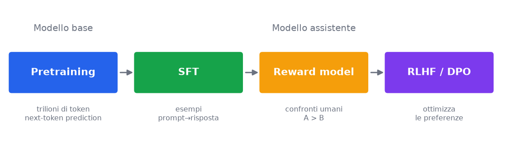

| Stadio | Dati | Obiettivo | Risultato |
|---|---|---|---|
| **Pretraining** | trilioni di token (web, libri, codice) | prevedere il token successivo | *modello base*: completa testo, non risponde |
| **SFT** (Supervised Fine-Tuning) | decine/centinaia di migliaia di dialoghi di qualità | imitare risposte ideali | modello che segue istruzioni |
| **Reward model** | confronti umani «A è meglio di B» | predire la preferenza | un "giudice" numerico |
| **RLHF / DPO** | prompt + giudice | massimizzare la preferenza | assistente allineato, utile e sicuro |

Il 99% del calcolo (e del costo) è nel **pretraining**. Le fasi successive sono più economiche e "modellano il comportamento".

##### 7.2 Riprodurre GPT-2 (124M): cosa serve davvero
Nel video si ricostruisce GPT-2 small (12 layer, 12 teste, embedding 768, contesto 1024) e lo si allena su FineWeb-Edu. Le ottimizzazioni sono la lezione più preziosa:

| Ottimizzazione | Effetto |
|---|---|
| Precisione mista (**bf16**/TF32) | meno memoria e molto più veloce su GPU moderne |
| `torch.compile` | fonde operazioni, meno accessi alla memoria |
| **FlashAttention** | attention senza materializzare la matrice T×T |
| Vocabolario "numero bello" (50257→50304) | multiplo di 64: kernel GPU più efficienti |
| AdamW + weight decay 0.1 | ottimizzatore standard degli LLM |
| Warmup + cosine decay del `lr` | stabilità all'inizio, convergenza alla fine |
| **Gradient clipping** (norma ≤ 1) | evita esplosioni |
| Gradient accumulation | emula batch enormi (~0.5M token) con poca VRAM |
| DDP multi-GPU | scala su più schede |
| *Weight tying* embedding/uscita | meno parametri, miglior qualità |

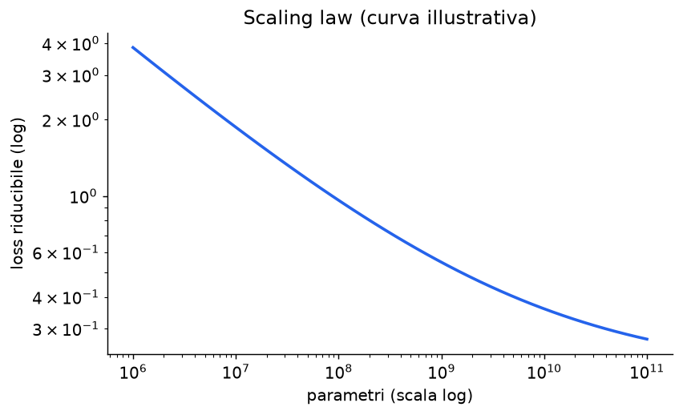

Le **scaling law** (Kaplan 2020, Chinchilla 2022): la loss scende prevedibilmente come legge di potenza con parametri, dati e calcolo. Per questo i laboratori "scommettono" su modelli sempre più grandi.

##### 7.3 Allucinazioni e limiti (dal "State of GPT")
- Un LLM è un **simulatore di testo plausibile**, non un database: può inventare.
- Il contesto è la sua **memoria di lavoro**: ciò che non è nel prompt, per lui spesso non esiste → **RAG**.
- Soggetto a *prompt injection*, bias, errori di ragionamento: servono verifiche e guardrail (cap. 14).
- Suggerimento di Karpathy: usare gli LLM come **assistenti con supervisione**, con prompt chiari, esempi (*few-shot*), strumenti esterni e controllo umano.


---


## Video 9 — Let's build the GPT Tokenizer (2:13:35)

🔗 <https://www.youtube.com/watch?v=zduSFxRajkE> · Codice: [`bpe.py`](code/python/bpe.py) · Libro: [cap. 6](book/06_tokenizer.md)

**Obiettivo:** capire e implementare il tokenizer (BPE), e perché molte stranezze degli LLM nascono lì.

#### Mappa dei capitoli (timestamp ufficiali)
| Tempo | Capitolo | Cosa si impara |
|---|---|---|
| 0:00 | intro: Tokenization, GPT-2 paper, issues | problemi tipici legati ai token |
| 5:50 | tokenization by example in a Web UI (tiktokenizer) | spazi, maiuscole, numeri e lingue diverse cambiano i token |
| 14:56 | strings in Python, Unicode code points | `ord()`/`chr()` |
| 18:15 | Unicode byte encodings: ASCII, UTF-8, UTF-16, UTF-32 | UTF-8 è la base dei tokenizer moderni |
| 22:47 | daydreaming: deleting tokenization | l'ideale sarebbe lavorare sui byte grezzi |
| 23:50 | Byte Pair Encoding algorithm walkthrough | fusione iterativa della coppia più frequente |
| 27:02 | starting the implementation | |
| 28:35 | counting consecutive pairs, most common pair | |
| 30:36 | merging the most common pair | |
| 34:58 | training the tokenizer: while loop, compression ratio | vocabolario = 256 + n_merge |
| 39:20 | tokenizer/LLM diagram: a completely separate stage | allenato a parte, con dati propri |
| 42:47 | decoding tokens to strings | attenzione ai byte UTF-8 non validi |
| 48:21 | encoding strings to tokens | applicare i merge nell'ordine di training |
| 57:36 | regex patterns to force splits across categories | impedisce di fondere lettere, numeri, punteggiatura |
| 1:11:38 | tiktoken library, GPT-2 vs GPT-4 regex | |
| 1:14:59 | GPT-2 encoder.py walkthrough | |
| 1:18:26 | special tokens | `<|endoftext|>` e simili, gestiti a parte |
| 1:25:28 | minbpe exercise | scrivi il tuo tokenizer GPT-4 |
| 1:28:42 | sentencepiece library, used for Llama 2 | BPE sui code point, fallback ai byte |
| 1:43:27 | how to set vocabulary size | compromesso fra lunghezza sequenza e embedding table |
| 1:48:11 | training new tokens, prompt compression | aggiungere token per comprimere i prompt |
| 1:49:58 | multimodal tokenization (vector quantization) | immagini/audio come token |
| 1:51:41 | revisiting the quirks of LLM tokenization | spiega errori su ortografia, aritmetica, lingue non inglesi, token "SolidGoldMagikarp" |
| 2:10:20 | final recommendations | |
| 2:12:50 | ??? :) | |

#### Concetti chiave
- **BPE**: da 256 byte a un vocabolario di sottoparole massimizzando la compressione.
- Il tokenizer è **separato dal modello**: cambiarlo = riaddestrare.
- Lingue diverse dall'inglese, codice, numeri e spazi sono tokenizzati con efficienza diversa → **costi e contesto** diversi.
- Molti difetti attribuiti al «modello» sono difetti di **tokenizzazione**.

#### Esercizi
1. Estendi [`bpe.py`](code/python/bpe.py) con `decode()` e verifica `decode(encode(s)) == s` anche con emoji.
2. Confronta i token per la stessa frase in italiano e inglese (libreria `tiktoken` o `transformers`).
3. Allena un BPE su un testo italiano e osserva i primi 20 merge.

#### Quiz
1. *Perché partire dai byte?* — nessun carattere "sconosciuto", qualsiasi stringa è codificabile.
2. *Perché la regex di pre-split?* — evita fusioni indesiderabili (`dog.` + `dog!`) e migliora la qualità del vocabolario.
3. *Perché l'italiano costa più token?* — il vocabolario è tipicamente addestrato su più inglese.

### 📖 Approfondimento: Il tokenizer


*Video 9: «Let's build the GPT Tokenizer» (2h13)*

##### 6.1 Perché non lavorare sui caratteri?
I caratteri producono sequenze lunghissime (attention costa O(T²)); le parole intere hanno vocabolari enormi e non gestiscono parole nuove. Soluzione: **sottoparole** con **Byte Pair Encoding (BPE)**.

##### 6.2 L'algoritmo BPE
1. Parti dai **byte UTF-8** (256 simboli).
2. Trova la **coppia adiacente più frequente**.
3. Sostituiscila con un nuovo simbolo (id 256, 257, ...).
4. Ripeti N volte: il vocabolario finale = 256 + N.

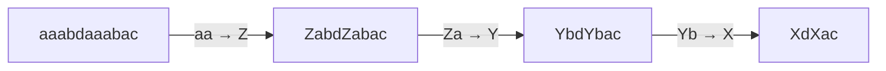
```mermaid
flowchart LR
    A["aaabdaaabac"] -->|"aa → Z"| B["ZabdZabac"]
    B -->|"Za → Y"| C["YbdYbac"]
    C -->|"Yb → X"| D["XdXac"]
```

Esecuzione reale ([`bpe.py`](code/python/bpe.py)):
```
merge appresi: {(97, 97): 256, (256, 97): 257, (257, 98): 258}
byte originali: 23 -> token: 11
```

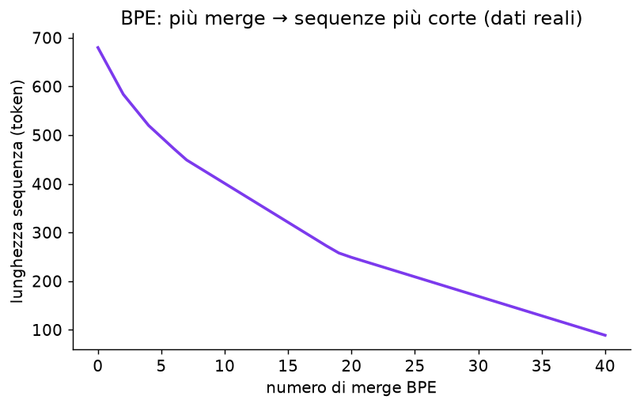

##### 6.3 Cosa c'è di vero nei tokenizer di produzione
| Aspetto | Dettaglio |
|---|---|
| GPT-2 | ~50k token; regex che impedisce di fondere lettere/numeri/punteggiatura |
| GPT-4 (`cl100k`) | ~100k token; gestisce meglio spazi e codice |
| Token speciali | `<|endoftext|>`, marcatori dei ruoli della chat |
| SentencePiece | usato da Llama/Mistral, lavora direttamente sul testo con fallback sui byte |

##### 6.4 Il tokenizer spiega molte "stranezze" degli LLM
- **Contare lettere** (`strawberry`) fallisce: il modello vede token, non lettere.
- **Aritmetica**: i numeri sono spezzati in modo irregolare.
- **Italiano**: spesso più token per parola dell'inglese → **costo e contesto** consumati più in fretta.
- **Spazi finali** e maiuscole cambiano i token, quindi la risposta.

> Per il tuo progetto: la **finestra di contesto** e i **costi** si misurano *in token*, non in parole. Regola empirica: 1 token ≈ 4 caratteri in inglese, ≈ 3 in italiano.


#### 💻 Codice: `code/python/bpe.py` — Byte Pair Encoding minimale

```python
"""Byte Pair Encoding minimale (video 9, 'GPT Tokenizer')."""
from collections import Counter

def merge(ids, pair, new_id):
    out, i = [], 0
    while i < len(ids):
        if i < len(ids) - 1 and (ids[i], ids[i + 1]) == pair:
            out.append(new_id); i += 2
        else:
            out.append(ids[i]); i += 1
    return out

def train(text, n_merges):
    ids, merges = list(text.encode("utf-8")), {}
    for k in range(n_merges):
        pair, _ = Counter(zip(ids, ids[1:])).most_common(1)[0]
        merges[pair] = 256 + k
        ids = merge(ids, pair, 256 + k)
    return merges

def encode(text, merges):
    ids = list(text.encode("utf-8"))
    for pair, new_id in merges.items():   # ordine di inserimento = ordine di training
        ids = merge(ids, pair, new_id)
    return ids

if __name__ == "__main__":
    text = "aaabdaaabac aaabdaaabac"
    m = train(text, 3)
    print("merge appresi:", m)
    print("byte originali:", len(text.encode()), "-> token:", len(encode(text, m)))
```

**Output reale** (eseguito durante la scrittura, `code/python/outputs/bpe.txt`):

```text
merge appresi: {(97, 97): 256, (256, 97): 257, (257, 98): 258}
byte originali: 23 -> token: 11
```


---


## Video 10 — Let's reproduce GPT-2 (124M) (4:01:26)

🔗 <https://www.youtube.com/watch?v=l8pRSuU81PU> · Libro: [cap. 7](book/07_dal_pretraining_all_assistente.md)

**Obiettivo:** costruire GPT-2 small, ottimizzarne il training su GPU e allenarlo davvero (tecniche da produzione).

#### Mappa dei capitoli (timestamp ufficiali)
| Tempo | Capitolo | Cosa si impara |
|---|---|---|
| 0:00 | intro | |
| 3:39 | exploring the GPT-2 (124M) OpenAI checkpoint | forma dei pesi: embedding, posizioni, blocchi |
| 13:47 | **SECTION 1:** implementing the GPT-2 nn.Module | |
| 28:08 | loading the huggingface/GPT-2 parameters | si verifica la correttezza caricando pesi ufficiali |
| 31:00 | forward pass to get logits | |
| 33:31 | sampling init, prefix tokens, tokenization | |
| 37:02 | sampling loop | top-k, generazione autoregressiva |
| 41:47 | sample, auto-detect the device | cpu / cuda / mps |
| 45:50 | let's train: data batches (B,T) → logits (B,T,C) | |
| 52:53 | cross entropy loss | |
| 56:42 | optimization loop: overfit a single batch | |
| 1:02:00 | data loader lite | |
| 1:06:14 | parameter sharing wte and lm_head | stessa matrice per embedding e uscita |
| 1:13:47 | model initialization: std 0.02, residual init | scala dei residui `1/√(2·n_layer)` |
| 1:22:18 | **SECTION 2:** let's make it fast | da ~1000 ms/step in giù |
| 1:28:14 | Tensor Cores, timing, TF32 | |
| 1:39:38 | float16, gradient scalers, bfloat16 | bf16: stesso range di fp32, niente scaler |
| 1:48:15 | torch.compile, Python overhead, kernel fusion | |
| 2:00:18 | flash attention | non materializza la matrice T×T |
| 2:06:54 | nice/ugly numbers: vocab 50257 → 50304 | multipli di potenze di 2 |
| 2:14:55 | **SECTION 3:** hyperparameters, AdamW, gradient clipping | |
| 2:21:06 | learning rate scheduler: warmup + cosine decay | |
| 2:26:21 | batch size schedule, weight decay, FusedAdamW | |
| 2:34:09 | gradient accumulation | batch grandi con poca memoria |
| 2:46:52 | distributed data parallel (DDP) | multi-GPU |
| 3:10:21 | datasets used in GPT-2, GPT-3, FineWeb (EDU) | qualità dei dati |
| 3:23:10 | validation split, validation loss, sampling revive | |
| 3:28:23 | evaluation: HellaSwag, starting the run | benchmark a scelta multipla |
| 3:43:05 | **SECTION 4:** results in the morning! | confronto con GPT-2/GPT-3 |
| 3:56:21 | shoutout to llm.c | stessa cosa in C/CUDA |
| 3:59:39 | summary, build-nanogpt repo | |

#### Concetti chiave
- Correttezza prima (carica i pesi ufficiali), **velocità** dopo (precisione mista, compile, flash attention).
- Il **batch effettivo** (~0.5M token) si ottiene con gradient accumulation e DDP.
- Schedule del learning rate e **clipping** stabilizzano l'ottimizzazione.
- La **qualità dei dati** (FineWeb-EDU) conta quanto l'architettura.

#### Formule / numeri
```
lr(t): warmup lineare → cosine decay fino al ~10% del massimo
batch effettivo = micro_batch × T × grad_accum × n_gpu
clip: g ← g · min(1, 1.0/‖g‖)
```

#### Trappole
1. `loss /= grad_accum` dimenticato nella gradient accumulation.
2. Non sincronizzare i gradienti DDP solo all'ultimo micro-step.
3. Confrontare le loss di run con tokenizer o dati diversi.

#### Esercizi
1. Misura ms/step passando da fp32 a bf16 e poi a `torch.compile`.
2. Traccia la curva di loss con diversi `lr` massimi.
3. Calcola quante ore servono per 10B token alla tua velocità.

#### Quiz
1. *Perché bf16 e non fp16?* — range esponente come fp32: niente gradient scaling.
2. *Cosa evita FlashAttention?* — scrivere in memoria la matrice di attenzione T×T.
3. *Cosa fa il weight tying?* — condivide la matrice di embedding con lo strato di uscita (meno parametri, spesso meglio).

---


# Parte III — LLM locale: Ollama, quantizzazione, LoRA


### 8.1 Perché non si addestra da zero
Ordine di grandezza (Karpathy, GPT-2 124M): ~4 ore su 8 GPU. Un modello da 70B su 15T token: migliaia di GPU per mesi, milioni di dollari. **Non è realistico per un'azienda normale**, e non serve: esistono ottimi modelli *open-weight*.

> **Open-weight ≠ open-source.** Di Llama/Mistral/Qwen/Gemma si scaricano i *pesi*, ma spesso non dati e codice di training; leggi **la licenza** prima dell'uso commerciale.

### 8.2 Strada 1 — Inferenza locale con Ollama
Ollama scarica, gestisce e serve modelli quantizzati con una semplice API REST su `localhost:11434`.

```bash
ollama pull llama3.2           # ~2 GB (3B, quantizzato Q4)
ollama run llama3.2 "Spiegami la backpropagation in 3 righe"
curl http://localhost:11434/api/chat -d '{
  "model": "llama3.2",
  "messages": [{"role":"user","content":"Ciao!"}],
  "stream": false
}'
```

#### Quantizzazione: comprimere i pesi
I pesi originali sono in 16 bit; si riducono a 8 o 4 bit con piccola perdita di qualità.

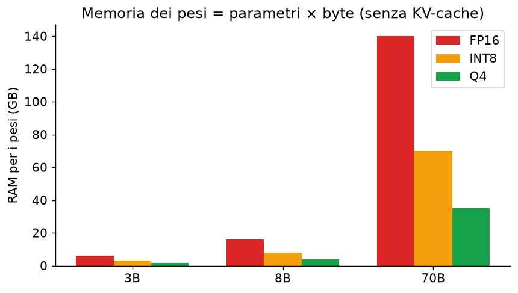

| Modello | FP16 | Q4 (≈) | Hardware indicativo |
|---|---|---|---|
| 3B | 6 GB | ~2 GB | laptop senza GPU |
| 8B | 16 GB | ~5 GB | GPU 8 GB / Mac 16 GB |
| 70B | 140 GB | ~40 GB | 2×GPU 24 GB / Mac 64 GB+ |

*(valori = parametri × byte per peso; a questi vanno aggiunti KV-cache e overhead.)*

### 8.3 Strada 2 — Fine-tuning con LoRA/QLoRA
Invece di aggiornare tutti i pesi, si **congelano** quelli originali e si allenano due matrici piccole per strato (**low-rank adaptation**).

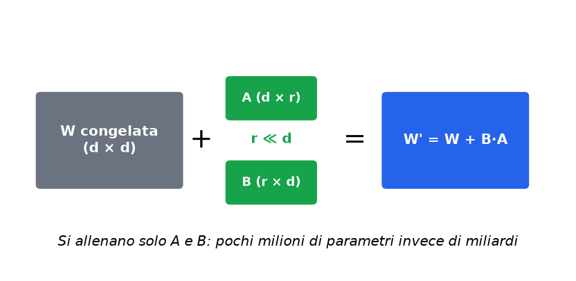

- **LoRA**: allena solo `A` e `B` (rango r tipico 8–64) → 0.1–1% dei parametri.
- **QLoRA**: come LoRA ma sul modello base **quantizzato a 4 bit** → fine-tuning di un 7–8B su una GPU da 12–24 GB.
- Il risultato è un piccolo "adapter" (decine di MB) da fondere nel modello e importare in Ollama tramite `Modelfile`.

**Quando ha senso:** cambiare *stile/formato/tono*, imparare un compito ripetitivo (classificazione, estrazione), ridurre i token del prompt. **Quando NO:** per "insegnare fatti" che cambiano → usa RAG.

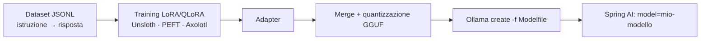
```mermaid
flowchart LR
    D[Dataset JSONL<br/>istruzione → risposta] --> T[Training LoRA/QLoRA<br/>Unsloth · PEFT · Axolotl]
    T --> A[Adapter]
    A --> G[Merge + quantizzazione GGUF]
    G --> O[Ollama create -f Modelfile]
    O --> S[Spring AI: model=mio-modello]
```

### 8.4 Strada 3 — RAG (la più comune in azienda)
Il modello non viene modificato: prima di rispondere, il sistema **recupera i passaggi rilevanti** dai tuoi documenti e li inserisce nel prompt.

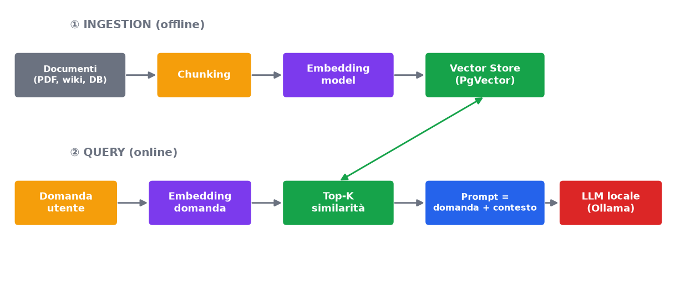

Vantaggi: conoscenza **aggiornabile in tempo reale**, **citazioni delle fonti**, controllo degli accessi per documento, nessun training. Lo implementeremo nel capitolo 12.

### 8.5 Quale scegliere?
| Esigenza | Prima scelta |
|---|---|
| Privacy: i dati non devono uscire | Inferenza locale (Ollama) |
| Rispondere sui documenti aziendali | **RAG** |
| Output in formato/stile rigido | Prompt + structured output → poi eventualmente LoRA |
| Agire su sistemi esistenti (ordini, CRM) | **Tool calling** verso API REST (cap. 13) |
| Dominio molto specifico, molti esempi etichettati | Fine-tuning |

Spesso si **combinano**: modello locale + RAG + tool calling, tutto orchestrato da Spring AI.

#### 💻 Codice: `code/python/v08_lora_da_zero.py` — LoRA da zero: congela W, allena solo A e B (≈3% dei parametri)

```python
"""Cap. 8 / Appendice A: LoRA da zero. Si congela un layer lineare e si allena solo la correzione a basso rango B·A."""
import torch, torch.nn as nn
torch.manual_seed(0)
D, R = 256, 4

class LoRALinear(nn.Module):
    def __init__(self, base: nn.Linear, r=R, alpha=8):
        super().__init__()
        self.base = base
        for p in self.base.parameters(): p.requires_grad = False       # pesi originali CONGELATI
        self.A = nn.Parameter(torch.randn(r, base.in_features) * 0.01)
        self.B = nn.Parameter(torch.zeros(base.out_features, r))        # B=0 → all'inizio W' = W
        self.scale = alpha / r
    def forward(self, x):
        return self.base(x) + (x @ self.A.T @ self.B.T) * self.scale

base = nn.Linear(D, D)
# "Compito nuovo": una trasformazione target = W originale + una correzione di rango 4
with torch.no_grad():
    U, V_ = torch.randn(D, R), torch.randn(R, D)
    target_W = base.weight + 0.5 * (U @ V_) / D ** 0.5

layer = LoRALinear(base)
trainable = sum(p.numel() for p in layer.parameters() if p.requires_grad)
total = sum(p.numel() for p in layer.parameters())
print(f"parametri totali: {total}  allenabili (LoRA): {trainable}  = {100*trainable/total:.2f}%")

W_before = base.weight.detach().clone()
opt = torch.optim.Adam([layer.A, layer.B], lr=1e-2)
X = torch.randn(512, D)
Y = X @ target_W.T + base.bias
for step in range(601):
    loss = ((layer(X) - Y) ** 2).mean()
    opt.zero_grad(); loss.backward(); opt.step()
    if step % 150 == 0: print(f"step {step:3d}  loss {loss.item():.5f}")
print("pesi base identici a prima del training?", torch.equal(W_before, base.weight))
merged = base.weight + (layer.B @ layer.A) * layer.scale      # merge: si può eliminare l'adapter
print("errore dopo il merge:", ((X @ merged.T + base.bias - Y) ** 2).mean().item())
```

**Output reale** (eseguito durante la scrittura, `code/python/outputs/v08_lora_da_zero.txt`):

```text
parametri totali: 67840  allenabili (LoRA): 2048  = 3.02%
step   0  loss 1.05658
step 150  loss 0.00000
step 300  loss 0.00000
step 450  loss 0.00000
step 600  loss 0.00000
pesi base identici a prima del training? True
errore dopo il merge: 9.446099369370131e-08
```


#### 💻 Codice: `code/python/ollama_client.py` — client REST per Ollama con la sola libreria standard

```python
"""Chiama Ollama (o il tuo servizio Spring) via REST usando solo la libreria standard."""
import json, urllib.request

def post(url, payload, timeout=120):
    req = urllib.request.Request(url, json.dumps(payload).encode(), {"Content-Type": "application/json"})
    with urllib.request.urlopen(req, timeout=timeout) as r:
        return json.load(r)

def chat(prompt, model="llama3.2", base="http://localhost:11434"):
    out = post(f"{base}/api/chat", {"model": model, "stream": False,
               "messages": [{"role": "user", "content": prompt}],
               "options": {"temperature": 0.2, "num_ctx": 4096}})
    return out["message"]["content"]

def embed(texts, model="nomic-embed-text", base="http://localhost:11434"):
    return post(f"{base}/api/embed", {"model": model, "input": texts})["embeddings"]

def stream_chat(prompt, model="llama3.2", base="http://localhost:11434"):
    """Streaming: Ollama manda una riga JSON per chunk (NDJSON)."""
    req = urllib.request.Request(f"{base}/api/chat", json.dumps({"model": model, "stream": True,
          "messages": [{"role": "user", "content": prompt}]}).encode(), {"Content-Type": "application/json"})
    with urllib.request.urlopen(req) as r:
        for line in r:
            chunk = json.loads(line)
            yield chunk["message"]["content"]
            if chunk.get("done"): break

if __name__ == "__main__":
    print(chat("Spiega cos'è un token in una frase."))
```


---


# Parte IV — Spring AI: installazione, fondamenti, chat, RAG, tool calling REST


## Capitolo 9 — Installare Spring AI (passo dopo passo)

### 9.1 Cos'è Spring AI
Un framework Spring che offre **astrazioni portabili** per usare modelli generativi: `ChatModel`/`ChatClient`, `EmbeddingModel`, `VectorStore`, *advisors*, *tool calling*, *chat memory*, *structured output*, con integrazione Boot (auto-configuration, Actuator, Micrometer). Stessa API per Ollama, OpenAI, Anthropic, Azure, Bedrock, Gemini, Mistral...

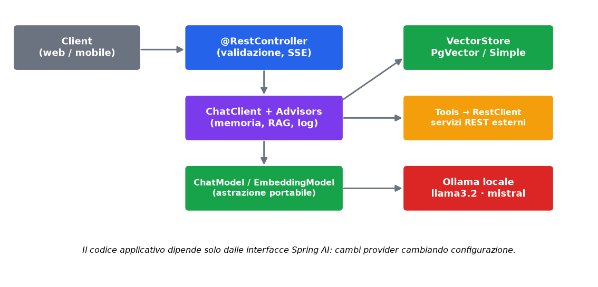

### 9.2 Prerequisiti e versioni usate nel libro
| Componente | Versione | Note |
|---|---|---|
| JDK | **21** (LTS) | |
| Spring Boot | **4.1.1** | Spring AI 2.x è costruito su Boot 4 |
| Spring AI | **2.0.1** | gestita dal BOM `spring-ai-bom` |
| Maven | 3.9+ | (Gradle equivalente) |
| Ollama | ultima | modello `llama3.2` + `nomic-embed-text` |

> 📌 Le versioni cambiano in fretta: controlla sempre [start.spring.io](https://start.spring.io) e la documentazione ufficiale. Se resti su Boot 3.x usa la linea Spring AI 1.x (nel progetto di esempio basta cambiare `parent` e `spring-ai.version`; alcune classi hanno package/nomi diversi).

### 9.3 Passo 1 — Installare Ollama e scaricare i modelli

**Opzione A — nativo** (macOS/Linux/Windows): installer da ollama.com, poi:
```bash
ollama pull llama3.2            # modello di chat
ollama pull nomic-embed-text    # modello di embedding (per il RAG)
ollama list                     # verifica
curl http://localhost:11434/api/tags
```

**Opzione B — Docker** (con GPU NVIDIA aggiungi `--gpus=all`):
```bash
docker run -d --name ollama -p 11434:11434 -v ollama:/root/.ollama ollama/ollama
docker exec ollama ollama pull llama3.2
docker exec ollama ollama pull nomic-embed-text
```
Trovi un `docker-compose.yml` pronto in `code/spring-ai-demo/`.

### 9.4 Passo 2 — Creare il progetto
Da [start.spring.io](https://start.spring.io): Maven · Java 21 · dipendenze **Spring Web**, **Validation**, **Actuator**, **Ollama**. Oppure parti dal `pom.xml` del libro. Il punto chiave è il **BOM**, che allinea tutte le versioni Spring AI:

```xml
<properties>
  <java.version>21</java.version>
  <spring-ai.version>2.0.1</spring-ai.version>
</properties>

<dependencyManagement>
  <dependencies>
    <dependency>
      <groupId>org.springframework.ai</groupId>
      <artifactId>spring-ai-bom</artifactId>
      <version>${spring-ai.version}</version>
      <type>pom</type>
      <scope>import</scope>
    </dependency>
  </dependencies>
</dependencyManagement>

<dependencies>
  <dependency>  <!-- ChatModel + EmbeddingModel verso Ollama -->
    <groupId>org.springframework.ai</groupId>
    <artifactId>spring-ai-starter-model-ollama</artifactId>
  </dependency>
  <dependency>  <!-- RetrievalAugmentationAdvisor (RAG modulare) -->
    <groupId>org.springframework.ai</groupId>
    <artifactId>spring-ai-rag</artifactId>
  </dependency>
  <dependency>  <!-- VectorStore, SimpleVectorStore, TokenTextSplitter -->
    <groupId>org.springframework.ai</groupId>
    <artifactId>spring-ai-vector-store</artifactId>
  </dependency>
  <dependency>  <!-- memoria conversazionale -->
    <groupId>org.springframework.ai</groupId>
    <artifactId>spring-ai-starter-model-chat-memory</artifactId>
  </dependency>
</dependencies>
```
Per **cambiare provider** sostituisci lo starter (`spring-ai-starter-model-openai`, `-anthropic`, ...) e le proprietà: il codice con `ChatClient` non cambia.

### 9.5 Passo 3 — Configurazione (`application.yml`)
```yaml
spring:
  ai:
    ollama:
      base-url: http://localhost:11434
      chat:
        options:
          model: llama3.2
          temperature: 0.3
          num-ctx: 4096
      embedding:
        options:
          model: nomic-embed-text
      init:
        pull-model-strategy: when_missing   # scarica il modello se manca (solo dev!)
```
Per **provider cloud** le chiavi API vanno in variabili d'ambiente (`${OPENAI_API_KEY}`), mai nel repository.

### 9.6 Passo 4 — Il "Hello LLM"
```java
@RestController
class HelloController {
    private final ChatClient chat;
    HelloController(ChatClient.Builder builder) { this.chat = builder.build(); }

    @GetMapping("/hello")
    String hello(@RequestParam(defaultValue = "Spiegami un Transformer in 2 frasi") String q) {
        return chat.prompt().user(q).call().content();
    }
}
```
```bash
mvn spring-boot:run
curl "localhost:8080/hello?q=Che%20cos%27%C3%A8%20un%20token%3F"
```

`ChatClient.Builder` viene auto-configurato da Boot: non serve creare il client a mano.

### 9.7 Checklist di verifica e problemi frequenti
| Sintomo | Causa probabile | Soluzione |
|---|---|---|
| `Connection refused :11434` | Ollama non avviato | `ollama serve` / controlla il container |
| `model "x" not found` | modello non scaricato | `ollama pull x` o `pull-model-strategy` |
| Prima risposta lentissima | il modello si sta caricando in RAM/VRAM | normale; `keep_alive` lo mantiene caldo |
| Risposte tagliate / contesto ignorato | `num-ctx` troppo piccolo | aumentalo (costa RAM) |
| Timeout | modello grande su CPU | modello più piccolo / aumenta read-timeout |
| `OutOfMemory` nel processo Ollama | modello > RAM/VRAM | quantizzazione più spinta o modello minore |

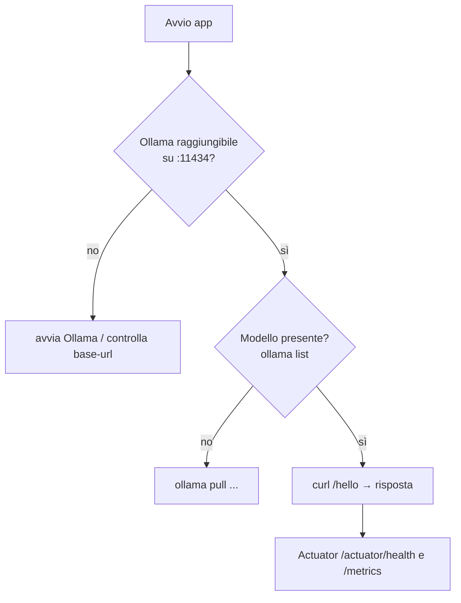
```mermaid
flowchart TD
    S[Avvio app] --> A{Ollama raggiungibile<br/>su :11434?}
    A -- no --> A1[avvia Ollama / controlla base-url]
    A -- sì --> B{Modello presente?<br/>ollama list}
    B -- no --> B1[ollama pull ...]
    B -- sì --> C[curl /hello → risposta]
    C --> D[Actuator /actuator/health e /metrics]
```


## Capitolo 10 — Fondamenti per gestire un LLM

Questo capitolo è il "manuale d'uso" concettuale: ciò che devi sapere per **controllare, dimensionare e rendere affidabile** un LLM, sia locale sia remoto.

### 10.1 Un LLM è una funzione *stateless*
Ogni richiesta è indipendente: il modello **non ricorda** nulla. La "conversazione" è un array di messaggi che **reinvii ogni volta**.

| Ruolo | Funzione |
|---|---|
| `system` | istruzioni persistenti: personalità, regole, formato |
| `user` | input dell'utente |
| `assistant` | risposte precedenti del modello |
| `tool` | risultati dei tool richiamati |

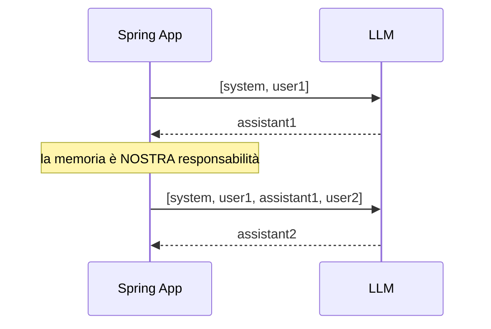
```mermaid
sequenceDiagram
    participant App as Spring App
    participant LLM
    App->>LLM: [system, user1]
    LLM-->>App: assistant1
    Note over App: la memoria è NOSTRA responsabilità
    App->>LLM: [system, user1, assistant1, user2]
    LLM-->>App: assistant2
```
In Spring AI la memoria è un *advisor* (`MessageChatMemoryAdvisor`) che salva e reinietta i messaggi per `conversationId`.

### 10.2 Token e finestra di contesto
- Tutto si misura in **token** (cap. 6).
- **Contesto** = token di input + token generati. Se lo superi: errore o troncamento silenzioso (con Ollama il default `num_ctx` è basso! impostalo).
- Più contesto = più RAM e più latenza.

#### Dimensionare la KV-cache
Per ogni token del contesto il modello conserva K e V di ogni strato:

`memoria_KV = 2 × n_strati × n_kv_heads × dim_head × byte × n_token`

Esempio *Llama 3 8B* (32 strati, 8 teste KV, dim 128, FP16 = 2 byte):
`2 × 32 × 8 × 128 × 2 = 131.072 B ≈ 128 KiB per token` → con 8.192 token ≈ **1 GiB**, con 128k token ≈ **16 GiB**. Per questo un contesto enorme *non è gratis*, anche in locale.

### 10.3 Parametri di campionamento


| Parametro | Cosa fa | Valori tipici |
|---|---|---|
| `temperature` | appiattisce/affila la distribuzione | 0–0.3 estrazione/codice · 0.7–1 creatività |
| `top_p` (nucleus) | campiona solo tra i token che sommano a p | 0.9 |
| `top_k` | solo i k più probabili | 40 |
| `num_predict` / `max_tokens` | tetto di token generati | **sempre** impostarlo |
| `seed` | riproducibilità (con temperature>0) | per test |
| `repeat_penalty` | scoraggia ripetizioni | ~1.1 |

Regola: **cambia temperatura *oppure* top_p, non entrambi**. Per risultati ripetibili: `temperature=0` (+ `seed`), ma "deterministico" non significa "corretto".

### 10.4 Opzioni in Spring AI
```java
// default globali: application.yml (spring.ai.ollama.chat.options.*)
// override per singola chiamata:
String r = chatClient.prompt()
    .user("Estrai i dati dal testo...")
    .options(OllamaChatOptions.builder()
        .temperature(0.0)
        .numPredict(300))   // in 2.x options() accetta il builder
    .call()
    .content();
```
> I nomi delle option sono specifici del provider: con `ChatOptions` generico (`temperature`, `maxTokens`, `topP`) resti portabile.

### 10.5 Streaming
Un LLM genera **un token alla volta**: aspettare la risposta completa dà una UX pessima. Con lo *streaming* mostri i token appena arrivano.

| Metrica | Significato |
|---|---|
| **TTFT** (time to first token) | latenza percepita (include caricamento del prompt) |
| **tokens/s** | velocità di generazione |
| Latenza totale | `TTFT + n_token / tokens_s` |

In Spring AI: `.stream().content()` → `Flux<String>`; esposto via **Server-Sent Events** (cap. 11).

### 10.6 Prompt: la vera "interfaccia di programmazione"
Struttura consigliata di un prompt di sistema:
1. **Ruolo** («Sei un assistente per il supporto clienti di...»)
2. **Regole** («Rispondi in italiano. Se manca l'informazione, dillo.»)
3. **Formato** (JSON, elenco, lunghezza massima)
4. **Esempi** (*few-shot*) per i compiti delicati
5. **Dati** (contesto RAG, risultati dei tool) chiaramente delimitati

Template parametrici (`{variabile}`) in Spring AI → evitano concatenazioni di stringhe e rendono i prompt versionabili in `resources/prompts/*.st`.

### 10.7 Affidabilità: cosa può andare storto
| Rischio | Mitigazione |
|---|---|
| **Allucinazioni** | RAG + «rispondi solo dal contesto» + citare fonti + `temperature` bassa |
| **Output non valido** | structured output + validazione + retry |
| **Prompt injection** (testo malevolo nei documenti o nell'input) | trattare il contesto come *non fidato*; mai far eseguire azioni distruttive senza conferma; tool a privilegi minimi |
| **Fuga di dati** | modello locale, mascheramento PII, log senza prompt completi |
| **Costi/latenza** | limiti di token, cache, modelli più piccoli per task semplici |
| **Non determinismo** | test su proprietà (schema, contenuto richiesto) non su stringhe esatte |

### 10.8 Scegliere il modello
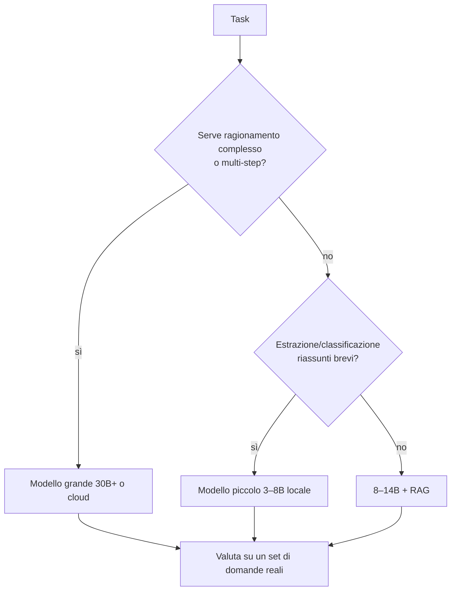
```mermaid
flowchart TD
    A[Task] --> B{Serve ragionamento complesso<br/>o multi-step?}
    B -- sì --> C[Modello grande 30B+ o cloud]
    B -- no --> D{Estrazione/classificazione<br/>riassunti brevi?}
    D -- sì --> E[Modello piccolo 3–8B locale]
    D -- no --> F[8–14B + RAG]
    C --> G[Valuta su un set di domande reali]
    E --> G
    F --> G
```
**Valuta sempre sui tuoi dati**: costruisci 30–100 domande con risposta attesa e misura (anche con un secondo LLM come giudice, *LLM-as-a-judge*, ma con campione verificato da umani).


## Capitolo 11 — Chat, streaming, memoria e structured output con Spring AI

Codice completo in `code/spring-ai-demo/src/main/java/it/example/llmbook/`.

### 11.1 Un `ChatClient` configurato una volta sola
```java
@Configuration
public class AiConfig {
    @Bean ChatMemory chatMemory() {
        return MessageWindowChatMemory.builder().maxMessages(10).build();
    }

    @Bean ChatClient chatClient(ChatModel model, ChatMemory memory) {
        return ChatClient.builder(model)
            .defaultSystem("""
                Sei un assistente tecnico. Rispondi sempre in italiano,
                in modo conciso. Se non conosci la risposta, dillo.""")
            .defaultAdvisors(
                MessageChatMemoryAdvisor.builder(memory).build(),
                new SimpleLoggerAdvisor())
            .build();
    }
}
```
**Advisors** = intercettori (come i filtri servlet) attorno alla chiamata: memoria, RAG, logging, guardrail.

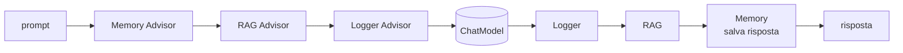
```mermaid
flowchart LR
    R[prompt] --> A1[Memory Advisor]
    A1 --> A2[RAG Advisor]
    A2 --> A3[Logger Advisor]
    A3 --> M[(ChatModel)]
    M --> A3b[Logger] --> A2b[RAG] --> A1b[Memory<br/>salva risposta] --> OUT[risposta]
```

### 11.2 API REST: risposta completa e streaming SSE
```java
@RestController @RequestMapping("/api/chat")
public class ChatController {
    public record ChatRequest(@NotBlank @Size(max = 4000) String message) {}
    public record ChatResponse(String conversationId, String answer) {}

    @PostMapping("/{conversationId}")
    public ChatResponse ask(@PathVariable String conversationId,
                            @Valid @RequestBody ChatRequest req) {
        String answer = chat.prompt().user(req.message())
            .advisors(a -> a.param(CONVERSATION_ID, conversationId))
            .call().content();
        return new ChatResponse(conversationId, answer);
    }

    @PostMapping(value = "/{conversationId}/stream",
                 produces = MediaType.TEXT_EVENT_STREAM_VALUE)
    public Flux<String> stream(@PathVariable String conversationId,
                               @Valid @RequestBody ChatRequest req) {
        return chat.prompt().user(req.message())
            .advisors(a -> a.param(CONVERSATION_ID, conversationId))
            .stream().content();
    }
}
```
Prova:
```bash
curl -X POST localhost:8080/api/chat/c1 -H 'Content-Type: application/json' \
     -d '{"message":"Mi chiamo Ciro. Cos è un Transformer?"}'
curl -X POST localhost:8080/api/chat/c1 -H 'Content-Type: application/json' \
     -d '{"message":"Come mi chiamo?"}'            # grazie alla memoria risponde: Ciro
curl -N -X POST localhost:8080/api/chat/c1/stream -H 'Content-Type: application/json' \
     -d '{"message":"Racconta una storia breve"}'  # token in streaming
```

#### Mockup dell'interfaccia


Un client web minimale usa `fetch` + `ReadableStream` (o `EventSource` con GET) per appendere i token al bubble della risposta.

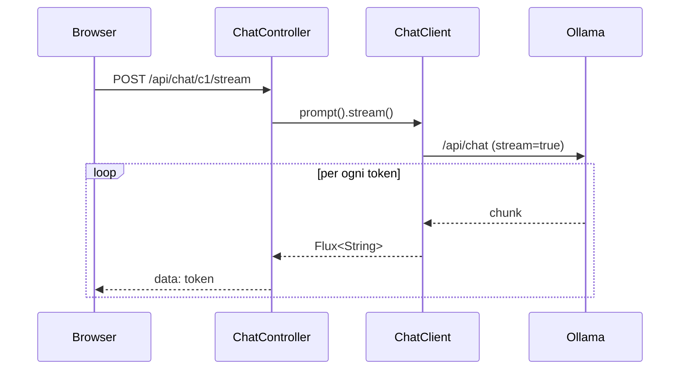
```mermaid
sequenceDiagram
    participant B as Browser
    participant C as ChatController
    participant S as ChatClient
    participant O as Ollama
    B->>C: POST /api/chat/c1/stream
    C->>S: prompt().stream()
    S->>O: /api/chat (stream=true)
    loop per ogni token
        O-->>S: chunk
        S-->>C: Flux<String>
        C-->>B: data: token
    end
```

### 11.3 Structured output: da testo libero a oggetti Java
```java
public record TicketAnalysis(String category, int priority,
                             List<String> keywords, String summary) {}

TicketAnalysis a = chat.prompt()
    .system("Classifica il ticket. priority da 1 (bassa) a 5 (critica).")
    .user(u -> u.text("Ticket: {t}").param("t", testo))
    .call()
    .entity(TicketAnalysis.class);
```
Spring AI aggiunge al prompt lo **schema JSON** del record e fa il parsing (`BeanOutputConverter`). Per elenchi: `new ParameterizedTypeReference<List<TicketAnalysis>>() {}`.

**Buone pratiche:** `temperature` bassa, validare il risultato (Bean Validation), gestire il fallimento del parsing con **retry limitato**, preferire modelli che supportano nativamente il *JSON mode*/structured output.


## Capitolo 12 — RAG con Spring AI

### 12.1 Perché RAG
Il modello non conosce i tuoi documenti e il suo sapere è congelato. RAG = **cercare prima, rispondere poi**. (Schema: figura 15 del cap. 8.)


### 12.2 Concetti
| Termine | Significato |
|---|---|
| **Embedding** | vettore (es. 768 numeri) che rappresenta il *significato* di un testo |
| **Similarità coseno** | angolo tra due vettori: ≈1 = significato simile |
| **Chunk** | pezzo di documento (200–500 token) con un po' di sovrapposizione |
| **Vector store** | database che cerca i vettori più vicini (PgVector, Qdrant, Milvus, Redis, Chroma...) |
| **Top-K / soglia** | quanti chunk recuperare e con quale similarità minima |

### 12.3 Ingestion (offline o a evento)
```java
public int ingest(String source, String text) {
    var chunks = TokenTextSplitter.builder()
            .withChunkSize(400).withMinChunkSizeChars(100)
            .withMinChunkLengthToEmbed(5).withMaxNumChunks(10_000)
            .withKeepSeparator(true).build()
            .apply(List.of(new Document(text, Map.of("source", source))));
    store.add(chunks);          // calcola gli embedding e li salva
    return chunks.size();
}
```
Per file reali usa i `DocumentReader` (PDF con `PagePdfDocumentReader`, Word/HTML con Apache Tika). **Metadati** (`source`, `pagina`, `tenant`, `data`) servono per citare le fonti e filtrare.

### 12.4 Query con `RetrievalAugmentationAdvisor`
```java
var retriever = VectorStoreDocumentRetriever.builder()
        .vectorStore(store).topK(4).similarityThreshold(0.5).build();

ChatClient ragClient = builder
        .defaultAdvisors(RetrievalAugmentationAdvisor.builder()
                .documentRetriever(retriever).build())
        .build();

String answer = ragClient.prompt().user(question).call().content();
```
Alternativa più semplice: `QuestionAnswerAdvisor`. La versione "modulare" permette di aggiungere *query rewriting/expansion*, *re-ranking* e filtri.

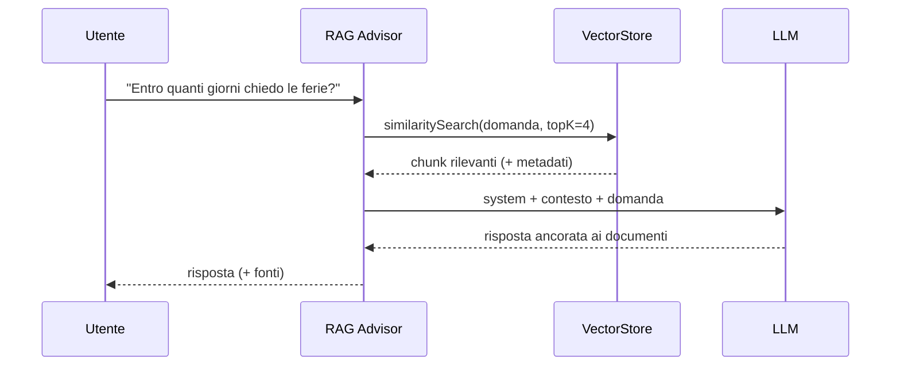
```mermaid
sequenceDiagram
    participant U as Utente
    participant A as RAG Advisor
    participant V as VectorStore
    participant L as LLM
    U->>A: "Entro quanti giorni chiedo le ferie?"
    A->>V: similaritySearch(domanda, topK=4)
    V-->>A: chunk rilevanti (+ metadati)
    A->>L: system + contesto + domanda
    L-->>A: risposta ancorata ai documenti
    A-->>U: risposta (+ fonti)
```

### 12.5 Vector store: da demo a produzione
| Fase | Scelta |
|---|---|
| Demo/test | `SimpleVectorStore` (in memoria, persistibile su file) |
| Produzione "Spring-friendly" | **PgVector** (`spring-ai-starter-vector-store-pgvector`) – riusi il Postgres che hai già |
| Grandi volumi | Qdrant, Milvus, Elasticsearch/OpenSearch |

```yaml
spring:
  datasource: { url: jdbc:postgresql://localhost:5432/rag, username: rag, password: ${DB_PASSWORD} }
  ai:
    vectorstore:
      pgvector:
        initialize-schema: true      # solo in dev: in prod usa Flyway/Liquibase
        dimensions: 768              # = dimensione del modello di embedding!
        index-type: HNSW
        distance-type: COSINE_DISTANCE
```
> ⚠️ **Cambiare il modello di embedding = reindicizzare tutto**: le dimensioni e lo spazio vettoriale non sono compatibili.

### 12.6 Qualità del RAG: dove si sbaglia davvero
1. **Chunking sbagliato** (troppo piccolo: perde contesto; troppo grande: rumore).
2. **Embedding inadatto alla lingua** (usa modelli multilingua per l'italiano, es. `bge-m3`, `multilingual-e5`).
3. **Nessuna soglia**: si inietta contesto irrilevante e il modello "risponde comunque".
4. **Prompt permissivo**: imponi *«rispondi solo con il contesto; se non c'è, dì che non lo sai»*.
5. **Nessuna valutazione**: crea un set di domande/risposte attese e misura *recall del retrieval* e correttezza.

Prova locale:
```bash
curl -X POST localhost:8080/api/rag/documents -H 'Content-Type: application/json' \
  -d '{"source":"hr.pdf","text":"Le ferie vanno richieste almeno 15 giorni prima tramite il portale HR."}'
curl -X POST localhost:8080/api/rag/ask -H 'Content-Type: application/json' \
  -d '{"question":"Con quanto anticipo chiedo le ferie?"}'
```
> Nel sandbox in cui è stato scritto il libro il RAG è compilato ma **non eseguito con un modello reale**; la digressione Python D3 mostra il meccanismo con un esempio realmente eseguito.


## Capitolo 13 — Tool calling e integrazione con servizi REST

Due direzioni di integrazione REST:
1. **Il tuo servizio espone REST** verso i client (capitoli 11–12).
2. **Il LLM "usa" servizi REST** come strumenti (*tool calling*): questo capitolo.

### 13.1 Come funziona il tool calling
Il modello **non esegue nulla**. Riceve la descrizione dei tool; se serve, risponde *"chiama `productInfo` con sku=ABC-123"*; **è la tua applicazione a eseguire** la chiamata e a restituire il risultato.

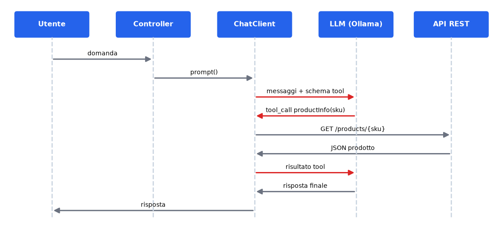

> Serve un modello con supporto ai tool (con Ollama: `llama3.1+`, `llama3.2`, `qwen2.5`, `mistral`...).

### 13.2 Il client REST (`RestClient`) con timeout
```java
@ConfigurationProperties(prefix = "app.catalog")
public record CatalogProperties(String baseUrl, Duration timeout) {}

@Bean
RestClient catalogRestClient(CatalogProperties props, RestClient.Builder builder) {
    var settings = HttpClientSettings.defaults()
            .withConnectTimeout(props.timeout())
            .withReadTimeout(props.timeout());
    return builder.baseUrl(props.baseUrl())
            .requestFactory(ClientHttpRequestFactoryBuilder.detect().build(settings))
            .build();
}

@Component
public class CatalogClient {
    public record Product(String sku, String name, double price, int stock) {}
    private final RestClient rest;
    public CatalogClient(RestClient catalogRestClient) { this.rest = catalogRestClient; }

    public Product findBySku(String sku) {
        return rest.get().uri("/products/{sku}", sku).retrieve().body(Product.class);
    }
}
```
`RestClient` è il client sincrono moderno di Spring (sostituisce `RestTemplate`); per chiamate reattive usa `WebClient`; per client dichiarativi `@HttpExchange`.

### 13.3 Esporlo come tool
```java
@Component
public class CatalogTools {
    @Tool(description = "Restituisce nome, prezzo in euro e giacenza di un prodotto dato il suo SKU")
    public String productInfo(@ToolParam(description = "Codice SKU, es. ABC-123") String sku) {
        try {
            var p = catalog.findBySku(sku);
            return "%s (%s): %.2f EUR, giacenza %d".formatted(p.name(), p.sku(), p.price(), p.stock());
        } catch (RestClientException e) {
            return "Servizio catalogo non disponibile o SKU inesistente: " + sku;
        }
    }
}

// uso
String answer = chat.prompt().user("Quanti pezzi di ABC-123 ho?")
        .tools(catalogTools).call().content();
```
La **descrizione** del tool è il "prompt" che guida il modello: scrivila con cura. L'errore viene restituito come *testo*, così il modello può spiegarlo all'utente invece di far crollare la richiesta.

### 13.4 Regole d'oro per i tool
| Regola | Motivo |
|---|---|
| **Privilegio minimo**: tool *read-only* di default | il modello può sbagliare o essere manipolato (prompt injection) |
| Azioni con effetti (ordini, pagamenti) → **conferma umana** o endpoint con policy | irreversibilità |
| Validare gli argomenti come input non fidato | il modello genera i parametri |
| Timeout e limite di iterazioni | evitare loop di chiamate |
| Risultati brevi e strutturati | consumano contesto |
| Autorizzazione basata sull'**utente**, non sul modello | niente escalation |
| Loggare ogni chiamata (senza PII) | audit |

### 13.5 Testare senza Ollama né servizi reali
```java
var builder = RestClient.builder().baseUrl("http://catalog");
var server = MockRestServiceServer.bindTo(builder).build();
server.expect(requestTo("http://catalog/products/ABC-123"))
      .andRespond(withSuccess("""
          {"sku":"ABC-123","name":"Tastiera","price":49.9,"stock":12}""",
          MediaType.APPLICATION_JSON));

var tools = new CatalogTools(new CatalogClient(builder.build()));
assertThat(tools.productInfo("ABC-123")).contains("Tastiera", "giacenza 12");
```
Questi test (in `CatalogClientTest`) **sono eseguiti e passano** (2/2). Per i test d'integrazione col modello usa Testcontainers + Ollama e asserzioni "per proprietà".

### 13.6 Altre integrazioni REST
- **MCP (Model Context Protocol)**: standard per esporre tool/risorse a un LLM; Spring AI ha client e server MCP.
- **API OpenAPI** → genera client tipizzato e wrappalo con `@Tool`.
- **Provider compatibili OpenAI**: Ollama espone anche `/v1/chat/completions`, quindi puoi puntare lo starter OpenAI a `http://localhost:11434/v1`.


## Capitolo 14 — Best practice enterprise per Spring + LLM

### 14.1 Architettura
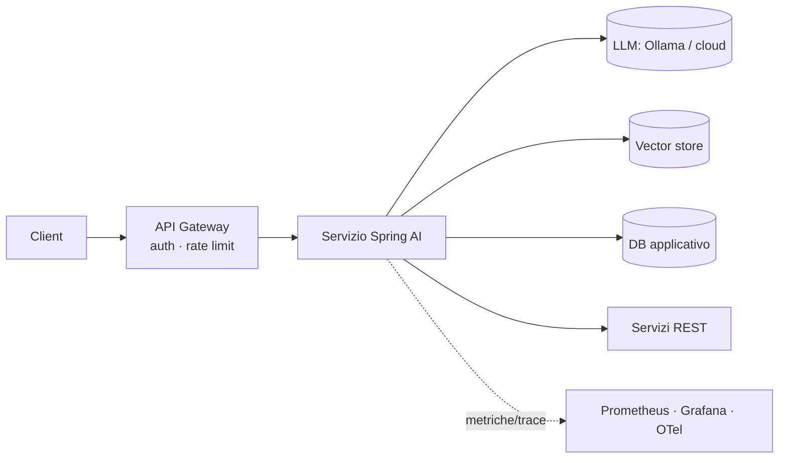
```mermaid
flowchart LR
    C[Client] --> GW[API Gateway<br/>auth · rate limit]
    GW --> APP[Servizio Spring AI]
    APP --> LLM[(LLM: Ollama / cloud)]
    APP --> VS[(Vector store)]
    APP --> DB[(DB applicativo)]
    APP --> EXT[Servizi REST]
    APP -. metriche/trace .-> OBS[Prometheus · Grafana · OTel]
```
- **Isola il LLM dietro un tuo servizio**: i client non parlano mai direttamente con Ollama.
- Usa **interfacce tue** (`AssistantService`) sopra `ChatClient`: più facile da testare e sostituire.
- Un LLM è lento e fallibile: trattalo come **dipendenza remota instabile**.

### 14.2 Checklist
| Area | Pratica |
|---|---|
| **Config** | `@ConfigurationProperties` tipizzate; segreti da env/Vault; profili `dev`/`prod`; `pull-model-strategy` solo in dev |
| **Validazione** | Bean Validation sugli input; limite lunghezza messaggio; sanitizzazione |
| **Errori** | `ProblemDetail` (RFC 9457) con `@RestControllerAdvice`; mai mostrare stack/prompt |
| **Resilienza** | timeout espliciti, retry con backoff solo su errori transienti, circuit breaker (Resilience4j), fallback |
| **Concorrenza** | pool/semafori: un modello locale serve poche richieste in parallelo; usa **virtual threads** (Java 21) per le chiamate bloccanti |
| **Performance** | streaming, `keep_alive` del modello, cache di risposte/embedding, modello piccolo per task semplici |
| **Sicurezza** | autenticazione/autorizzazione (Spring Security), filtri per tenant sul retrieval, tool read-only, difesa da prompt injection, niente PII nei log |
| **Osservabilità** | Actuator + Micrometer: latenza, token in/out (`gen_ai.*`), errori; trace OpenTelemetry; log con `SimpleLoggerAdvisor` solo in dev |
| **Test** | unit con mock REST; test di proprietà sulle risposte; dataset di valutazione RAG in CI; Testcontainers per integrazione |
| **Prompt** | file `.st` versionati; nessuna concatenazione di stringhe con input utente |
| **Costi/limiti** | `maxTokens`, rate limit per utente, budget token |
| **Governance** | registra modello + versione + prompt usati; informativa utenti; controllo licenze modelli |

### 14.3 Esempio: errori coerenti
```java
@RestControllerAdvice
public class ApiExceptionHandler {
    @ExceptionHandler(NonTransientAiException.class)
    ProblemDetail aiUnavailable(Exception e) {
        var pd = ProblemDetail.forStatusAndDetail(HttpStatus.BAD_GATEWAY,
                "Il modello non ha risposto correttamente");
        pd.setTitle("LLM error");
        return pd;
    }
}
```

### 14.4 Docker Compose per lo sviluppo
`code/spring-ai-demo/docker-compose.yml` avvia Ollama e Postgres+PgVector. Poi:
```bash
docker compose up -d
docker exec ollama ollama pull llama3.2 && docker exec ollama ollama pull nomic-embed-text
mvn spring-boot:run
```

### 14.5 Percorso di crescita consigliato
```mermaid
flowchart LR
    A[1 Hello LLM] --> B[2 Streaming + memoria]
    B --> C[3 Structured output]
    C --> D[4 RAG con PgVector]
    D --> E[5 Tool calling su API REST]
    E --> F[6 Valutazione + osservabilità]
    F --> G[7 Fine-tuning solo se serve]
```


## 💻 Codice completo del progetto `code/spring-ai-demo`

Tutti i file sono quelli che compilano; i test `CatalogClientTest` passano (2/2).

**Test eseguiti:**

```text
Tests run: 2, Failures: 0, Errors: 0, Skipped: 0, Time elapsed: 0.516 s -- in it.example.llmbook.CatalogClientTest
```


#### 💻 Codice: `code/spring-ai-demo/pom.xml`

```xml
<?xml version="1.0" encoding="UTF-8"?>
<project xmlns="http://maven.apache.org/POM/4.0.0" xmlns:xsi="http://www.w3.org/2001/XMLSchema-instance"
         xsi:schemaLocation="http://maven.apache.org/POM/4.0.0 https://maven.apache.org/xsd/maven-4.0.0.xsd">
  <modelVersion>4.0.0</modelVersion>

  <parent>
    <groupId>org.springframework.boot</groupId>
    <artifactId>spring-boot-starter-parent</artifactId>
    <version>4.1.1</version>
    <relativePath/>
  </parent>

  <groupId>it.example</groupId>
  <artifactId>llmbook-demo</artifactId>
  <version>1.0.0</version>
  <name>llmbook-demo</name>
  <description>Esempi del libro: da una rete neurale a un LLM locale con Spring AI</description>

  <properties>
    <java.version>21</java.version>
    <spring-ai.version>2.0.1</spring-ai.version>
  </properties>

  <dependencyManagement>
    <dependencies>
      <dependency>
        <groupId>org.springframework.ai</groupId>
        <artifactId>spring-ai-bom</artifactId>
        <version>${spring-ai.version}</version>
        <type>pom</type>
        <scope>import</scope>
      </dependency>
    </dependencies>
  </dependencyManagement>

  <dependencies>
    <dependency>
      <groupId>org.springframework.boot</groupId>
      <artifactId>spring-boot-starter-web</artifactId>
    </dependency>
    <dependency>
      <groupId>org.springframework.boot</groupId>
      <artifactId>spring-boot-starter-validation</artifactId>
    </dependency>
    <dependency>
      <groupId>org.springframework.boot</groupId>
      <artifactId>spring-boot-starter-actuator</artifactId>
    </dependency>
    <dependency>
      <groupId>org.springframework.ai</groupId>
      <artifactId>spring-ai-starter-model-ollama</artifactId>
    </dependency>
    <dependency>
      <groupId>org.springframework.ai</groupId>
      <artifactId>spring-ai-rag</artifactId>
    </dependency>
    <dependency>
      <groupId>org.springframework.ai</groupId>
      <artifactId>spring-ai-vector-store</artifactId>
    </dependency>
    <dependency>
      <groupId>org.springframework.ai</groupId>
      <artifactId>spring-ai-vector-store-advisor</artifactId>
    </dependency>
    <dependency>
      <groupId>org.springframework.ai</groupId>
      <artifactId>spring-ai-starter-model-chat-memory</artifactId>
    </dependency>
    <dependency>
      <groupId>org.springframework.boot</groupId>
      <artifactId>spring-boot-starter-test</artifactId>
      <scope>test</scope>
    </dependency>
  </dependencies>

  <build>
    <plugins>
      <plugin>
        <groupId>org.springframework.boot</groupId>
        <artifactId>spring-boot-maven-plugin</artifactId>
      </plugin>
    </plugins>
  </build>
</project>
```


#### 💻 Codice: `code/spring-ai-demo/src/main/resources/application.yml`

```yaml
spring:
  application:
    name: llmbook-demo
  ai:
    ollama:
      base-url: http://localhost:11434
      chat:
        options:
          model: llama3.2        # ollama pull llama3.2
          temperature: 0.3
          num-ctx: 4096          # finestra di contesto richiesta a Ollama
      embedding:
        options:
          model: nomic-embed-text  # ollama pull nomic-embed-text
      init:
        pull-model-strategy: when_missing   # scarica il modello se manca
    chat:
      memory:
        repository:
          jdbc:
            initialize-schema: never

management:
  endpoints:
    web:
      exposure:
        include: health,metrics,prometheus

app:
  catalog:
    base-url: http://localhost:8081   # servizio REST esterno (cap. 14)
    timeout: 3s
```


#### 💻 Codice: `code/spring-ai-demo/docker-compose.yml`

```yaml
services:
  ollama:
    image: ollama/ollama
    container_name: ollama
    ports: ["11434:11434"]
    volumes: ["ollama:/root/.ollama"]
    # GPU NVIDIA: decommenta
    # deploy: { resources: { reservations: { devices: [{ driver: nvidia, count: all, capabilities: [gpu] }] } } }
  pgvector:
    image: pgvector/pgvector:pg17
    container_name: pgvector
    environment: { POSTGRES_DB: rag, POSTGRES_USER: rag, POSTGRES_PASSWORD: rag }
    ports: ["5432:5432"]
volumes:
  ollama:
```


#### 💻 Codice: `code/spring-ai-demo/src/main/java/it/example/llmbook/LlmBookApplication.java`

```java
package it.example.llmbook;

import org.springframework.boot.SpringApplication;
import org.springframework.boot.autoconfigure.SpringBootApplication;

@SpringBootApplication
public class LlmBookApplication {
    public static void main(String[] args) {
        SpringApplication.run(LlmBookApplication.class, args);
    }
}
```


#### 💻 Codice: `code/spring-ai-demo/src/main/java/it/example/llmbook/config/AiConfig.java`

```java
package it.example.llmbook.config;

import org.springframework.ai.chat.client.ChatClient;
import org.springframework.ai.chat.client.advisor.MessageChatMemoryAdvisor;
import org.springframework.ai.chat.client.advisor.SimpleLoggerAdvisor;
import org.springframework.ai.chat.memory.ChatMemory;
import org.springframework.ai.chat.memory.MessageWindowChatMemory;
import org.springframework.ai.chat.model.ChatModel;
import org.springframework.ai.embedding.EmbeddingModel;
import org.springframework.ai.vectorstore.SimpleVectorStore;
import org.springframework.ai.vectorstore.VectorStore;
import org.springframework.context.annotation.Bean;
import org.springframework.context.annotation.Configuration;

@Configuration
public class AiConfig {

    /** Memoria conversazionale in RAM: ultimi 10 messaggi per conversazione. */
    @Bean
    ChatMemory chatMemory() {
        return MessageWindowChatMemory.builder().maxMessages(10).build();
    }

    /** ChatClient condiviso: system prompt + advisor trasversali. */
    @Bean
    ChatClient chatClient(ChatModel model, ChatMemory memory) {
        return ChatClient.builder(model)
                .defaultSystem("""
                        Sei un assistente tecnico. Rispondi sempre in italiano,
                        in modo conciso. Se non conosci la risposta, dillo.""")
                .defaultAdvisors(
                        MessageChatMemoryAdvisor.builder(memory).build(),
                        new SimpleLoggerAdvisor())
                .build();
    }

    /** Vector store in memoria: ottimo per demo e test; in produzione PgVector. */
    @Bean
    VectorStore vectorStore(EmbeddingModel embeddingModel) {
        return SimpleVectorStore.builder(embeddingModel).build();
    }
}
```


#### 💻 Codice: `code/spring-ai-demo/src/main/java/it/example/llmbook/config/CatalogProperties.java`

```java
package it.example.llmbook.config;

import org.springframework.boot.context.properties.ConfigurationProperties;

import java.time.Duration;

@ConfigurationProperties(prefix = "app.catalog")
public record CatalogProperties(String baseUrl, Duration timeout) {}
```


#### 💻 Codice: `code/spring-ai-demo/src/main/java/it/example/llmbook/config/RestClientConfig.java`

```java
package it.example.llmbook.config;

import org.springframework.boot.context.properties.EnableConfigurationProperties;
import org.springframework.boot.http.client.ClientHttpRequestFactoryBuilder;
import org.springframework.boot.http.client.HttpClientSettings;
import org.springframework.context.annotation.Bean;
import org.springframework.context.annotation.Configuration;
import org.springframework.web.client.RestClient;

@Configuration
@EnableConfigurationProperties(CatalogProperties.class)
public class RestClientConfig {

    @Bean
    RestClient catalogRestClient(CatalogProperties props, RestClient.Builder builder) {
        var settings = HttpClientSettings.defaults()
                .withConnectTimeout(props.timeout())
                .withReadTimeout(props.timeout());
        return builder
                .baseUrl(props.baseUrl())
                .requestFactory(ClientHttpRequestFactoryBuilder.detect().build(settings))
                .build();
    }
}
```


#### 💻 Codice: `code/spring-ai-demo/src/main/java/it/example/llmbook/chat/ChatController.java`

```java
package it.example.llmbook.chat;

import jakarta.validation.Valid;
import jakarta.validation.constraints.NotBlank;
import jakarta.validation.constraints.Size;
import org.springframework.ai.chat.client.ChatClient;
import org.springframework.http.MediaType;
import org.springframework.web.bind.annotation.*;
import reactor.core.publisher.Flux;

import static org.springframework.ai.chat.memory.ChatMemory.CONVERSATION_ID;

@RestController
@RequestMapping("/api/chat")
public class ChatController {

    public record ChatRequest(@NotBlank @Size(max = 4000) String message) {}
    public record ChatResponse(String conversationId, String answer) {}

    private final ChatClient chat;

    public ChatController(ChatClient chat) {
        this.chat = chat;
    }

    /** Risposta completa (bloccante). */
    @PostMapping("/{conversationId}")
    public ChatResponse ask(@PathVariable String conversationId, @Valid @RequestBody ChatRequest req) {
        String answer = chat.prompt()
                .user(req.message())
                .advisors(a -> a.param(CONVERSATION_ID, conversationId))
                .call()
                .content();
        return new ChatResponse(conversationId, answer);
    }

    /** Streaming token-per-token via Server-Sent Events. */
    @PostMapping(value = "/{conversationId}/stream", produces = MediaType.TEXT_EVENT_STREAM_VALUE)
    public Flux<String> stream(@PathVariable String conversationId, @Valid @RequestBody ChatRequest req) {
        return chat.prompt()
                .user(req.message())
                .advisors(a -> a.param(CONVERSATION_ID, conversationId))
                .stream()
                .content();
    }
}
```


#### 💻 Codice: `code/spring-ai-demo/src/main/java/it/example/llmbook/chat/StructuredService.java`

```java
package it.example.llmbook.chat;

import org.springframework.ai.chat.client.ChatClient;
import org.springframework.stereotype.Service;

import java.util.List;

/** Structured output: il modello risponde in JSON, Spring lo mappa su un record. */
@Service
public class StructuredService {

    public record TicketAnalysis(String category, int priority, List<String> keywords, String summary) {}

    private final ChatClient chat;

    public StructuredService(ChatClient.Builder builder) {
        // builder "pulito": niente memoria per un task one-shot
        this.chat = builder.build();
    }

    public TicketAnalysis analyze(String ticketText) {
        return chat.prompt()
                .system("Classifica il ticket. priority da 1 (bassa) a 5 (critica).")
                .user(u -> u.text("Ticket: {t}").param("t", ticketText))
                .call()
                .entity(TicketAnalysis.class);
    }
}
```


#### 💻 Codice: `code/spring-ai-demo/src/main/java/it/example/llmbook/chat/OptionsExample.java`

```java
package it.example.llmbook.chat;

import org.springframework.ai.chat.client.ChatClient;
import org.springframework.ai.ollama.api.OllamaChatOptions;

/** Override delle opzioni per singola chiamata (cap. 10). */
class OptionsExample {
    String extract(ChatClient chatClient, String text) {
        return chatClient.prompt()
                .user("Estrai i dati dal testo: " + text)
                .options(OllamaChatOptions.builder()
                        .temperature(0.0)
                        .numPredict(300))
                .call()
                .content();
    }
}
```


#### 💻 Codice: `code/spring-ai-demo/src/main/java/it/example/llmbook/rag/RagService.java`

```java
package it.example.llmbook.rag;

import org.springframework.ai.chat.client.ChatClient;
import org.springframework.ai.document.Document;
import org.springframework.ai.rag.advisor.RetrievalAugmentationAdvisor;
import org.springframework.ai.rag.retrieval.search.VectorStoreDocumentRetriever;
import org.springframework.ai.transformer.splitter.TokenTextSplitter;
import org.springframework.ai.vectorstore.VectorStore;
import org.springframework.stereotype.Service;

import java.util.List;
import java.util.Map;

@Service
public class RagService {

    private final VectorStore store;
    private final ChatClient ragClient;

    public RagService(VectorStore store, ChatClient.Builder builder) {
        this.store = store;
        var retriever = VectorStoreDocumentRetriever.builder()
                .vectorStore(store)
                .topK(4)
                .similarityThreshold(0.5)
                .build();
        this.ragClient = builder
                .defaultAdvisors(RetrievalAugmentationAdvisor.builder()
                        .documentRetriever(retriever)
                        .build())
                .build();
    }

    /** Ingestion: testo -> chunk -> embedding -> vector store. */
    public int ingest(String source, String text) {
        var chunks = TokenTextSplitter.builder()
                .withChunkSize(400).withMinChunkSizeChars(100)
                .withMinChunkLengthToEmbed(5).withMaxNumChunks(10_000)
                .withKeepSeparator(true).build()
                .apply(List.of(new Document(text, Map.of("source", source))));
        store.add(chunks);
        return chunks.size();
    }

    public String ask(String question) {
        return ragClient.prompt().user(question).call().content();
    }
}
```


#### 💻 Codice: `code/spring-ai-demo/src/main/java/it/example/llmbook/rag/RagController.java`

```java
package it.example.llmbook.rag;

import jakarta.validation.constraints.NotBlank;
import org.springframework.validation.annotation.Validated;
import org.springframework.web.bind.annotation.*;

@Validated
@RestController
@RequestMapping("/api/rag")
public class RagController {

    public record IngestRequest(@NotBlank String source, @NotBlank String text) {}
    public record Question(@NotBlank String question) {}

    private final RagService rag;

    public RagController(RagService rag) {
        this.rag = rag;
    }

    @PostMapping("/documents")
    public java.util.Map<String, Object> ingest(@RequestBody IngestRequest r) {
        return java.util.Map.of("chunks", rag.ingest(r.source(), r.text()));
    }

    @PostMapping("/ask")
    public java.util.Map<String, String> ask(@RequestBody Question q) {
        return java.util.Map.of("answer", rag.ask(q.question()));
    }
}
```


#### 💻 Codice: `code/spring-ai-demo/src/main/java/it/example/llmbook/tools/CatalogClient.java`

```java
package it.example.llmbook.tools;

import org.springframework.stereotype.Component;
import org.springframework.web.client.RestClient;

/** Client REST verso un servizio esterno (il "catalogo prodotti"). */
@Component
public class CatalogClient {

    public record Product(String sku, String name, double price, int stock) {}

    private final RestClient rest;

    public CatalogClient(RestClient catalogRestClient) {
        this.rest = catalogRestClient;
    }

    public Product findBySku(String sku) {
        return rest.get()
                .uri("/products/{sku}", sku)
                .retrieve()
                .body(Product.class);
    }
}
```


#### 💻 Codice: `code/spring-ai-demo/src/main/java/it/example/llmbook/tools/CatalogTools.java`

```java
package it.example.llmbook.tools;

import org.springframework.ai.tool.annotation.Tool;
import org.springframework.ai.tool.annotation.ToolParam;
import org.springframework.stereotype.Component;
import org.springframework.web.client.RestClientException;

/** Tool calling: il LLM decide *quando* chiamare questo metodo; lo eseguiamo noi. */
@Component
public class CatalogTools {

    private final CatalogClient catalog;

    public CatalogTools(CatalogClient catalog) {
        this.catalog = catalog;
    }

    @Tool(description = "Restituisce nome, prezzo in euro e giacenza di un prodotto dato il suo SKU")
    public String productInfo(@ToolParam(description = "Codice SKU, es. ABC-123") String sku) {
        try {
            var p = catalog.findBySku(sku);
            return "%s (%s): %.2f EUR, giacenza %d".formatted(p.name(), p.sku(), p.price(), p.stock());
        } catch (RestClientException e) {
            // L'errore torna al modello come testo: potrà spiegarlo all'utente.
            return "Servizio catalogo non disponibile o SKU inesistente: " + sku;
        }
    }
}
```


#### 💻 Codice: `code/spring-ai-demo/src/main/java/it/example/llmbook/web/AssistantController.java`

```java
package it.example.llmbook.web;

import it.example.llmbook.tools.CatalogTools;
import jakarta.validation.constraints.NotBlank;
import org.springframework.ai.chat.client.ChatClient;
import org.springframework.web.bind.annotation.*;

@RestController
@RequestMapping("/api/assistant")
public class AssistantController {

    public record Question(@NotBlank String question) {}

    private final ChatClient chat;
    private final CatalogTools tools;

    public AssistantController(ChatClient.Builder builder, CatalogTools tools) {
        this.chat = builder.build();
        this.tools = tools;
    }

    @PostMapping
    public java.util.Map<String, String> ask(@RequestBody Question q) {
        String answer = chat.prompt().user(q.question()).tools(tools).call().content();
        return java.util.Map.of("answer", answer);
    }
}
```


#### 💻 Codice: `code/spring-ai-demo/src/main/java/it/example/llmbook/web/ApiExceptionHandler.java`

```java
package it.example.llmbook.web;

import org.springframework.http.HttpStatus;
import org.springframework.http.ProblemDetail;
import org.springframework.web.bind.annotation.ExceptionHandler;
import org.springframework.web.bind.annotation.RestControllerAdvice;

/** Errori in formato RFC 9457 (ProblemDetail). */
@RestControllerAdvice
public class ApiExceptionHandler {

    @ExceptionHandler(org.springframework.ai.retry.NonTransientAiException.class)
    ProblemDetail aiUnavailable(Exception e) {
        var pd = ProblemDetail.forStatusAndDetail(HttpStatus.BAD_GATEWAY,
                "Il modello non ha risposto correttamente");
        pd.setTitle("LLM error");
        return pd;
    }
}
```


#### 💻 Codice: `code/spring-ai-demo/src/test/java/it/example/llmbook/CatalogClientTest.java`

```java
package it.example.llmbook;

import it.example.llmbook.tools.CatalogClient;
import it.example.llmbook.tools.CatalogTools;
import org.junit.jupiter.api.Test;
import org.springframework.http.MediaType;
import org.springframework.test.web.client.MockRestServiceServer;
import org.springframework.web.client.RestClient;

import static org.assertj.core.api.Assertions.assertThat;
import static org.springframework.test.web.client.match.MockRestRequestMatchers.requestTo;
import static org.springframework.test.web.client.response.MockRestResponseCreators.withServerError;
import static org.springframework.test.web.client.response.MockRestResponseCreators.withSuccess;

/** Test del layer REST senza avviare né Ollama né il servizio reale. */
class CatalogClientTest {

    private RestClient.Builder builder() {
        return RestClient.builder().baseUrl("http://catalog");
    }

    @Test
    void tool_returns_formatted_product() {
        var builder = builder();
        var server = MockRestServiceServer.bindTo(builder).build();
        server.expect(requestTo("http://catalog/products/ABC-123"))
              .andRespond(withSuccess("""
                      {"sku":"ABC-123","name":"Tastiera","price":49.9,"stock":12}""",
                      MediaType.APPLICATION_JSON));

        var tools = new CatalogTools(new CatalogClient(builder.build()));

        assertThat(tools.productInfo("ABC-123")).contains("Tastiera", "49", "giacenza 12");
        server.verify();
    }

    @Test
    void tool_degrades_gracefully_on_server_error() {
        var builder = builder();
        var server = MockRestServiceServer.bindTo(builder).build();
        server.expect(requestTo("http://catalog/products/X")).andRespond(withServerError());

        var tools = new CatalogTools(new CatalogClient(builder.build()));

        assertThat(tools.productInfo("X")).contains("non disponibile");
    }
}
```


---


# Parte V — Python: digressioni


Python è il linguaggio in cui **si addestrano e si studiano** i modelli; Java/Spring è dove spesso li **si integra in produzione**. Qui alcune digressioni utili. Quelle marcate ✅ sono state eseguite durante la scrittura; ⚠️ sono snippet standard non eseguiti nel sandbox (richiedono librerie/GPU/modelli).

### A.1 Perché Python domina il machine learning
- Ecosistema: **PyTorch**, NumPy, Hugging Face (`transformers`, `peft`, `trl`), `llama.cpp` bindings.
- Python è solo la "colla": i calcoli pesanti girano in C++/CUDA.
- Ruoli tipici: **Python** = ricerca, training, fine-tuning, valutazione. **Java/Spring** = API, sicurezza, transazioni, integrazioni, scalabilità.

```mermaid
flowchart LR
    subgraph Python
      D[Dati] --> T[Training / LoRA] --> E[Valutazione] --> X[Export GGUF]
    end
    X --> O[Ollama]
    subgraph Java
      S[Spring AI] --> API[REST per i client]
    end
    O <--> S
```

### A.2 Tensori e autograd con PyTorch ⚠️
Ciò che nel cap. 1 abbiamo fatto con `Value` scalari, PyTorch lo fa su tensori:
```python
import torch
w = torch.randn(3, requires_grad=True); b = torch.zeros(1, requires_grad=True)
x = torch.tensor([2.0, 3.0, -1.0]); y = torch.tensor(1.0)

for step in range(50):
    pred = torch.tanh(x @ w + b)
    loss = (pred - y) ** 2
    w.grad = b.grad = None      # azzera i gradienti
    loss.backward()             # backprop automatica
    with torch.no_grad():
        w -= 0.1 * w.grad; b -= 0.1 * b.grad
```
Idiomi da ricordare: `@` prodotto matriciale · broadcasting · `.item()` per estrarre uno scalare · `torch.no_grad()` in inferenza · `.to("cuda")`/`"mps"` per la GPU.

### A.3 Campionamento da zero: temperature, top-k, top-p ✅
File [`code/python/sampling.py`](code/python/sampling.py). Stessi logits `[2.0, 1.0, 0.5, 0.1, -1.0]` su 5 parole, 2000 estrazioni (output reale):

| Configurazione | il | un | lo | la | gli |
|---|---|---|---|---|---|
| `temperature=0` (greedy) | 1.00 | 0 | 0 | 0 | 0 |
| `temperature=1` | 0.55 | 0.21 | 0.13 | 0.08 | 0.03 |
| `temperature=1, top_k=2` | 0.74 | 0.26 | 0 | 0 | 0 |
| `temperature=1, top_p=0.8` | 0.62 | 0.24 | 0.14 | 0 | 0 |
| `temperature=2` | 0.38 | 0.22 | 0.18 | 0.14 | 0.09 |

Lettura: `top_k` e `top_p` **tagliano le code** (token improbabili) *prima* di estrarre; la temperatura **cambia la forma** della distribuzione. Sono gli stessi parametri che passi a Ollama/Spring AI.

### A.4 Mini-RAG in Python puro (e perché fallisce) ✅
File [`code/python/mini_rag.py`](code/python/mini_rag.py): embedding *bag-of-words* + similarità coseno. Domanda: *«Entro quanti giorni devo chiedere le ferie?»*

```
risultati: [(0.47, 'trasferta'), (0.39, 'ferie')]     ← sbagliato!
```
Il documento sulle **trasferte** vince perché condivide parole *vuote* («entro», «giorni»). Rimuovendo le stopword ("entro", "quanti", "devo", "le", "la"...) il risultato corretto torna in cima (`ferie` 0.45 vs `trasferta` 0.21, verificato).

**Lezione (fondamentale per il cap. 12):** un embedding *lessicale* confronta parole; un embedding *semantico* (modello neurale) confronta **significati**, e capisce che «chiedere le ferie» e «richiedere le ferie con anticipo» sono la stessa cosa anche con parole diverse. Per questo il RAG usa un modello di embedding dedicato, e per questo vanno valutati retrieval e soglie.

### A.5 Parlare con Ollama (o con il tuo Spring) da Python ✅ (sintassi verificata)
File [`code/python/ollama_client.py`](code/python/ollama_client.py), solo libreria standard:
```python
out = post("http://localhost:11434/api/chat",
           {"model": "llama3.2", "stream": False,
            "messages": [{"role": "user", "content": "Cos'è un token?"}],
            "options": {"temperature": 0.2, "num_ctx": 4096}})
print(out["message"]["content"])
```
- Embedding: `POST /api/embed` con `{"model": "nomic-embed-text", "input": [...]}`.
- Streaming: righe **NDJSON** (una per chunk); `stream_chat()` le legge in un generatore.
- Stessa tecnica per chiamare **il tuo servizio Spring** (`/api/chat/{id}`): utile per test di carico/valutazione in Python di un backend Java.
- Alternativa: libreria ufficiale `pip install ollama`.

### A.6 Usare un modello Hugging Face e vedere i token ⚠️
```python
from transformers import AutoTokenizer, AutoModelForCausalLM
import torch
name = "Qwen/Qwen2.5-0.5B-Instruct"
tok = AutoTokenizer.from_pretrained(name)
model = AutoModelForCausalLM.from_pretrained(name, torch_dtype=torch.bfloat16)

ids = tok("Il gatto dorme sul divano", return_tensors="pt")
print(tok.convert_ids_to_tokens(ids.input_ids[0]))   # i token reali (cap. 6)

out = model.generate(**ids, max_new_tokens=30, do_sample=True, temperature=0.7, top_p=0.9)
print(tok.decode(out[0], skip_special_tokens=True))
```
Utile per **contare i token** di un prompt in italiano e stimare costi/contesto.

### A.7 Fine-tuning LoRA/QLoRA con PEFT + TRL ⚠️
Traduzione in codice di quanto visto al cap. 8:
```python
from datasets import load_dataset
from peft import LoraConfig
from trl import SFTTrainer, SFTConfig
from transformers import AutoModelForCausalLM, BitsAndBytesConfig
import torch

bnb = BitsAndBytesConfig(load_in_4bit=True, bnb_4bit_quant_type="nf4",
                         bnb_4bit_compute_dtype=torch.bfloat16)          # QLoRA
model = AutoModelForCausalLM.from_pretrained("meta-llama/Llama-3.2-3B-Instruct",
                                             quantization_config=bnb)
lora = LoraConfig(r=16, lora_alpha=32, lora_dropout=0.05,
                  target_modules=["q_proj", "k_proj", "v_proj", "o_proj"],
                  task_type="CAUSAL_LM")
data = load_dataset("json", data_files="dataset.jsonl")["train"]   # {"messages":[...]}
SFTTrainer(model=model, train_dataset=data, peft_config=lora,
           args=SFTConfig(output_dir="out", per_device_train_batch_size=2,
                          gradient_accumulation_steps=8, learning_rate=2e-4,
                          num_train_epochs=2, bf16=True)).train()
```
Poi: merge dell'adapter → conversione **GGUF** (`llama.cpp`) → `ollama create mio-modello -f Modelfile` → in Spring basta `model: mio-modello`.
**Qualità del dataset > quantità**: 500–5.000 esempi curati battono 100.000 rumorosi.

### A.8 Valutare un'app LLM con Python ✅/⚠️
Un piccolo harness che chiama il tuo endpoint e confronta con risposte attese:
```python
import json, urllib.request
CASES = [("Con quanto anticipo chiedo le ferie?", "15 giorni")]
for q, expected in CASES:
    req = urllib.request.Request("http://localhost:8080/api/rag/ask",
          json.dumps({"question": q}).encode(), {"Content-Type": "application/json"})
    ans = json.load(urllib.request.urlopen(req))["answer"]
    print("OK " if expected in ans else "KO ", q, "->", ans[:80])
```
Metriche: *recall@k* del retrieval, correttezza, aderenza al contesto (*faithfulness*), latenza p50/p95, token consumati. Strumenti: Ragas, DeepEval, promptfoo.

### A.9 Python o Java? Regola pratica
| Se devi… | Usa |
|---|---|
| addestrare, fare LoRA, sperimentare, valutare | **Python** |
| esporre API sicure, integrare DB/servizi, scalare, osservare | **Java + Spring AI** |
| prototipare un'idea in un pomeriggio | Python (poi porti in Spring) |
| mettere in produzione in un'azienda con stack JVM | **Spring AI** |

#### 💻 Codice: `code/python/mini_rag.py` — mini-RAG con embedding lessicale: mostra anche perché fallisce

```python
"""Mini-RAG senza dipendenze: embedding 'bag of words' + similarità coseno + prompt aumentato.
Serve solo a capire il meccanismo; in produzione l'embedding lo calcola un modello (nomic-embed-text)."""
import math, re
from collections import Counter

DOCS = {
    "ferie":   "Le ferie vanno richieste al responsabile con almeno 15 giorni di anticipo tramite il portale HR.",
    "trasferta": "Le spese di trasferta si rimborsano entro 30 giorni allegando le ricevute nel portale spese.",
    "vpn":     "Per lavorare da remoto occorre collegarsi alla VPN aziendale con autenticazione a due fattori.",
}
tok = lambda s: re.findall(r"[a-zàèéìòù]+", s.lower())
vocab = sorted({w for d in DOCS.values() for w in tok(d)})

def embed(text):
    c = Counter(tok(text)); v = [c[w] for w in vocab]
    n = math.sqrt(sum(x * x for x in v)) or 1.0
    return [x / n for x in v]

cosine = lambda a, b: sum(x * y for x, y in zip(a, b))   # vettori già normalizzati
index = {k: embed(t) for k, t in DOCS.items()}

def retrieve(q, k=1):
    qv = embed(q)
    return sorted(((cosine(qv, v), key) for key, v in index.items()), reverse=True)[:k]

if __name__ == "__main__":
    q = "Entro quanti giorni devo chiedere le ferie?"
    hits = retrieve(q, 2)
    print("risultati:", [(round(s, 2), k) for s, k in hits])
    ctx = "\n".join(DOCS[k] for _, k in hits[:1])
    print("\n--- PROMPT AUMENTATO ---")
    print(f"Rispondi SOLO usando il contesto.\nContesto:\n{ctx}\n\nDomanda: {q}")
```

**Output reale** (eseguito durante la scrittura, `code/python/outputs/mini_rag.txt`):

```text
risultati: [(0.47, 'trasferta'), (0.39, 'ferie')]

--- PROMPT AUMENTATO ---
Rispondi SOLO usando il contesto.
Contesto:
Le spese di trasferta si rimborsano entro 30 giorni allegando le ricevute nel portale spese.

Domanda: Entro quanti giorni devo chiedere le ferie?
```


---

# Appendice — Glossario


| Termine | Definizione breve |
|---|---|
| **Advisor** | In Spring AI, intercettore attorno alla chiamata al modello (memoria, RAG, log). |
| **Attention** | Meccanismo con cui ogni token pesa gli altri token del contesto. |
| **Backpropagation** | Calcolo dei gradienti applicando la chain rule al grafo di calcolo. |
| **BPE** | Byte Pair Encoding: algoritmo di tokenizzazione a sottoparole. |
| **Chunk** | Porzione di documento indicizzata nel RAG. |
| **Context window** | Numero massimo di token (input+output) gestibili in una richiesta. |
| **Embedding** | Vettore che rappresenta il significato di un token/testo. |
| **Fine-tuning** | Ulteriore addestramento di un modello su dati specifici. |
| **GGUF** | Formato di file per modelli quantizzati usato da llama.cpp/Ollama. |
| **Gradiente** | Derivata della loss rispetto a un parametro. |
| **KV-cache** | Cache di Key/Value dei token già elaborati, per velocizzare la generazione. |
| **LoRA / QLoRA** | Fine-tuning efficiente con matrici a basso rango (QLoRA su modello a 4 bit). |
| **Loss** | Numero che misura l'errore del modello da minimizzare. |
| **MCP** | Model Context Protocol: standard per collegare tool/risorse ai modelli. |
| **Open-weight** | Pesi scaricabili; non implica sempre codice/dati/licenza liberi. |
| **Perplexity** | `exp(loss)`; quanto il modello è "incerto". |
| **Prompt injection** | Istruzioni malevole nascoste in input/documenti per manipolare il modello. |
| **Quantizzazione** | Riduzione della precisione dei pesi (FP16→INT8/Q4) per risparmiare memoria. |
| **RAG** | Retrieval-Augmented Generation: recupero di contesto prima della risposta. |
| **RLHF / DPO** | Allineamento del modello con preferenze umane. |
| **SFT** | Supervised Fine-Tuning su coppie istruzione→risposta. |
| **Softmax** | Trasforma punteggi in probabilità. |
| **SSE** | Server-Sent Events: streaming HTTP unidirezionale server→client. |
| **Temperature** | Parametro che regola la casualità del campionamento. |
| **Token** | Unità minima di testo vista dal modello (sottoparola). |
| **Tool calling** | Il modello chiede all'app di eseguire una funzione e ne usa il risultato. |
| **Transformer** | Architettura basata su self-attention alla base degli LLM. |
| **Vector store** | Database per ricerca per similarità tra embedding. |


---
*Fine della dispensa.*
