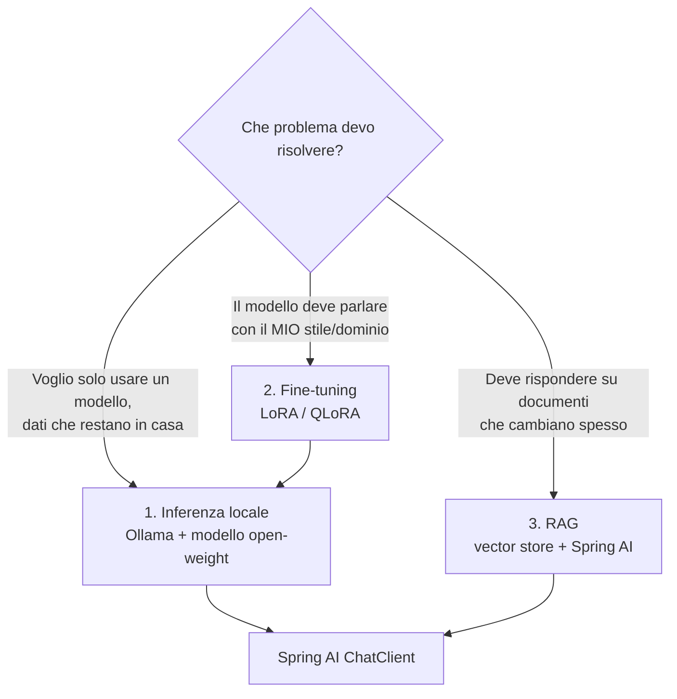

# Dalla rete neurale al LLM locale — con Spring AI

> Guida pratica in italiano: come nasce un LLM (percorso *Neural Networks: Zero to Hero* di Andrej Karpathy) e come usarlo da Java con **Spring AI** e servizi **REST**.

## 0.1 Ho capito la richiesta? Sì — ecco la mia lettura

| Tu hai chiesto | Come l'ho tradotto |
|---|---|
| Recap della playlist YouTube | La playlist è **"Neural Networks: Zero to Hero"** (Andrej Karpathy, 10 video). I capitoli 1–7 la seguono in ordine, con codice Python eseguibile e grafici. |
| "Parti dal principio e spiega come è costruito un LLM" | Neurone → backpropagation → language model → MLP/embedding → attivazioni → Transformer → tokenizer → pretraining → SFT/RLHF. |
| "Creazione di un LLM locale" | Capitolo 8: le **3 strade realistiche** (inferenza locale con Ollama, fine-tuning LoRA/QLoRA, RAG) e perché non si addestra da zero. |
| Java + Spring AI + REST | Capitoli 9–13 + progetto Maven funzionante in `code/spring-ai-demo` (chat, streaming, structured output, RAG, tool calling verso API REST). |
| Installare Spring AI e fondamenti per gestire un LLM | Capitolo 9 (installazione passo-passo) e 10 (fondamenti operativi: token, contesto, temperatura, memoria, streaming, risorse). |
| Immagini, grafici, mockup, flow model | 18 figure in `book/figures/` (generate da `scripts/make_figures.py`, i grafici dati usano dati reali dagli script) + diagrammi **Mermaid** per i flussi. |
| "Usa tutte le skill Java/Spring per le best practice" | In questa sessione non ho skill specifiche per Java/Spring: ho applicato le best practice che conosco (cap. 13) e **verificato** che il codice compili e i test passino. |

### Una precisazione importante
Il testo che hai incollato dice «il corso di Spring che hai visto con Ollama». Io non ho visibilità su quel corso: ho quindi basato il libro sulla playlist indicata e sulla documentazione Spring AI. Se vuoi che il libro segua anche quel corso, indicami titolo/link.

### Cosa ho (e non ho) verificato
- ✅ Gli script Python (`code/python/`) **sono stati eseguiti**; i grafici dei capitoli 1, 2, 5, 6 usano i loro output reali.
- ✅ Il progetto Spring (Spring Boot 4.1.1, Spring AI 2.0.1, Java 21) **compila** e i **2 test** passano.
- ⚠️ Non ho potuto far girare un modello Ollama reale nel sandbox: gli endpoint di chat/RAG sono compilati ma non provati end-to-end. Il capitolo 9 ha una checklist per provarli sulla tua macchina.
- ⚠️ I grafici "illustrativi" (embedding 2D, scaling law) sono dichiarati tali nella didascalia.

## 0.2 Mappa del libro

```mermaid
flowchart LR
    A[1 Neurone e backprop] --> B[2 Language model bigramma]
    B --> C[3 MLP + embedding]
    C --> D[4 Training sano: attivazioni, BatchNorm]
    D --> E[5 Transformer / GPT]
    E --> F[6 Tokenizer BPE]
    F --> G[7 Pretraining → SFT → RLHF]
    G --> H[8 LLM locale: 3 strade]
    H --> I[9 Installare Spring AI]
    I --> J[10 Fondamenti per gestire un LLM]
    J --> K[11 Chat, streaming, structured output]
    K --> L[12 RAG]
    L --> M[13 Tool calling + API REST]
    M --> N[14 Best practice enterprise]
```

## 0.3 Le tre strade per "avere un LLM locale"

Nel 99% dei casi un backend developer **non addestra un modello da zero** (milioni di dollari, cluster di GPU). Le strade reali:

| Strada | Costo | Quando | Dati aggiornabili? |
|---|---|---|---|
| Inferenza (Ollama) | Basso (una GPU/CPU decente) | Sempre, è il punto di partenza | No (conoscenza congelata) |
| Fine-tuning LoRA | Medio (1 GPU + dataset curato) | Stile, formato, compiti ripetitivi | Richiede nuovo training |
| **RAG** | Basso-medio | **Il caso enterprise più comune** | **Sì, istantaneamente** |

**Regola pratica:** parti da RAG + prompt buono. Fai fine-tuning solo se misuri che RAG non basta.

## 0.4 Come leggere il libro
- Se non conosci il machine learning: leggi 1→8 in ordine.
- Se sei solo uno sviluppatore Java con fretta: leggi 0.3, 8, poi 9→14 e usa il progetto in `code/spring-ai-demo`.
- Il codice Python gira con `python3` senza dipendenze (solo `attention.py` richiede NumPy).
