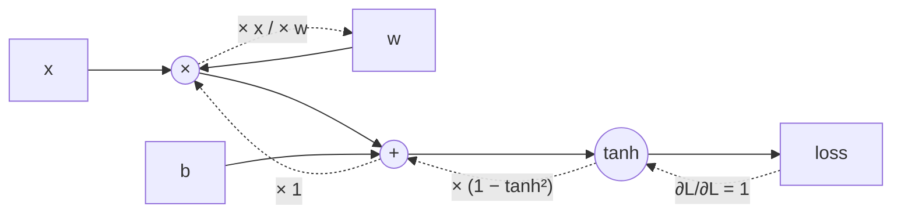
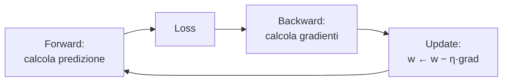

# Capitolo 1 — Reti neurali e backpropagation

*Video 1: «The spelled-out intro to neural networks and backpropagation: building micrograd» (2h25)*

## 1.1 Il neurone
Un neurone artificiale fa tre cose: **moltiplica** ogni ingresso per un peso, **somma** (più un bias), applica una **non-linearità**.


Senza la non-linearità, impilare strati equivarrebbe a un solo strato lineare: la rete non potrebbe imparare nulla di interessante.


| Funzione | Pro | Contro |
|---|---|---|
| tanh | centrata su 0 | satura (gradiente ≈ 0 agli estremi) |
| sigmoide | output in (0,1) | satura, non centrata |
| ReLU | semplice, veloce | "neuroni morti" se sempre < 0 |
| GELU | liscia, usata nei Transformer | più costosa |

## 1.2 La loss: misurare l'errore
Confrontiamo la predizione con il target e otteniamo **un solo numero** (la *loss*), es. errore quadratico: `L = Σ (y_pred − y_true)²`. Allenare = ridurre L.

## 1.3 Il gradiente e la chain rule
Il **gradiente** `∂L/∂w` dice: *"se aumento w di un soffio, di quanto cambia L?"*. Per una composizione di operazioni vale la **chain rule**: si moltiplicano le derivate locali lungo il cammino.



La **backpropagation** non è magia: è la chain rule applicata a un grafo di calcolo, partendo dalla loss (gradiente 1) verso i parametri.

## 1.4 La discesa del gradiente
Dato il gradiente, si muovono i pesi nella direzione opposta: `w ← w − η · ∂L/∂w`, dove `η` è il *learning rate*.


## 1.5 Codice: un autograd in 60 righe
Il file [`code/python/micrograd_mini.py`](../code/python/micrograd_mini.py) implementa `Value` (con `+`, `*`, `**`, `tanh` e `backward()`), un `Neuron` e un `MLP`. Estratto del cuore:

```python
def __mul__(self, o):
    out = Value(self.data * o.data, (self, o), "*")
    def _b():
        self.grad += o.data * out.grad      # d(a*b)/da = b
        o.grad    += self.data * out.grad   # d(a*b)/db = a
    out._backward = _b
    return out
```

Esecuzione reale (60 step, `lr = 0.05`):

```
step  0  loss 3.1407
step 10  loss 0.0695
step 59  loss 0.0103
predizioni: [0.952, -0.95, -0.956, 0.942] target: [1.0, -1.0, -1.0, 1.0]
```


### Il ciclo di training (lo ritroverai identico in un LLM da 100 miliardi di parametri)

> ⚠️ Trappola classica (la mostra anche Karpathy): **azzerare i gradienti** prima di ogni `backward()`, altrimenti si accumulano.

## 1.6 Cosa portarsi a casa
- Una rete è una funzione differenziabile con milioni/miliardi di parametri.
- "Imparare" = minimizzare una loss con la discesa del gradiente.
- PyTorch fa esattamente ciò che fa `micrograd`, ma su **tensori** e su GPU.
