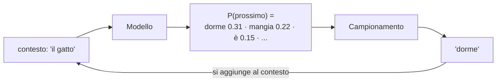

# Capitolo 2 — Language modeling: il modello bigramma

*Video 2: «The spelled-out intro to language modeling: building makemore» (1h57)*

## 2.1 Cos'è un language model
Un language model assegna una **probabilità al prossimo elemento** (carattere o token) dato ciò che precede. **Un LLM fa esattamente questo**, solo con contesti lunghi e miliardi di parametri.



## 2.2 Il bigramma a conteggi
Contiamo quante volte ogni carattere segue un altro (con `.` come inizio/fine parola) e normalizziamo in probabilità.


Codice: [`code/python/bigram.py`](../code/python/bigram.py). Output reale su 16 nomi:

```
NLL media (loss): 1.305
generati: ['sa', 'er', 'ca', 'ela', 'ela', 'ililyn']
```

I nomi generati sono "quasi plausibili": il modello vede **un solo carattere** di contesto. Pochissimo.

## 2.3 La loss giusta: Negative Log-Likelihood
Si usa `NLL = −media(log P(carattere vero))`. Se il modello assegna alta probabilità al carattere corretto, la NLL è bassa. Una NLL di 1.3 significa che mediamente il modello assegna ~27% (`e^-1.3`) al carattere giusto.

| Concetto | Significato |
|---|---|
| Logits | punteggi grezzi della rete |
| Softmax | logits → probabilità che sommano a 1 |
| NLL / cross-entropy | `−log p(target)` |
| Perplexity | `exp(NLL)`: "tra quante scelte equiprobabili sono indeciso" |

## 2.4 Dal conteggio alla rete neurale
Lo stesso modello si può esprimere come **una rete a un solo strato lineare**: codifica one-hot → moltiplica per una matrice `W` → softmax. Allenandola con la discesa del gradiente si ottiene (circa) la tabella dei conteggi. Perché farlo? Perché **una rete scala**: possiamo aggiungere strati e contesto, la tabella no (con 3 caratteri di contesto servirebbero 27³ righe, con 100 token di contesto è impossibile).

## 2.5 Softmax e temperatura (utile anche per Spring AI)
Alla generazione si può "scaldare" o "raffreddare" la distribuzione dividendo i logits per `T`:


- `T → 0`: sceglie sempre il più probabile (deterministico, ripetitivo)
- `T = 1`: distribuzione del modello
- `T > 1`: più sorprese, più errori

Troverai questo parametro come `temperature` nelle opzioni di Spring AI/Ollama (capitolo 10).
