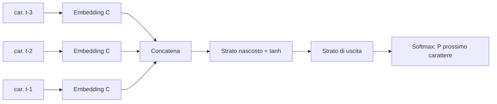

# Capitolo 3 — MLP ed embedding

*Video 3: «Building makemore Part 2: MLP» (1h15)*

## 3.1 Il limite del bigramma e l'idea di Bengio (2003)
Per usare più contesto senza esplodere in tabelle, ogni simbolo viene mappato in un **vettore denso** (*embedding*); i vettori del contesto vengono concatenati e passati a un **MLP** (strati lineari + tanh) che predice il prossimo simbolo.

La tabella `C` (embedding) è **condivisa** tra le posizioni ed è **appresa**: simboli che compaiono in contesti simili finiscono vicini nello spazio.

> Questo è lo stesso principio degli *embedding di testo* che in Spring AI usi per il RAG (cap. 12), ma con più dimensioni (es. 768) e un modello dedicato.

## 3.2 Buone pratiche di training introdotte nel video
| Pratica | Perché |
|---|---|
| **Train / dev / test split** (80/10/10) | La loss di training mente: misura la generalizzazione sul dev |
| **Mini-batch** | Gradiente approssimato ma 100× più veloce |
| **Trovare il learning rate** | Si scorre `lr` da 10⁻³ a 1 e si guarda dove la loss scende meglio |
| **Learning-rate decay** | Passi più piccoli a fine training |
| **Overfitting** | Train ≪ dev: la rete ha memorizzato |

## 3.3 Iperparametri tipici
`block_size` (contesto), `emb_dim`, `hidden`, `lr`, `batch_size`. Il video mostra come il modello migliora aumentando dimensione e contesto — in miniatura, la stessa storia degli LLM: **più parametri + più contesto + più dati = loss più bassa**.
