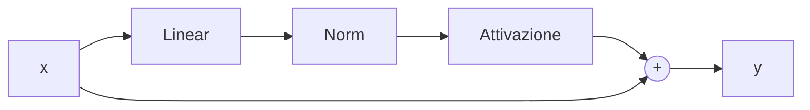
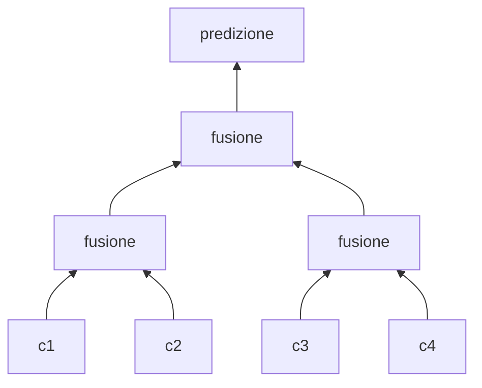

# Capitolo 4 — Far funzionare davvero il training

*Video 4: «Activations & Gradients, BatchNorm» (1h55) · Video 5: «Becoming a Backprop Ninja» (1h55) · Video 6: «Building a WaveNet» (56 min)*

## 4.1 Inizializzazione: partire dalla loss giusta
Con 27 caratteri possibili, un modello **completamente ignorante** dovrebbe avere loss iniziale `−ln(1/27) ≈ 3.30`. Se all'inizio vedi 27, i pesi di uscita sono troppo grandi: il modello è *sicuro e sbagliato*. Soluzione: scalare i pesi dell'ultimo strato (×0.01) e il bias a 0.

## 4.2 Attivazioni sature e gradienti che spariscono
Con `tanh`, se i valori entrano nelle code (|x| grande) il gradiente `1 − tanh²` ≈ 0: il neurone smette di imparare. Rimedi:

| Tecnica | Idea |
|---|---|
| **Kaiming/He init** | scala i pesi con `gain / √fan_in` per mantenere la varianza stabile da strato a strato |
| **BatchNorm** | normalizza le attivazioni (media 0, std 1) per mini-batch, poi riscala con parametri appresi |
| **LayerNorm** | come BatchNorm ma per esempio, non per batch → **è quella dei Transformer** |
| **Residual connection** | `y = x + f(x)`: il gradiente ha una "autostrada" fino all'ingresso |

## 4.3 Strumenti diagnostici (da usare davvero)
- Istogrammi delle attivazioni per strato (% di saturazione).
- Istogrammi dei gradienti (devono avere scala simile tra strati).
- Rapporto **update/data** ≈ 10⁻³ per ogni parametro (se è molto diverso, `lr` sbagliato).

## 4.4 Backprop "a mano" (video 5)
Karpathy calcola i gradienti di un'intera rete **senza `loss.backward()`**, tensore per tensore, e li confronta con PyTorch. Perché? Perché chi capisce la backprop riconosce subito i bug (gradienti che esplodono, `softmax` instabile, errori di broadcasting). Il trucco chiave: la derivata di `softmax + cross-entropy` rispetto ai logits è semplicemente `p − y`.

## 4.5 WaveNet: contesto gerarchico (video 6)
Invece di concatenare tutti i caratteri in un colpo solo, li si fonde **a coppie, strato dopo strato** (struttura ad albero). È un'anticipazione dell'idea che nei Transformer diventa *attention*: ogni posizione può raccogliere informazioni da molte altre.

