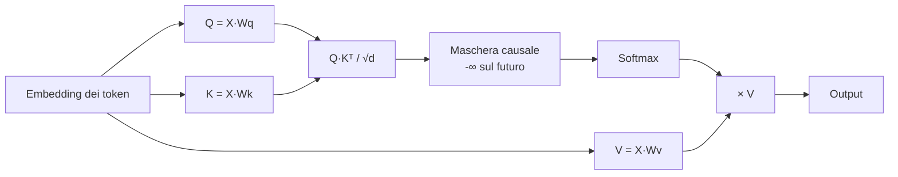
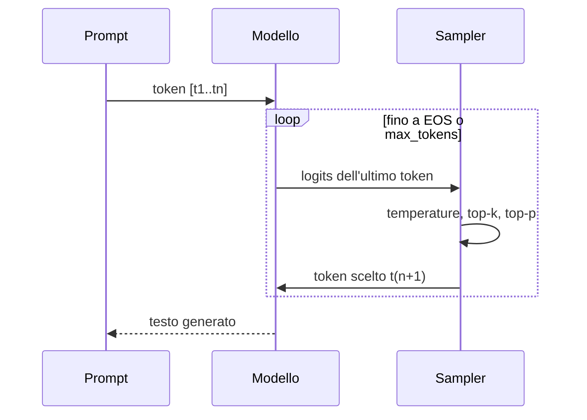

# Capitolo 5 — Il Transformer: costruire GPT da zero

*Video 7: «Let's build GPT: from scratch, in code, spelled out» (1h56) — paper «Attention Is All You Need» (2017)*

## 5.1 L'idea: ogni token "guarda" i token precedenti
Per prevedere il prossimo token servono le informazioni dei token passati — ma **non tutte con lo stesso peso**. La *self-attention* calcola questi pesi dinamicamente.

Ogni token produce tre vettori:
- **Query (Q)**: *"cosa sto cercando?"*
- **Key (K)**: *"cosa contengo?"*
- **Value (V)**: *"cosa comunico se mi scegli?"*

`Attention(Q,K,V) = softmax( Q·Kᵀ / √d ) · V`

La divisione per `√d` evita che i prodotti scalari diventino enormi (softmax satura → gradienti nulli).



## 5.2 La maschera causale
Un modello *decoder-only* (GPT, Llama, Mistral...) **non può vedere il futuro**: la matrice dei punteggi è resa triangolare inferiore.


Codice reale ([`attention.py`](../code/python/attention.py)): le righe sommano a 1 e sopra la diagonale c'è zero.

```python
scores = q @ k.T / np.sqrt(k.shape[-1])
scores = np.where(np.tril(np.ones((T, T), bool)), scores, -np.inf)
att = softmax(scores)          # (T, T), triangolare
out = att @ v
```

## 5.3 Multi-head attention
Si eseguono *h* teste di attenzione in parallelo (ognuna con dimensione `d/h`) e si concatenano: teste diverse imparano relazioni diverse (sintassi, coreferenze, posizione...).

## 5.4 Il blocco Transformer


| Componente | Ruolo |
|---|---|
| Embedding + posizione | il modello non ha nozione d'ordine: la si aggiunge |
| Self-attention | **comunicazione** tra token |
| MLP (feed-forward) | **calcolo** su ogni token (4× più largo, poi GELU) |
| Residual + LayerNorm | rende trainabili reti profonde |
| Linear + softmax finale | distribuzione sul vocabolario |

Il blocco si ripete N volte (GPT-2 small: 12; modelli grandi: 32–120+).

## 5.5 Generare testo


Ogni nuovo token richiede un passaggio nel modello; per non ricalcolare tutto si usa la **KV-cache** (cap. 10).

## 5.6 Encoder, decoder, encoder-decoder
| Tipo | Esempi | Uso |
|---|---|---|
| Decoder-only | GPT, Llama, Mistral, Qwen | generazione (chat) |
| Encoder-only | BERT | embedding, classificazione |
| Encoder-decoder | T5 | traduzione |

I **modelli di embedding** (`nomic-embed-text`, ecc.) usati nel RAG sono di tipo encoder.
