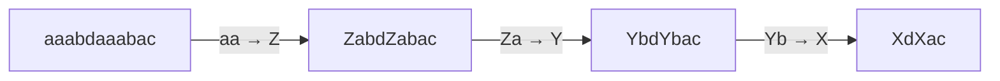

# Capitolo 6 — Il tokenizer

*Video 9: «Let's build the GPT Tokenizer» (2h13)*

## 6.1 Perché non lavorare sui caratteri?
I caratteri producono sequenze lunghissime (attention costa O(T²)); le parole intere hanno vocabolari enormi e non gestiscono parole nuove. Soluzione: **sottoparole** con **Byte Pair Encoding (BPE)**.

## 6.2 L'algoritmo BPE
1. Parti dai **byte UTF-8** (256 simboli).
2. Trova la **coppia adiacente più frequente**.
3. Sostituiscila con un nuovo simbolo (id 256, 257, ...).
4. Ripeti N volte: il vocabolario finale = 256 + N.



Esecuzione reale ([`bpe.py`](../code/python/bpe.py)):
```
merge appresi: {(97, 97): 256, (256, 97): 257, (257, 98): 258}
byte originali: 23 -> token: 11
```


## 6.3 Cosa c'è di vero nei tokenizer di produzione
| Aspetto | Dettaglio |
|---|---|
| GPT-2 | ~50k token; regex che impedisce di fondere lettere/numeri/punteggiatura |
| GPT-4 (`cl100k`) | ~100k token; gestisce meglio spazi e codice |
| Token speciali | `<|endoftext|>`, marcatori dei ruoli della chat |
| SentencePiece | usato da Llama/Mistral, lavora direttamente sul testo con fallback sui byte |

## 6.4 Il tokenizer spiega molte "stranezze" degli LLM
- **Contare lettere** (`strawberry`) fallisce: il modello vede token, non lettere.
- **Aritmetica**: i numeri sono spezzati in modo irregolare.
- **Italiano**: spesso più token per parola dell'inglese → **costo e contesto** consumati più in fretta.
- **Spazi finali** e maiuscole cambiano i token, quindi la risposta.

> Per il tuo progetto: la **finestra di contesto** e i **costi** si misurano *in token*, non in parole. Regola empirica: 1 token ≈ 4 caratteri in inglese, ≈ 3 in italiano.
