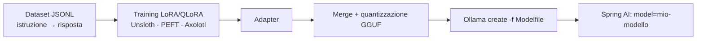

# Capitolo 8 — Avere un LLM locale: le tre strade

## 8.1 Perché non si addestra da zero
Ordine di grandezza (Karpathy, GPT-2 124M): ~4 ore su 8 GPU. Un modello da 70B su 15T token: migliaia di GPU per mesi, milioni di dollari. **Non è realistico per un'azienda normale**, e non serve: esistono ottimi modelli *open-weight*.

> **Open-weight ≠ open-source.** Di Llama/Mistral/Qwen/Gemma si scaricano i *pesi*, ma spesso non dati e codice di training; leggi **la licenza** prima dell'uso commerciale.

## 8.2 Strada 1 — Inferenza locale con Ollama
Ollama scarica, gestisce e serve modelli quantizzati con una semplice API REST su `localhost:11434`.

```bash
ollama pull llama3.2           # ~2 GB (3B, quantizzato Q4)
ollama run llama3.2 "Spiegami la backpropagation in 3 righe"
curl http://localhost:11434/api/chat -d '{
  "model": "llama3.2",
  "messages": [{"role":"user","content":"Ciao!"}],
  "stream": false
}'
```

### Quantizzazione: comprimere i pesi
I pesi originali sono in 16 bit; si riducono a 8 o 4 bit con piccola perdita di qualità.


| Modello | FP16 | Q4 (≈) | Hardware indicativo |
|---|---|---|---|
| 3B | 6 GB | ~2 GB | laptop senza GPU |
| 8B | 16 GB | ~5 GB | GPU 8 GB / Mac 16 GB |
| 70B | 140 GB | ~40 GB | 2×GPU 24 GB / Mac 64 GB+ |

*(valori = parametri × byte per peso; a questi vanno aggiunti KV-cache e overhead.)*

## 8.3 Strada 2 — Fine-tuning con LoRA/QLoRA
Invece di aggiornare tutti i pesi, si **congelano** quelli originali e si allenano due matrici piccole per strato (**low-rank adaptation**).


- **LoRA**: allena solo `A` e `B` (rango r tipico 8–64) → 0.1–1% dei parametri.
- **QLoRA**: come LoRA ma sul modello base **quantizzato a 4 bit** → fine-tuning di un 7–8B su una GPU da 12–24 GB.
- Il risultato è un piccolo "adapter" (decine di MB) da fondere nel modello e importare in Ollama tramite `Modelfile`.

**Quando ha senso:** cambiare *stile/formato/tono*, imparare un compito ripetitivo (classificazione, estrazione), ridurre i token del prompt. **Quando NO:** per "insegnare fatti" che cambiano → usa RAG.



## 8.4 Strada 3 — RAG (la più comune in azienda)
Il modello non viene modificato: prima di rispondere, il sistema **recupera i passaggi rilevanti** dai tuoi documenti e li inserisce nel prompt.


Vantaggi: conoscenza **aggiornabile in tempo reale**, **citazioni delle fonti**, controllo degli accessi per documento, nessun training. Lo implementeremo nel capitolo 12.

## 8.5 Quale scegliere?
| Esigenza | Prima scelta |
|---|---|
| Privacy: i dati non devono uscire | Inferenza locale (Ollama) |
| Rispondere sui documenti aziendali | **RAG** |
| Output in formato/stile rigido | Prompt + structured output → poi eventualmente LoRA |
| Agire su sistemi esistenti (ordini, CRM) | **Tool calling** verso API REST (cap. 13) |
| Dominio molto specifico, molti esempi etichettati | Fine-tuning |

Spesso si **combinano**: modello locale + RAG + tool calling, tutto orchestrato da Spring AI.
