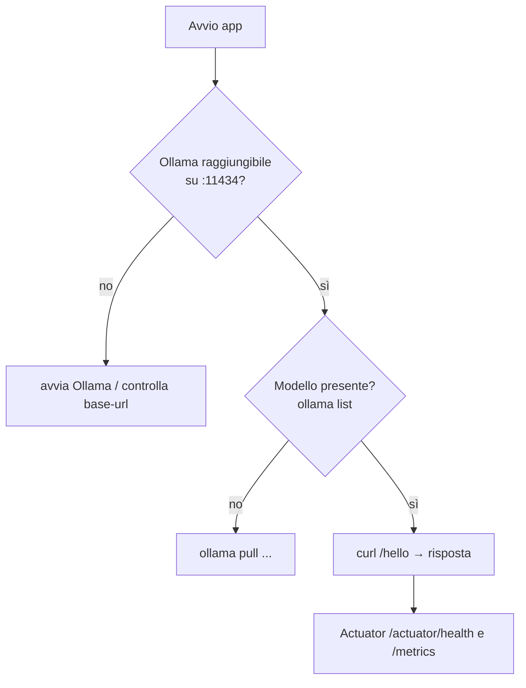

# Capitolo 9 — Installare Spring AI (passo dopo passo)

## 9.1 Cos'è Spring AI
Un framework Spring che offre **astrazioni portabili** per usare modelli generativi: `ChatModel`/`ChatClient`, `EmbeddingModel`, `VectorStore`, *advisors*, *tool calling*, *chat memory*, *structured output*, con integrazione Boot (auto-configuration, Actuator, Micrometer). Stessa API per Ollama, OpenAI, Anthropic, Azure, Bedrock, Gemini, Mistral...


## 9.2 Prerequisiti e versioni usate nel libro
| Componente | Versione | Note |
|---|---|---|
| JDK | **21** (LTS) | |
| Spring Boot | **4.1.1** | Spring AI 2.x è costruito su Boot 4 |
| Spring AI | **2.0.1** | gestita dal BOM `spring-ai-bom` |
| Maven | 3.9+ | (Gradle equivalente) |
| Ollama | ultima | modello `llama3.2` + `nomic-embed-text` |

> 📌 Le versioni cambiano in fretta: controlla sempre [start.spring.io](https://start.spring.io) e la documentazione ufficiale. Se resti su Boot 3.x usa la linea Spring AI 1.x (nel progetto di esempio basta cambiare `parent` e `spring-ai.version`; alcune classi hanno package/nomi diversi).

## 9.3 Passo 1 — Installare Ollama e scaricare i modelli

**Opzione A — nativo** (macOS/Linux/Windows): installer da ollama.com, poi:
```bash
ollama pull llama3.2            # modello di chat
ollama pull nomic-embed-text    # modello di embedding (per il RAG)
ollama list                     # verifica
curl http://localhost:11434/api/tags
```

**Opzione B — Docker** (con GPU NVIDIA aggiungi `--gpus=all`):
```bash
docker run -d --name ollama -p 11434:11434 -v ollama:/root/.ollama ollama/ollama
docker exec ollama ollama pull llama3.2
docker exec ollama ollama pull nomic-embed-text
```
Trovi un `docker-compose.yml` pronto in `code/spring-ai-demo/`.

## 9.4 Passo 2 — Creare il progetto
Da [start.spring.io](https://start.spring.io): Maven · Java 21 · dipendenze **Spring Web**, **Validation**, **Actuator**, **Ollama**. Oppure parti dal `pom.xml` del libro. Il punto chiave è il **BOM**, che allinea tutte le versioni Spring AI:

```xml
<properties>
  <java.version>21</java.version>
  <spring-ai.version>2.0.1</spring-ai.version>
</properties>

<dependencyManagement>
  <dependencies>
    <dependency>
      <groupId>org.springframework.ai</groupId>
      <artifactId>spring-ai-bom</artifactId>
      <version>${spring-ai.version}</version>
      <type>pom</type>
      <scope>import</scope>
    </dependency>
  </dependencies>
</dependencyManagement>

<dependencies>
  <dependency>  <!-- ChatModel + EmbeddingModel verso Ollama -->
    <groupId>org.springframework.ai</groupId>
    <artifactId>spring-ai-starter-model-ollama</artifactId>
  </dependency>
  <dependency>  <!-- RetrievalAugmentationAdvisor (RAG modulare) -->
    <groupId>org.springframework.ai</groupId>
    <artifactId>spring-ai-rag</artifactId>
  </dependency>
  <dependency>  <!-- VectorStore, SimpleVectorStore, TokenTextSplitter -->
    <groupId>org.springframework.ai</groupId>
    <artifactId>spring-ai-vector-store</artifactId>
  </dependency>
  <dependency>  <!-- memoria conversazionale -->
    <groupId>org.springframework.ai</groupId>
    <artifactId>spring-ai-starter-model-chat-memory</artifactId>
  </dependency>
</dependencies>
```
Per **cambiare provider** sostituisci lo starter (`spring-ai-starter-model-openai`, `-anthropic`, ...) e le proprietà: il codice con `ChatClient` non cambia.

## 9.5 Passo 3 — Configurazione (`application.yml`)
```yaml
spring:
  ai:
    ollama:
      base-url: http://localhost:11434
      chat:
        options:
          model: llama3.2
          temperature: 0.3
          num-ctx: 4096
      embedding:
        options:
          model: nomic-embed-text
      init:
        pull-model-strategy: when_missing   # scarica il modello se manca (solo dev!)
```
Per **provider cloud** le chiavi API vanno in variabili d'ambiente (`${OPENAI_API_KEY}`), mai nel repository.

## 9.6 Passo 4 — Il "Hello LLM"
```java
@RestController
class HelloController {
    private final ChatClient chat;
    HelloController(ChatClient.Builder builder) { this.chat = builder.build(); }

    @GetMapping("/hello")
    String hello(@RequestParam(defaultValue = "Spiegami un Transformer in 2 frasi") String q) {
        return chat.prompt().user(q).call().content();
    }
}
```
```bash
mvn spring-boot:run
curl "localhost:8080/hello?q=Che%20cos%27%C3%A8%20un%20token%3F"
```

`ChatClient.Builder` viene auto-configurato da Boot: non serve creare il client a mano.

## 9.7 Checklist di verifica e problemi frequenti
| Sintomo | Causa probabile | Soluzione |
|---|---|---|
| `Connection refused :11434` | Ollama non avviato | `ollama serve` / controlla il container |
| `model "x" not found` | modello non scaricato | `ollama pull x` o `pull-model-strategy` |
| Prima risposta lentissima | il modello si sta caricando in RAM/VRAM | normale; `keep_alive` lo mantiene caldo |
| Risposte tagliate / contesto ignorato | `num-ctx` troppo piccolo | aumentalo (costa RAM) |
| Timeout | modello grande su CPU | modello più piccolo / aumenta read-timeout |
| `OutOfMemory` nel processo Ollama | modello > RAM/VRAM | quantizzazione più spinta o modello minore |


