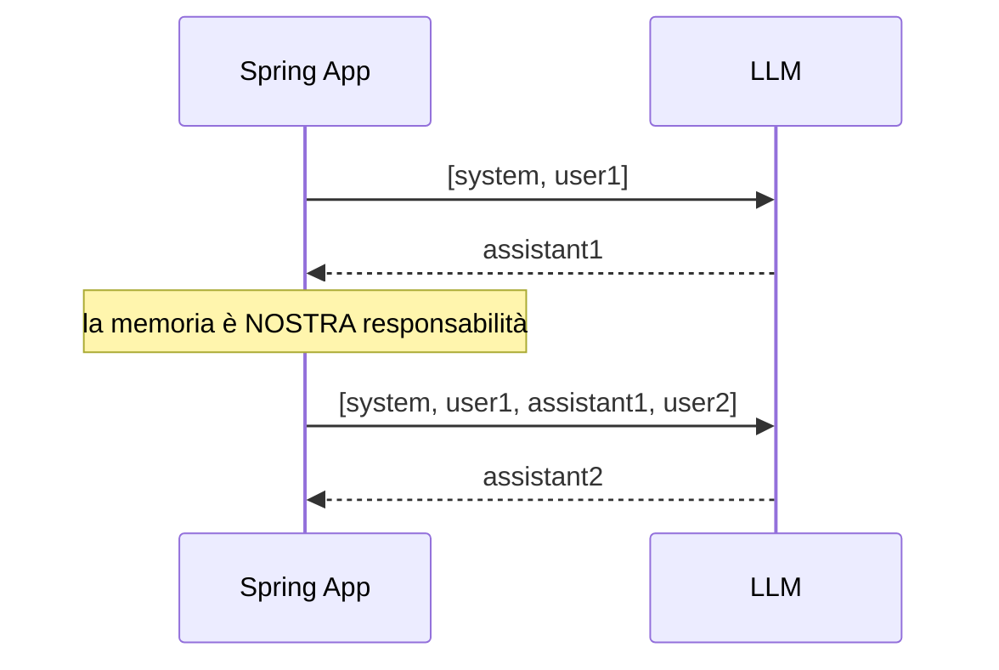
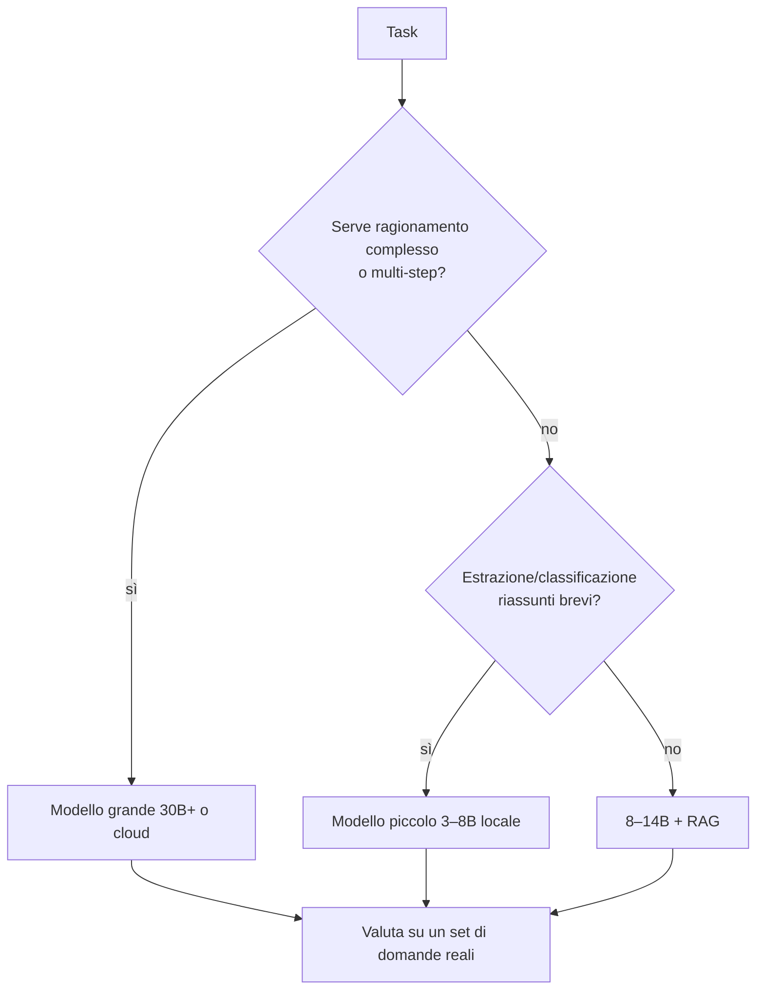

# Capitolo 10 — Fondamenti per gestire un LLM

Questo capitolo è il "manuale d'uso" concettuale: ciò che devi sapere per **controllare, dimensionare e rendere affidabile** un LLM, sia locale sia remoto.

## 10.1 Un LLM è una funzione *stateless*
Ogni richiesta è indipendente: il modello **non ricorda** nulla. La "conversazione" è un array di messaggi che **reinvii ogni volta**.

| Ruolo | Funzione |
|---|---|
| `system` | istruzioni persistenti: personalità, regole, formato |
| `user` | input dell'utente |
| `assistant` | risposte precedenti del modello |
| `tool` | risultati dei tool richiamati |


In Spring AI la memoria è un *advisor* (`MessageChatMemoryAdvisor`) che salva e reinietta i messaggi per `conversationId`.

## 10.2 Token e finestra di contesto
- Tutto si misura in **token** (cap. 6).
- **Contesto** = token di input + token generati. Se lo superi: errore o troncamento silenzioso (con Ollama il default `num_ctx` è basso! impostalo).
- Più contesto = più RAM e più latenza.

### Dimensionare la KV-cache
Per ogni token del contesto il modello conserva K e V di ogni strato:

`memoria_KV = 2 × n_strati × n_kv_heads × dim_head × byte × n_token`

Esempio *Llama 3 8B* (32 strati, 8 teste KV, dim 128, FP16 = 2 byte):
`2 × 32 × 8 × 128 × 2 = 131.072 B ≈ 128 KiB per token` → con 8.192 token ≈ **1 GiB**, con 128k token ≈ **16 GiB**. Per questo un contesto enorme *non è gratis*, anche in locale.

## 10.3 Parametri di campionamento


| Parametro | Cosa fa | Valori tipici |
|---|---|---|
| `temperature` | appiattisce/affila la distribuzione | 0–0.3 estrazione/codice · 0.7–1 creatività |
| `top_p` (nucleus) | campiona solo tra i token che sommano a p | 0.9 |
| `top_k` | solo i k più probabili | 40 |
| `num_predict` / `max_tokens` | tetto di token generati | **sempre** impostarlo |
| `seed` | riproducibilità (con temperature>0) | per test |
| `repeat_penalty` | scoraggia ripetizioni | ~1.1 |

Regola: **cambia temperatura *oppure* top_p, non entrambi**. Per risultati ripetibili: `temperature=0` (+ `seed`), ma "deterministico" non significa "corretto".

## 10.4 Opzioni in Spring AI
```java
// default globali: application.yml (spring.ai.ollama.chat.options.*)
// override per singola chiamata:
String r = chatClient.prompt()
    .user("Estrai i dati dal testo...")
    .options(OllamaChatOptions.builder()
        .temperature(0.0)
        .numPredict(300))   // in 2.x options() accetta il builder
    .call()
    .content();
```
> I nomi delle option sono specifici del provider: con `ChatOptions` generico (`temperature`, `maxTokens`, `topP`) resti portabile.

## 10.5 Streaming
Un LLM genera **un token alla volta**: aspettare la risposta completa dà una UX pessima. Con lo *streaming* mostri i token appena arrivano.

| Metrica | Significato |
|---|---|
| **TTFT** (time to first token) | latenza percepita (include caricamento del prompt) |
| **tokens/s** | velocità di generazione |
| Latenza totale | `TTFT + n_token / tokens_s` |

In Spring AI: `.stream().content()` → `Flux<String>`; esposto via **Server-Sent Events** (cap. 11).

## 10.6 Prompt: la vera "interfaccia di programmazione"
Struttura consigliata di un prompt di sistema:
1. **Ruolo** («Sei un assistente per il supporto clienti di...»)
2. **Regole** («Rispondi in italiano. Se manca l'informazione, dillo.»)
3. **Formato** (JSON, elenco, lunghezza massima)
4. **Esempi** (*few-shot*) per i compiti delicati
5. **Dati** (contesto RAG, risultati dei tool) chiaramente delimitati

Template parametrici (`{variabile}`) in Spring AI → evitano concatenazioni di stringhe e rendono i prompt versionabili in `resources/prompts/*.st`.

## 10.7 Affidabilità: cosa può andare storto
| Rischio | Mitigazione |
|---|---|
| **Allucinazioni** | RAG + «rispondi solo dal contesto» + citare fonti + `temperature` bassa |
| **Output non valido** | structured output + validazione + retry |
| **Prompt injection** (testo malevolo nei documenti o nell'input) | trattare il contesto come *non fidato*; mai far eseguire azioni distruttive senza conferma; tool a privilegi minimi |
| **Fuga di dati** | modello locale, mascheramento PII, log senza prompt completi |
| **Costi/latenza** | limiti di token, cache, modelli più piccoli per task semplici |
| **Non determinismo** | test su proprietà (schema, contenuto richiesto) non su stringhe esatte |

## 10.8 Scegliere il modello

**Valuta sempre sui tuoi dati**: costruisci 30–100 domande con risposta attesa e misura (anche con un secondo LLM come giudice, *LLM-as-a-judge*, ma con campione verificato da umani).
