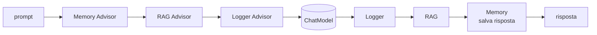
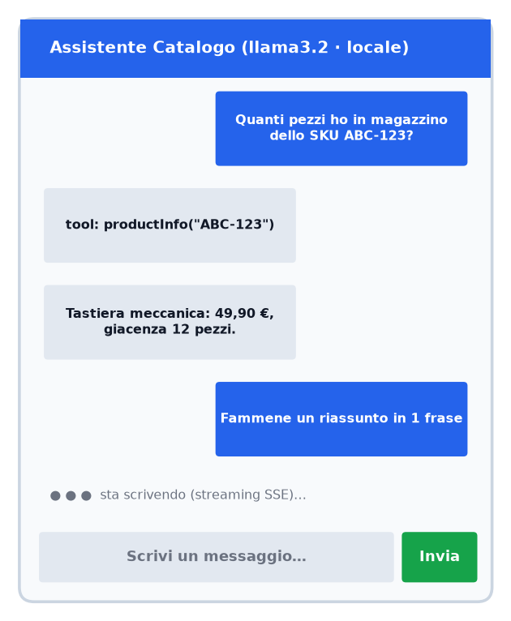
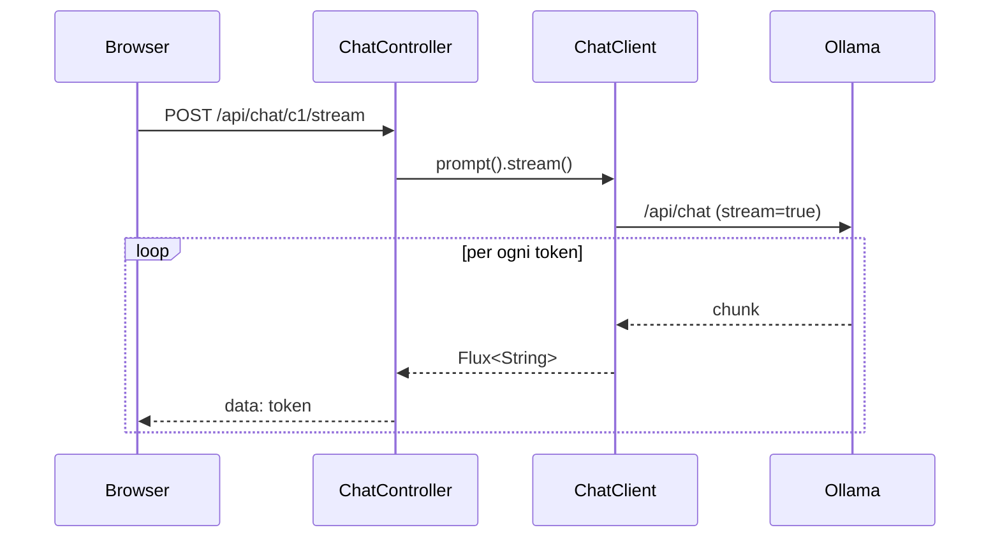

# Capitolo 11 — Chat, streaming, memoria e structured output con Spring AI

Codice completo in `code/spring-ai-demo/src/main/java/it/example/llmbook/`.

## 11.1 Un `ChatClient` configurato una volta sola
```java
@Configuration
public class AiConfig {
    @Bean ChatMemory chatMemory() {
        return MessageWindowChatMemory.builder().maxMessages(10).build();
    }

    @Bean ChatClient chatClient(ChatModel model, ChatMemory memory) {
        return ChatClient.builder(model)
            .defaultSystem("""
                Sei un assistente tecnico. Rispondi sempre in italiano,
                in modo conciso. Se non conosci la risposta, dillo.""")
            .defaultAdvisors(
                MessageChatMemoryAdvisor.builder(memory).build(),
                new SimpleLoggerAdvisor())
            .build();
    }
}
```
**Advisors** = intercettori (come i filtri servlet) attorno alla chiamata: memoria, RAG, logging, guardrail.



## 11.2 API REST: risposta completa e streaming SSE
```java
@RestController @RequestMapping("/api/chat")
public class ChatController {
    public record ChatRequest(@NotBlank @Size(max = 4000) String message) {}
    public record ChatResponse(String conversationId, String answer) {}

    @PostMapping("/{conversationId}")
    public ChatResponse ask(@PathVariable String conversationId,
                            @Valid @RequestBody ChatRequest req) {
        String answer = chat.prompt().user(req.message())
            .advisors(a -> a.param(CONVERSATION_ID, conversationId))
            .call().content();
        return new ChatResponse(conversationId, answer);
    }

    @PostMapping(value = "/{conversationId}/stream",
                 produces = MediaType.TEXT_EVENT_STREAM_VALUE)
    public Flux<String> stream(@PathVariable String conversationId,
                               @Valid @RequestBody ChatRequest req) {
        return chat.prompt().user(req.message())
            .advisors(a -> a.param(CONVERSATION_ID, conversationId))
            .stream().content();
    }
}
```
Prova:
```bash
curl -X POST localhost:8080/api/chat/c1 -H 'Content-Type: application/json' \
     -d '{"message":"Mi chiamo Ciro. Cos è un Transformer?"}'
curl -X POST localhost:8080/api/chat/c1 -H 'Content-Type: application/json' \
     -d '{"message":"Come mi chiamo?"}'            # grazie alla memoria risponde: Ciro
curl -N -X POST localhost:8080/api/chat/c1/stream -H 'Content-Type: application/json' \
     -d '{"message":"Racconta una storia breve"}'  # token in streaming
```

### Mockup dell'interfaccia


Un client web minimale usa `fetch` + `ReadableStream` (o `EventSource` con GET) per appendere i token al bubble della risposta.



## 11.3 Structured output: da testo libero a oggetti Java
```java
public record TicketAnalysis(String category, int priority,
                             List<String> keywords, String summary) {}

TicketAnalysis a = chat.prompt()
    .system("Classifica il ticket. priority da 1 (bassa) a 5 (critica).")
    .user(u -> u.text("Ticket: {t}").param("t", testo))
    .call()
    .entity(TicketAnalysis.class);
```
Spring AI aggiunge al prompt lo **schema JSON** del record e fa il parsing (`BeanOutputConverter`). Per elenchi: `new ParameterizedTypeReference<List<TicketAnalysis>>() {}`.

**Buone pratiche:** `temperature` bassa, validare il risultato (Bean Validation), gestire il fallimento del parsing con **retry limitato**, preferire modelli che supportano nativamente il *JSON mode*/structured output.
