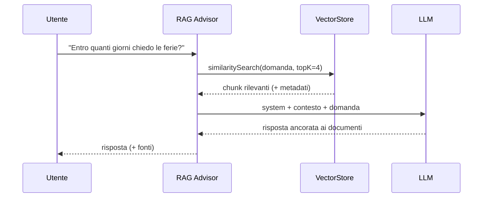

# Capitolo 12 — RAG con Spring AI

## 12.1 Perché RAG
Il modello non conosce i tuoi documenti e il suo sapere è congelato. RAG = **cercare prima, rispondere poi**. (Schema: figura 15 del cap. 8.)


## 12.2 Concetti
| Termine | Significato |
|---|---|
| **Embedding** | vettore (es. 768 numeri) che rappresenta il *significato* di un testo |
| **Similarità coseno** | angolo tra due vettori: ≈1 = significato simile |
| **Chunk** | pezzo di documento (200–500 token) con un po' di sovrapposizione |
| **Vector store** | database che cerca i vettori più vicini (PgVector, Qdrant, Milvus, Redis, Chroma...) |
| **Top-K / soglia** | quanti chunk recuperare e con quale similarità minima |

## 12.3 Ingestion (offline o a evento)
```java
public int ingest(String source, String text) {
    var chunks = TokenTextSplitter.builder()
            .withChunkSize(400).withMinChunkSizeChars(100)
            .withMinChunkLengthToEmbed(5).withMaxNumChunks(10_000)
            .withKeepSeparator(true).build()
            .apply(List.of(new Document(text, Map.of("source", source))));
    store.add(chunks);          // calcola gli embedding e li salva
    return chunks.size();
}
```
Per file reali usa i `DocumentReader` (PDF con `PagePdfDocumentReader`, Word/HTML con Apache Tika). **Metadati** (`source`, `pagina`, `tenant`, `data`) servono per citare le fonti e filtrare.

## 12.4 Query con `RetrievalAugmentationAdvisor`
```java
var retriever = VectorStoreDocumentRetriever.builder()
        .vectorStore(store).topK(4).similarityThreshold(0.5).build();

ChatClient ragClient = builder
        .defaultAdvisors(RetrievalAugmentationAdvisor.builder()
                .documentRetriever(retriever).build())
        .build();

String answer = ragClient.prompt().user(question).call().content();
```
Alternativa più semplice: `QuestionAnswerAdvisor`. La versione "modulare" permette di aggiungere *query rewriting/expansion*, *re-ranking* e filtri.



## 12.5 Vector store: da demo a produzione
| Fase | Scelta |
|---|---|
| Demo/test | `SimpleVectorStore` (in memoria, persistibile su file) |
| Produzione "Spring-friendly" | **PgVector** (`spring-ai-starter-vector-store-pgvector`) – riusi il Postgres che hai già |
| Grandi volumi | Qdrant, Milvus, Elasticsearch/OpenSearch |

```yaml
spring:
  datasource: { url: jdbc:postgresql://localhost:5432/rag, username: rag, password: ${DB_PASSWORD} }
  ai:
    vectorstore:
      pgvector:
        initialize-schema: true      # solo in dev: in prod usa Flyway/Liquibase
        dimensions: 768              # = dimensione del modello di embedding!
        index-type: HNSW
        distance-type: COSINE_DISTANCE
```
> ⚠️ **Cambiare il modello di embedding = reindicizzare tutto**: le dimensioni e lo spazio vettoriale non sono compatibili.

## 12.6 Qualità del RAG: dove si sbaglia davvero
1. **Chunking sbagliato** (troppo piccolo: perde contesto; troppo grande: rumore).
2. **Embedding inadatto alla lingua** (usa modelli multilingua per l'italiano, es. `bge-m3`, `multilingual-e5`).
3. **Nessuna soglia**: si inietta contesto irrilevante e il modello "risponde comunque".
4. **Prompt permissivo**: imponi *«rispondi solo con il contesto; se non c'è, dì che non lo sai»*.
5. **Nessuna valutazione**: crea un set di domande/risposte attese e misura *recall del retrieval* e correttezza.

Prova locale:
```bash
curl -X POST localhost:8080/api/rag/documents -H 'Content-Type: application/json' \
  -d '{"source":"hr.pdf","text":"Le ferie vanno richieste almeno 15 giorni prima tramite il portale HR."}'
curl -X POST localhost:8080/api/rag/ask -H 'Content-Type: application/json' \
  -d '{"question":"Con quanto anticipo chiedo le ferie?"}'
```
> Nel sandbox in cui è stato scritto il libro il RAG è compilato ma **non eseguito con un modello reale**; la digressione Python D3 mostra il meccanismo con un esempio realmente eseguito.
