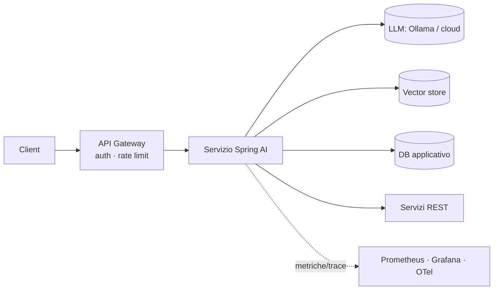
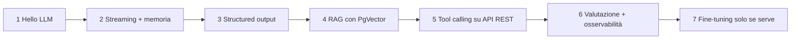

# Capitolo 14 — Best practice enterprise per Spring + LLM

## 14.1 Architettura

- **Isola il LLM dietro un tuo servizio**: i client non parlano mai direttamente con Ollama.
- Usa **interfacce tue** (`AssistantService`) sopra `ChatClient`: più facile da testare e sostituire.
- Un LLM è lento e fallibile: trattalo come **dipendenza remota instabile**.

## 14.2 Checklist
| Area | Pratica |
|---|---|
| **Config** | `@ConfigurationProperties` tipizzate; segreti da env/Vault; profili `dev`/`prod`; `pull-model-strategy` solo in dev |
| **Validazione** | Bean Validation sugli input; limite lunghezza messaggio; sanitizzazione |
| **Errori** | `ProblemDetail` (RFC 9457) con `@RestControllerAdvice`; mai mostrare stack/prompt |
| **Resilienza** | timeout espliciti, retry con backoff solo su errori transienti, circuit breaker (Resilience4j), fallback |
| **Concorrenza** | pool/semafori: un modello locale serve poche richieste in parallelo; usa **virtual threads** (Java 21) per le chiamate bloccanti |
| **Performance** | streaming, `keep_alive` del modello, cache di risposte/embedding, modello piccolo per task semplici |
| **Sicurezza** | autenticazione/autorizzazione (Spring Security), filtri per tenant sul retrieval, tool read-only, difesa da prompt injection, niente PII nei log |
| **Osservabilità** | Actuator + Micrometer: latenza, token in/out (`gen_ai.*`), errori; trace OpenTelemetry; log con `SimpleLoggerAdvisor` solo in dev |
| **Test** | unit con mock REST; test di proprietà sulle risposte; dataset di valutazione RAG in CI; Testcontainers per integrazione |
| **Prompt** | file `.st` versionati; nessuna concatenazione di stringhe con input utente |
| **Costi/limiti** | `maxTokens`, rate limit per utente, budget token |
| **Governance** | registra modello + versione + prompt usati; informativa utenti; controllo licenze modelli |

## 14.3 Esempio: errori coerenti
```java
@RestControllerAdvice
public class ApiExceptionHandler {
    @ExceptionHandler(NonTransientAiException.class)
    ProblemDetail aiUnavailable(Exception e) {
        var pd = ProblemDetail.forStatusAndDetail(HttpStatus.BAD_GATEWAY,
                "Il modello non ha risposto correttamente");
        pd.setTitle("LLM error");
        return pd;
    }
}
```

## 14.4 Docker Compose per lo sviluppo
`code/spring-ai-demo/docker-compose.yml` avvia Ollama e Postgres+PgVector. Poi:
```bash
docker compose up -d
docker exec ollama ollama pull llama3.2 && docker exec ollama ollama pull nomic-embed-text
mvn spring-boot:run
```

## 14.5 Percorso di crescita consigliato

