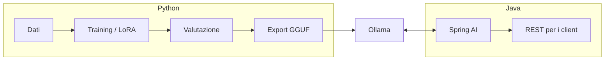

# Appendice A — Digressioni su Python

Python è il linguaggio in cui **si addestrano e si studiano** i modelli; Java/Spring è dove spesso li **si integra in produzione**. Qui alcune digressioni utili. Quelle marcate ✅ sono state eseguite durante la scrittura; ⚠️ sono snippet standard non eseguiti nel sandbox (richiedono librerie/GPU/modelli).

## A.1 Perché Python domina il machine learning
- Ecosistema: **PyTorch**, NumPy, Hugging Face (`transformers`, `peft`, `trl`), `llama.cpp` bindings.
- Python è solo la "colla": i calcoli pesanti girano in C++/CUDA.
- Ruoli tipici: **Python** = ricerca, training, fine-tuning, valutazione. **Java/Spring** = API, sicurezza, transazioni, integrazioni, scalabilità.



## A.2 Tensori e autograd con PyTorch ⚠️
Ciò che nel cap. 1 abbiamo fatto con `Value` scalari, PyTorch lo fa su tensori:
```python
import torch
w = torch.randn(3, requires_grad=True); b = torch.zeros(1, requires_grad=True)
x = torch.tensor([2.0, 3.0, -1.0]); y = torch.tensor(1.0)

for step in range(50):
    pred = torch.tanh(x @ w + b)
    loss = (pred - y) ** 2
    w.grad = b.grad = None      # azzera i gradienti
    loss.backward()             # backprop automatica
    with torch.no_grad():
        w -= 0.1 * w.grad; b -= 0.1 * b.grad
```
Idiomi da ricordare: `@` prodotto matriciale · broadcasting · `.item()` per estrarre uno scalare · `torch.no_grad()` in inferenza · `.to("cuda")`/`"mps"` per la GPU.

## A.3 Campionamento da zero: temperature, top-k, top-p ✅
File [`code/python/sampling.py`](../code/python/sampling.py). Stessi logits `[2.0, 1.0, 0.5, 0.1, -1.0]` su 5 parole, 2000 estrazioni (output reale):

| Configurazione | il | un | lo | la | gli |
|---|---|---|---|---|---|
| `temperature=0` (greedy) | 1.00 | 0 | 0 | 0 | 0 |
| `temperature=1` | 0.55 | 0.21 | 0.13 | 0.08 | 0.03 |
| `temperature=1, top_k=2` | 0.74 | 0.26 | 0 | 0 | 0 |
| `temperature=1, top_p=0.8` | 0.62 | 0.24 | 0.14 | 0 | 0 |
| `temperature=2` | 0.38 | 0.22 | 0.18 | 0.14 | 0.09 |

Lettura: `top_k` e `top_p` **tagliano le code** (token improbabili) *prima* di estrarre; la temperatura **cambia la forma** della distribuzione. Sono gli stessi parametri che passi a Ollama/Spring AI.

## A.4 Mini-RAG in Python puro (e perché fallisce) ✅
File [`code/python/mini_rag.py`](../code/python/mini_rag.py): embedding *bag-of-words* + similarità coseno. Domanda: *«Entro quanti giorni devo chiedere le ferie?»*

```
risultati: [(0.47, 'trasferta'), (0.39, 'ferie')]     ← sbagliato!
```
Il documento sulle **trasferte** vince perché condivide parole *vuote* («entro», «giorni»). Rimuovendo le stopword ("entro", "quanti", "devo", "le", "la"...) il risultato corretto torna in cima (`ferie` 0.45 vs `trasferta` 0.21, verificato).

**Lezione (fondamentale per il cap. 12):** un embedding *lessicale* confronta parole; un embedding *semantico* (modello neurale) confronta **significati**, e capisce che «chiedere le ferie» e «richiedere le ferie con anticipo» sono la stessa cosa anche con parole diverse. Per questo il RAG usa un modello di embedding dedicato, e per questo vanno valutati retrieval e soglie.

## A.5 Parlare con Ollama (o con il tuo Spring) da Python ✅ (sintassi verificata)
File [`code/python/ollama_client.py`](../code/python/ollama_client.py), solo libreria standard:
```python
out = post("http://localhost:11434/api/chat",
           {"model": "llama3.2", "stream": False,
            "messages": [{"role": "user", "content": "Cos'è un token?"}],
            "options": {"temperature": 0.2, "num_ctx": 4096}})
print(out["message"]["content"])
```
- Embedding: `POST /api/embed` con `{"model": "nomic-embed-text", "input": [...]}`.
- Streaming: righe **NDJSON** (una per chunk); `stream_chat()` le legge in un generatore.
- Stessa tecnica per chiamare **il tuo servizio Spring** (`/api/chat/{id}`): utile per test di carico/valutazione in Python di un backend Java.
- Alternativa: libreria ufficiale `pip install ollama`.

## A.6 Usare un modello Hugging Face e vedere i token ⚠️
```python
from transformers import AutoTokenizer, AutoModelForCausalLM
import torch
name = "Qwen/Qwen2.5-0.5B-Instruct"
tok = AutoTokenizer.from_pretrained(name)
model = AutoModelForCausalLM.from_pretrained(name, torch_dtype=torch.bfloat16)

ids = tok("Il gatto dorme sul divano", return_tensors="pt")
print(tok.convert_ids_to_tokens(ids.input_ids[0]))   # i token reali (cap. 6)

out = model.generate(**ids, max_new_tokens=30, do_sample=True, temperature=0.7, top_p=0.9)
print(tok.decode(out[0], skip_special_tokens=True))
```
Utile per **contare i token** di un prompt in italiano e stimare costi/contesto.

## A.7 Fine-tuning LoRA/QLoRA con PEFT + TRL ⚠️
Traduzione in codice di quanto visto al cap. 8:
```python
from datasets import load_dataset
from peft import LoraConfig
from trl import SFTTrainer, SFTConfig
from transformers import AutoModelForCausalLM, BitsAndBytesConfig
import torch

bnb = BitsAndBytesConfig(load_in_4bit=True, bnb_4bit_quant_type="nf4",
                         bnb_4bit_compute_dtype=torch.bfloat16)          # QLoRA
model = AutoModelForCausalLM.from_pretrained("meta-llama/Llama-3.2-3B-Instruct",
                                             quantization_config=bnb)
lora = LoraConfig(r=16, lora_alpha=32, lora_dropout=0.05,
                  target_modules=["q_proj", "k_proj", "v_proj", "o_proj"],
                  task_type="CAUSAL_LM")
data = load_dataset("json", data_files="dataset.jsonl")["train"]   # {"messages":[...]}
SFTTrainer(model=model, train_dataset=data, peft_config=lora,
           args=SFTConfig(output_dir="out", per_device_train_batch_size=2,
                          gradient_accumulation_steps=8, learning_rate=2e-4,
                          num_train_epochs=2, bf16=True)).train()
```
Poi: merge dell'adapter → conversione **GGUF** (`llama.cpp`) → `ollama create mio-modello -f Modelfile` → in Spring basta `model: mio-modello`.
**Qualità del dataset > quantità**: 500–5.000 esempi curati battono 100.000 rumorosi.

## A.8 Valutare un'app LLM con Python ✅/⚠️
Un piccolo harness che chiama il tuo endpoint e confronta con risposte attese:
```python
import json, urllib.request
CASES = [("Con quanto anticipo chiedo le ferie?", "15 giorni")]
for q, expected in CASES:
    req = urllib.request.Request("http://localhost:8080/api/rag/ask",
          json.dumps({"question": q}).encode(), {"Content-Type": "application/json"})
    ans = json.load(urllib.request.urlopen(req))["answer"]
    print("OK " if expected in ans else "KO ", q, "->", ans[:80])
```
Metriche: *recall@k* del retrieval, correttezza, aderenza al contesto (*faithfulness*), latenza p50/p95, token consumati. Strumenti: Ragas, DeepEval, promptfoo.

## A.9 Python o Java? Regola pratica
| Se devi… | Usa |
|---|---|
| addestrare, fare LoRA, sperimentare, valutare | **Python** |
| esporre API sicure, integrare DB/servizi, scalare, osservare | **Java + Spring AI** |
| prototipare un'idea in un pomeriggio | Python (poi porti in Spring) |
| mettere in produzione in un'azienda con stack JVM | **Spring AI** |
