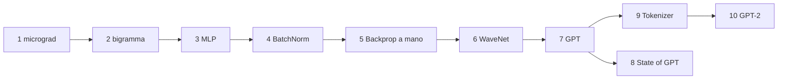

# Dispensa — *Neural Networks: Zero to Hero* video per video

Playlist: <https://www.youtube.com/playlist?list=PLAqhIrjkxbuWI23v9cThsA9GvCAUhRvKZ> · Autore: Andrej Karpathy · 10 video

## ⚠️ Come è stata costruita (leggere!)
Non ho potuto fare una **trascrizione parlata** dei video: dal sandbox YouTube non è raggiungibile (rete bloccata) e il testo dei sottotitoli non è tra i dati recuperabili; inoltre non ho accesso all'audio per un riconoscimento vocale. Cosa ho fatto invece:

| Fonte | Uso |
|---|---|
| **Capitoli ufficiali con timestamp** (nella descrizione di ogni video, recuperati realmente) | scheletro di ogni lezione: i timestamp ti permettono di saltare al punto giusto |
| La mia conoscenza del contenuto di queste lezioni e del codice | spiegazione **in italiano, con parole mie**, formule, trappole, esercizi, quiz |
| Esempi Python eseguiti nel repo (`code/python/`) | dove un concetto è dimostrabile in poche righe |

Quindi: **non è una trascrizione** e non riporta il parlato di Karpathy; è una dispensa di studio guidata dai capitoli del video. Dove ho un dubbio sul dettaglio esatto lo indico con ⚠️. Per i video **6 (WaveNet)** e **8 (State of GPT)** YouTube non espone capitoli: la struttura è ricostruita da me e va verificata guardando il video.

Se vuoi una vera trascrizione: su YouTube apri il video → «…altro» → **Mostra trascrizione**, oppure su una tua macchina `pip install youtube-transcript-api` / `yt-dlp --write-auto-subs --skip-download`. Poi posso integrarla nella dispensa (tradotta e rielaborata).

## Indice
| # | Video | Durata | File |
|---|---|---|---|
| 1 | micrograd: backpropagation | 2:25:52 | [01](01_micrograd.md) |
| 2 | makemore: language modeling (bigramma) | 1:57:45 | [02](02_makemore_bigramma.md) |
| 3 | makemore Part 2: MLP | 1:15:40 | [03](03_makemore_mlp.md) |
| 4 | makemore Part 3: attivazioni, gradienti, BatchNorm | 1:55:58 | [04](04_makemore_batchnorm.md) |
| 5 | makemore Part 4: Backprop Ninja | 1:55:24 | [05](05_makemore_backprop_ninja.md) |
| 6 | makemore Part 5: WaveNet | 56:22 | [06](06_makemore_wavenet.md) |
| 7 | Let's build GPT | 1:56:20 | [07](07_build_gpt.md) |
| 8 | State of GPT (Microsoft Build 2023) | 42:40 | [08](08_state_of_gpt.md) |
| 9 | Let's build the GPT Tokenizer | 2:13:35 | [09](09_tokenizer.md) |
| 10 | Let's reproduce GPT-2 (124M) | 4:01:26 | [10](10_gpt2_124m.md) |

## Percorso consigliato

Prerequisiti: Python di base e un ricordo di derivate delle superiori. Per ogni video: guarda **con il codice aperto** e fermati ad ogni capitolo per riscriverlo tu.

## Formato di ogni scheda
Obiettivo · Mappa dei capitoli (timestamp ufficiali + cosa si impara) · Concetti chiave · Formule · Trappole · Esercizi · Quiz con risposte.
